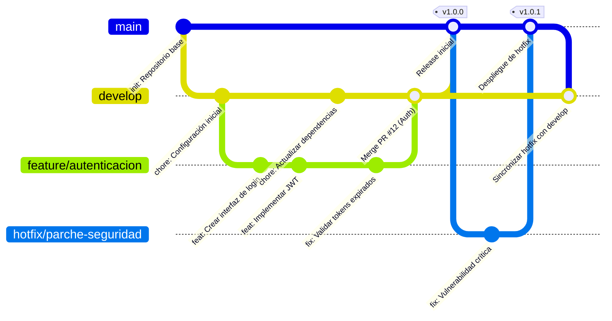

**Resumen ejecutivo:** Git es un sistema de control de versiones que lleva el historial de cambios de tus archivos, y GitHub es un servicio en la nube que aloja repositorios Git para colaborar con otros. Un *repositorio local* es la copia del proyecto en tu computadora; un *repositorio remoto* es la copia en un servidor (por ejemplo, GitHub). Con Git trabajas creando *confirmaciones (commits)*, que son fotos o instantáneas de los cambios preparados. Para colaborar, se usan *ramas*: cada rama es una línea independiente de desarrollo. Cuando terminas una función, fusionas la rama con la rama principal (usualmente `main`) mediante una *merge*, uniendo así los historiales. Para trabajar con repositorios remotos, usas `git push` (para subir tus commits) y `git pull` (para bajar cambios de otros). Si contribuyes a un proyecto ajeno, primero haces un *fork* (copia personal del repositorio) y luego envías un *pull request* (“solicitud de cambios”) para que integren tu rama.

Estos conceptos serán explicados con analogías prácticas y ejemplos paso a paso en el desarrollo de esta guía. Veremos flujos típicos como **iniciar un repositorio local**, **colaborar en GitHub usando fork+PR** y el **flujo de trabajo de rama de característica→PR→merge**. Al final habrá tablas con los comandos básicos agrupados por tarea (configuración, trabajo diario, ramas, sincronización, resolución de conflictos) y su uso.

## Conceptos clave (definiciones sencillas)

- **Repositorio local:** Es tu copia privada del proyecto en tu computador. Imagina un folder donde trabajas. Ahí Git guarda el historial de cambios en una subcarpeta oculta `.git`.  
- **Repositorio remoto:** Es la copia “en la nube” (servidor) del proyecto, por ejemplo en GitHub. Al sincronizar, envías tus cambios locales al repositorio remoto o bajas los cambios de otros en él.  
- **Commit (confirmación):** Es una instantánea de los archivos preparados. Guarda el estado actual de tu proyecto. Piensa en ello como “guardar” en tu editor pero con historial. Como explica Atlassian: *“`git commit` captura una instantánea de los cambios preparados… consideradas versiones ‘seguras’ del proyecto”*.  
- **Staging / Índice:** Es la “zona de preparación” donde indicas qué archivos entrarán en el próximo commit. Un archivo modificado está primero en tu carpeta de trabajo; al hacer `git add` lo pasas al área de staging. Pro Git lo define así: *“El área de preparación… almacena información acerca de lo que va a ir en tu próxima confirmación. A veces se le denomina índice (‘index’)”*.  
- **Rama (*branch*):** Es una línea paralela de desarrollo. Al crear una rama Git hace un marcador o puntero a cierto commit y luego al hacer más commits en esa rama, ese puntero avanza. Como dice Atlassian: *“Las ramas de Git son un puntero eficaz para las instantáneas de tus cambios. Cuando quieres añadir una nueva función… generas una nueva rama”*. De esta forma puedes trabajar en paralelo sin afectar la rama principal.  
- **Rama principal (`main`/`master`):** Es la rama por defecto de tu proyecto, que suele contener el código “oficial” o listo para producción. Anteriormente llamada `master`, se renombró a `main`. En ella se van integrando (mediante merge) las mejoras o funciones terminadas de otras ramas.  
- **HEAD:** Es un apuntador interno de Git al *commit actual* donde estás trabajando. Normalmente coincide con el último commit de la rama activa. Piensa en HEAD como tu “ubicación” actual en la historia: si cambias de rama o apuntas a otro commit, HEAD se mueve.  
- **Origen remoto (`origin`):** Nombre por convención del repositorio remoto principal al que apunta tu local. Cuando clonas un proyecto, Git asigna “origin” al URL de ese repositorio. CampusMVP lo explica: *“Origin es simplemente el nombre predeterminado que recibe el repositorio remoto principal contra el que trabajamos.”*.  
- **Clone (clonar):** Crear una copia local de un repositorio remoto existente. GitHub dice que al clonar “se crea una copia local en tu computadora y sincronizarla con la remota”. Es como copiar la biblioteca completa a tu PC para trabajar.  
- **Fork (bifurcar):** En GitHub, copiar un repositorio (propiedad de otro) a tu cuenta. Esto crea un nuevo repositorio en tu perfil con el mismo contenido. Es como tomar prestado el proyecto de alguien más para hacerle cambios tú. Luego puedes enviar los cambios de tu fork al proyecto original mediante pull requests. GitHub dice que “cualquier persona puede hacer un *fork* de un repositorio existente (‘upstream’) al que tenga acceso de lectura”.  
- **Pull request (solicitud de extracción/incorporación):** Es una petición para integrar cambios. Básicamente notificas al dueño del repositorio que quieres fusionar tu rama (por ejemplo, de tu fork) en su rama principal. Atlassian lo describe así: un PR es un mecanismo para avisar que has terminado una feature en una rama, y pedir revisión para fusionarla a la rama principal. En la práctica, en la interfaz web de GitHub ves las diferencias y discutes la integración antes de hacer el merge.  
- **Push (insertar):** Enviar tus commits locales hacia un repositorio remoto. Deja tus cambios en GitHub.  
- **Pull (extraer):** Traer (bajar) los nuevos commits del repositorio remoto a tu copia local.  
GitHub resume este ciclo de colaboración: *“**Extrae** todos los cambios más recientes… del repositorio remoto en GitHub. **Insertar** sus propios cambios en el mismo repositorio remoto en GitHub.”*. Es decir, hacer un `git pull` para bajar y `git push` para subir.  

## Analogías prácticas

- **Repositorio:** Imagina que tu proyecto es un documento largo. El *repositorio* es como una carpeta que guarda todas las versiones de ese documento. El repositorio local es tu copia personal de la carpeta, y el remoto es la copia en la nube.  
- **Commit:** Piensa en un commit como tomar una foto del documento en ese instante. Cuando guardas un commit, guardas la “foto” de todos los archivos preparados, para poder volver a ella más tarde.  
- **Rama:** Una rama es como una copia alternativa del documento para hacer pruebas. Si quieres escribir un capítulo nuevo, puedes bifurcarte en una rama: escribes ahí sin tocar el texto original. Cuando terminas, haces un merge de tu rama de prueba con la rama principal (documento final).  
- **Staging (área de preparación):** Es como un carrito donde colocas los archivos que quieres incluir en la próxima foto (commit). Editas archivos en tu “mesa de trabajo” y cuando estén listos los pones en el carrito (`git add`). Al presionar “tomar foto” (`git commit`), Git captura lo que está en ese carrito.  
- **HEAD:** Es tu “lugar marcado” actual en la historia. Como si fuese el marcador de libro que indica en qué página estás leyendo. Cuando cambias de rama o ves otra versión antigua, mueves el marcador HEAD a ese commit.  
- **Fork y Pull Request:** Imagínate que colaboras en una enciclopedia en línea. Haces una copia de un artículo en tu propia área (fork), mejoras párrafos en privado y, cuando listo, solicitas a los editores que revisen tu cambio (pull request) para que lo agreguen al artículo oficial.  

## Flujos paso a paso

### Flujo 1: Iniciar un repositorio local

1. **Crear carpeta** y entrar en ella:  

   ```bash
   mkdir mi-proyecto
   cd mi-proyecto
   ```  

2. **Inicializar Git:** Esto crea el repositorio local (carpeta `.git`):  

   ```bash
   $ git init
   Initialized empty Git repository in /ruta/mi-proyecto/.git/
   ```  

3. **Crear un archivo** (ej.: `archivo.txt`) y editarlo.  
4. **Ver estado actual:**  

   ```bash
   $ git status
   On branch main
   Untracked files:
     (use "git add <file>..." to include in what will be committed)
       archivo.txt
   ```  

   Git indica que `archivo.txt` no está bajo seguimiento.  
5. **Preparar archivo para commit:**  

   ```bash
   git add archivo.txt
   ```  

6. **Hacer un commit:** Guarda los cambios preparados. Se necesita un mensaje descriptivo:  

   ```bash
   $ git commit -m "Agrega archivo inicial"
   [main (root-commit) abc1234] Agrega archivo inicial
    1 file changed, 1 insertion(+)
    create mode 100644 archivo.txt
   ```  

   Ahora el proyecto tiene un historial con un commit inicial.  
7. **Ver el historial de commits:**  

   ```bash
   $ git log --oneline
   abc1234 (HEAD -> main) Agrega archivo inicial
   ```  

   Esto muestra el identificador corto de commit y el mensaje.  

A partir de aquí, puedes seguir editando archivos, haciendo `git add` y `git commit` para guardar versiones sucesivas.

### Flujo 2: Colaborar en GitHub con *fork* y *pull request*

Supongamos que quieres contribuir a un proyecto abierto. El proceso típico es:

1. **Fork en GitHub:** En la página del repositorio original (upstream), presiona “Fork” para crear tu copia en GitHub (tu cuenta).  
2. **Clonar tu fork:** Copia la URL de tu fork y haz `git clone` en tu máquina:  

   ```bash
   $ git clone https://github.com/TuUsuario/proyecto-ejemplo.git
   Cloning into 'proyecto-ejemplo'...
   ```  

   Ahora tienes el repositorio remoto “origin” apuntando a tu fork en GitHub.  
3. **Configurar upstream (opcional):** Puedes agregar el repositorio original como remoto “upstream”:  

   ```bash
   git remote add upstream https://github.com/OrgOriginal/proyecto-ejemplo.git
   ```  

   Así podrás bajarte cambios nuevos del original con `git pull upstream main`.  
4. **Crear una rama de trabajo:** Por ejemplo, crear una rama para tu mejora:  

   ```bash
   git checkout -b feature-cambio
   ```  

5. **Realizar cambios y commit:** Edita archivos, luego `git add` y `git commit` con mensajes claros:  

   ```bash
   git add archivo-modificado.txt
   git commit -m "Mejora: ajusta el cálculo de totales"
   ```  

6. **Subir tu rama a tu fork:**  

   ```bash
   git push origin feature-cambio
   ```  

   Esto crea la rama `feature-cambio` en tu repositorio en GitHub.  
7. **Crear Pull Request:** En GitHub, ve a tu fork. Debería sugerirte abrir un PR desde `feature-cambio` en tu fork hacia la rama `main` del repositorio original. En la interfaz web, haz click en “Compare & pull request”. Escribe un título y descripción claros de tu cambio. Luego envía la PR.  
8. **Revisión y merge:** Los mantenedores del proyecto original revisarán tu PR. Pueden pedirte que hagas más commits de corrección en la misma rama. Cuando aprueben, ellos realizarán el *merge* (fusión) de tu rama al `main` del proyecto original.  

Este flujo muestra el modelo de *fork and pull* que GitHub usa en proyectos colaborativos. Tu código nunca toca el repositorio original hasta que se acepta la PR.

### Flujo 3: Rama de característica → Pull Request → Merge

En equipos internos (repositorio compartido), el flujo más común es crear ramas de característica desde `main` y luego revisarlas con PR. Por ejemplo:

1. **Actualizar `main`:**  

   ```bash
   git checkout main
   git pull  # traemos últimos cambios del remoto
   ```  

2. **Crear rama feature:**  

   ```bash
   git checkout -b feature-nueva-funcionalidad
   ```  

3. **Trabajar en la rama:** Edita archivos, luego repite `git add` y `git commit`:  

   ```bash
   git add archivo1 archivo2
   git commit -m "Agrega nueva funcionalidad X"
   ```  

   Puedes hacer varios commits con cambios incrementales.  
4. **Subir la rama al remoto:**  

   ```bash
   git push -u origin feature-nueva-funcionalidad
   ```  

5. **Abrir pull request:** En GitHub, desde tu repositorio, crea un PR solicitando fusionar `feature-nueva-funcionalidad` en `main`. Describe bien los cambios.  
6. **Revisar y fusionar:** Otro miembro del equipo revisa el código. Si hay conflictos o mejoras, comentará en el PR. Cuando esté listo, alguien aprueba y hace *merge* a `main`【36†L1187-L1190】. Después de fusionar, puedes borrar la rama de la interfaz de GitHub.  
7. **Actualizar tu repositorio local:** Al final, vuelve a `main` y trae los cambios:  

   ```bash
   git checkout main
   git pull
   ```  

Así se aísla el trabajo de cada funcionalidad y se asegura que `main` siempre tenga código probado.

#### Diagrama de flujo de ramas y PR



Este diagrama muestra cómo partimos de `main`, creamos la rama `feature/nueva-funcionalidad`, hacemos commits en ella, luego volvemos a `main` y hacemos `merge` de la rama (se ve la *confirmación de fusión* final).

## Guía definitiva de comandos básicos

A continuación se listan los comandos esenciales de Git organizados por tarea. Úsalos con cuidado y con mensajes descriptivos.

- **Configuración inicial:** Se ejecuta una sola vez por máquina.  
  - `git config --global user.name "Tu Nombre"` – Establece tu nombre de usuario.  
  - `git config --global user.email "tu@correo.com"` – Establece tu correo.  

- **Flujo de trabajo diario:** Añadir y guardar cambios.  
  - `git status` – Muestra el estado actual: archivos modificados, sin seguimiento, staged, etc.  
  - `git add <archivo>` – Prepara (stage) uno o varios archivos para el próximo commit. Ej.: `git add index.html`.  
  - `git add .` – Prepara todos los cambios nuevos/modificados.  
  - `git commit -m "Mensaje descriptivo"` – Crea un commit con los cambios ya preparados.  
  - `git log` – Ve el historial de commits. Con `--oneline` muestra versión corta.  
  - `git diff` – Muestra diferencias entre archivos modificados y la última versión confirmada.  
  - **Ejemplo:** Después de editar archivos, siempre revisa con `git status`, luego `git add` y finalmente `git commit`.  

    ```bash
    git status
    git add archivo1 archivo2
    git commit -m "Explica qué has hecho"
    ```

- **Ramas (branching):**  
  - `git branch` – Lista las ramas locales. La que estás aparece con `*`.  
  - `git branch nombre-rama` – Crea una nueva rama (sin cambiarte a ella).  
  - `git checkout nombre-rama` – Cambia a la rama especificada, actualiza archivos al estado de esa rama.  
  - `git checkout -b nombre-rama` – Crea *y* cambia a la nueva rama (atajo muy usado).  
  - `git merge nombre-rama` – Fusiona la rama indicada con la rama actual (tiene que estar *checkouteado* en la actual). Crea un commit de merge si hay cambios. Ver Atlassian: *“`git merge` permite tomar líneas independientes de desarrollo… e integrarlas en una sola rama”*.  
  - `git branch -d nombre-rama` – Elimina localmente la rama (solo si ya está fusionada).  

- **Sincronización remota:**  
  - `git clone <URL>` – Copia un repositorio remoto a tu máquina local. Ej.: `git clone https://github.com/usuario/repositorio.git`. GitHub aclara que clonar “crea una copia local en tu computadora”.  
  - `git remote -v` – Lista los remotos (origin, upstream, etc).  
  - `git fetch` – Trae cambios del remoto a tus referencias locales (pero no modifica tu carpeta de trabajo ni ramas actuales). Se guarda en `origin/main` por ejemplo.  
  - `git pull` – Combina `git fetch` + `git merge` (descarga y fusiona cambios en tu rama actual). Cuidado con conflictos.  
  - `git push` – Envía tus commits locales a un remoto (origin u otro). Ej.: `git push origin main`.  
  - `git push -u origin rama` – Envía rama nueva y establece origen por defecto para futuros pushes en esa rama.  
  - **Comparación:** `git pull` vs `git fetch`:  
    - `git pull` actualiza directamente tu rama actual con cambios remotos.  
    - `git fetch` sólo descarga los datos, necesitas luego hacer manualmente `git merge origin/main` o similar.  
  - **Analogía:** Extraer (pull) es como sincronizar tu disco con la copia en la nube para tener lo último de todos. Insertar (push) es subir tus novedades al servidor.  

- **Colaboración (fork/PR):**  
  - Como usuario colaborador: primero `git fork` en la web, luego clonar tu fork, trabajar en una rama, hacer commits y `git push`. Finalmente, crear pull request en GitHub para pedir revisión.  

- **Resolución de conflictos:** Cuando un `merge` o `pull` no puede combinar automáticamente, Git marca los archivos en conflicto. Debes editar esos archivos para resolver diferencias, luego `git add` y `git commit` de nuevo. Siempre verifica con `git status` los archivos en conflicto. En GitHub (o Atlassian) suele verse similar a la fusión de dos ramas describiendo los cambios que no coinciden.  

#### Tabla: comandos para tareas comunes

| Tarea                    | Comando                                  | Cuándo usarlo                                                |
|--------------------------|------------------------------------------|--------------------------------------------------------------|
| Ver estado               | `git status`                             | Antes de cada commit para ver qué ha cambiado.               |
| Preparar cambios         | `git add <archivo>`                      | Tras editar archivos, para incluirlos en el próximo commit.  |
| Hacer commit             | `git commit -m "mensaje"`                | Una vez que todo está preparado para guardar.                |
| Ver historial            | `git log --oneline`                      | Para revisar commits recientes con sus mensajes.             |
| Crear rama               | `git checkout -b <rama>`                 | Al empezar a trabajar en nueva funcionalidad.                |
| Cambiar rama             | `git checkout <rama>`                    | Para cambiar de tarea o empezar a fusionar.                  |
| Fusionar ramas           | `git merge <rama>`                       | Cuando terminas la tarea y deseas integrarla.                |
| Eliminar rama (local)    | `git branch -d <rama>`                   | Tras fusionar una rama, para limpiar nombres.                |
| Clonar repositorio       | `git clone <URL>`                        | Para obtener un proyecto remoto en tu máquina.               |
| Ver remotos              | `git remote -v`                          | Para saber contra qué repositorios empujar/traer.            |
| Traer cambios remotos    | `git fetch`                              | Para actualizar info de remotos sin tocar tu rama actual.    |
| Traer y combinar         | `git pull`                               | Para bajar y fusionar de una sola vez.                       |
| Enviar cambios al remoto | `git push`                               | Para subir commits locales al servidor remoto.               |
| Configurar usuario       | `git config --global user.name "Nombre"` | Una sola vez, establece tu identidad.                        |

##### Cuadro comparativo de comandos

- **`git pull` vs `git fetch`:** `pull` es fetch+merge automático en la rama actual, mientras que `fetch` solo descarga datos. Usa `pull` para actualizar rápido, `fetch` si quieres revisar antes de combinar.  
- **`merge` vs `rebase`:** Ambos integran ramas distintas. `merge` combina y crea un commit de fusión (history con ramificaciones visibles). `rebase` reescribe tus commits sobre la punta de otra rama (history más linear). Para principiantes, `merge` suele ser más sencillo y seguro.  
- **`clone` vs `fork`:** `git clone` copia un repositorio remoto a tu máquina (solo lectura/escritura si tienes permiso). Un *fork* es una copia del repositorio en tu cuenta de GitHub; se suele clonar después. Fork = crear un nuevo repo en tu cuenta; clone = copiarlo localmente.  
- **`checkout <rama>` vs `branch`:** `branch nombre` solo crea la rama. `checkout nombre` cambia tu contexto a esa rama. O bien `checkout -b nombre` hace ambos pasos.  
- **`origin/main` vs `HEAD`:** `HEAD` es tu posicion actual (¿qué commit estás viendo?). `origin/main` es la última versión conocida de la rama `main` en el remoto “origin”. Si quieres actualizarte a lo último del remoto, usualmente haces `git pull origin main` (que mueve HEAD de tu main local a coincidir con origin/main).  

## Conclusión

Git y GitHub pueden parecer complejos al principio, pero con esta guía esperamos haber aclarado los conceptos básicos con definiciones sencillas, analogías claras y ejemplos prácticos. Recuerda que **no necesitas ser experto desde el inicio**; experimenta libremente porque Git protege tu historial de cambios. Siempre puedes explorar tu historial (`git log`), revertir commits o comparar versiones. La clave es practicar los flujos: crear repositorios locales, hacer commits frecuentes, trabajar en ramas para cada tarea, sincronizar con el remoto (`pull/push`) y utilizar PR para colaboración.

**Fuentes:**

1. [Acerca de GitHub y Git - Documentación de GitHub](https://docs.github.com/es/get-started/start-your-journey/about-github-and-git#:~:text=Git%20es%20un%20sistema%20de,mismos%20archivos%20al%20mismo%20tiempo)
Git es un sistema de control de versiones que realiza un seguimiento de los cambios en los archivos. Git es especialmente útil cuando un grupo de personas y tú estáis haciendo cambios en los mismos archivos al mismo tiempo.

2. [Clonar un repositorio - Documentación de GitHub](https://docs.github.com/es/repositories/creating-and-managing-repositories/cloning-a-repository)

3. [Acerca de los modelos de desarrollo colaborativo - Documentación de GitHub](https://docs.github.com/es/pull-requests/collaborating-with-pull-requests/getting-started/about-collaborative-development-models#:~:text=En%20el%20modelo%20de%20fork,rama%20de%20su%20solicitud%20de)

4. [Git commit | Tutorial de Atlassian sobre Git](https://www.atlassian.com/es/git/tutorials/saving-changes/git-commit#:~:text=El%20comando%20,que%20se%20lo%20pidas%20expresamente)

5. [¿Cómo crear una rama en Git? | Tutorial de Atlassian sobre Git](https://www.atlassian.com/es/git/tutorials/using-branches#:~:text=Las%20ramas%20de%20Git%20son,fusionarlo%20con%20la%20rama%20main)

6. [Git merge | Tutorial de Atlassian sobre Git](https://www.atlassian.com/es/git/tutorials/using-branches/git-merge#:~:text=La%20fusi%C3%B3n%20es%20la%20forma,integrarlas%20en%20una%20sola%20rama)

7. [What Is a Pull Request? | Atlassian Git Tutorial](https://www.atlassian.com/git/tutorials/making-a-pull-request#:~:text=In%20their%20simplest%20form%2C%20pull,branch)

8. [Git - Fundamentos de Git](https://git-scm.com/book/es/v2/Inicio---Sobre-el-Control-de-Versiones-Fundamentos-de-Git#:~:text=El%20%C3%A1rea%20de%20preparaci%C3%B3n%20es,como%20el%20%C3%A1rea%20de%20preparaci%C3%B3n)

9. [Git: los conceptos de "main", "origin" y "HEAD" | campusMVP.es](https://www.campusmvp.es/recursos/post/git-los-conceptos-de-master-origin-y-head.aspx?srsltid=AfmBOorNYEVQyKE-eE5HMAl2MTcT9PCzIKD720R36bxpxRWuFLR1N9Fr#:~:text=Por%20regla%20general%20a%20main%C2%A0se,e%20incorporarla%20al%20producto%20final)

10. [Git: los conceptos de "main", "origin" y "HEAD" | campusMVP.es](https://www.campusmvp.es/recursos/post/git-los-conceptos-de-master-origin-y-head.aspx?srsltid=AfmBOorNYEVQyKE-eE5HMAl2MTcT9PCzIKD720R36bxpxRWuFLR1N9Fr#:~:text=HEAD)
