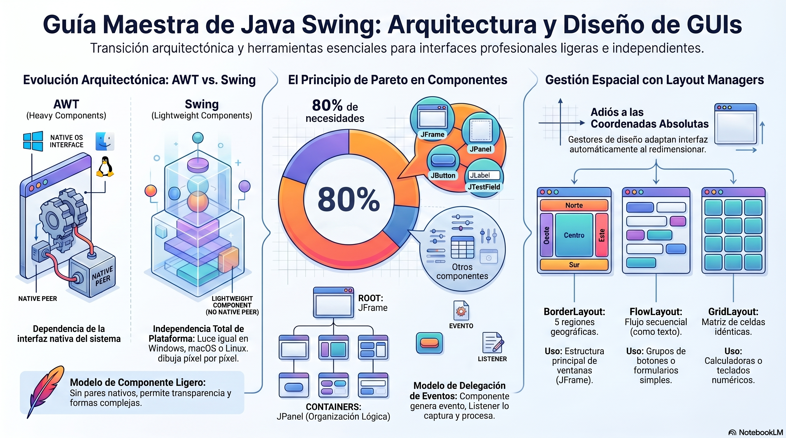

La construcción de software a nivel industrial trasciende la mera formulación de algoritmos procesados en la opacidad de una terminal de comandos; exige la edificación de puentes interactivos robustos entre la lógica computacional pura y el usuario final. En el vasto ecosistema del desarrollo con Java, la creación de Interfaces Gráficas de Usuario (GUI) ha experimentado una evolución arquitectónica profunda. Las aplicaciones modernas del mundo real, desde plataformas de transacciones financieras de alta frecuencia hasta entornos de desarrollo integrado (IDE) complejos como IntelliJ IDEA o Eclipse, dependen de arquitecturas visuales que sean simultáneamente responsivas, escalables y estéticamente consistentes a través de múltiples sistemas operativos.  
El dominio de la biblioteca Java Swing no solo proporciona las herramientas para construir estas interfaces, sino que sirve como un campo de entrenamiento riguroso para interiorizar paradigmas fundamentales de la ingeniería de software. Al dominar Swing, el desarrollador consolida los pilares de la Programación Orientada a Objetos (POO), implementa patrones de diseño estructurales como el Modelo-Vista-Controlador (MVC), aplica principios de Programación Funcional para el manejo de eventos y enfrenta los desafíos críticos de la programación concurrente y las operaciones de entrada/salida (I/O), como la comunicación en red mediante Sockets. El presente documento constituye una guía exhaustiva y académica diseñada para acelerar la asimilación de estos conceptos, estructurada metodológicamente para maximizar la retención cognitiva y la aplicación práctica.

## **1. Evolución Arquitectónica: De AWT a la Revolución de Swing**

Para comprender la sofisticación de Java Swing, es imperativo analizar la crisis arquitectónica que precedió a su creación. En las primeras iteraciones del Java Development Kit (JDK 1.0), la responsabilidad de renderizar interfaces gráficas recaía enteramente sobre el Abstract Window Toolkit (AWT).

### **1.1 El Paradigma de los Componentes Pesados (Heavyweight) en AWT**

La filosofía de diseño subyacente de AWT se basaba en la delegación estricta al sistema operativo anfitrión. Cuando un desarrollador instanciaba un componente de AWT, como un java.awt.Button, la Máquina Virtual de Java (JVM) no dibujaba el botón por sí misma. En su lugar, invocaba una interfaz de programación de aplicaciones (API) nativa del sistema operativo (por ejemplo, Win32 en Windows o Motif en sistemas Unix) para crear un componente "peer" (par nativo).1  
Este enfoque garantizaba que la aplicación Java tuviera la apariencia exacta de una aplicación nativa, pero introdujo limitaciones arquitectónicas severas. Debido a que el sistema operativo era el responsable final del renderizado y de la gestión de la memoria visual de cada elemento, los componentes de AWT fueron denominados "componentes pesados" (Heavyweight Components).1 Esta dependencia de las bibliotecas nativas significaba que AWT solo podía ofrecer el conjunto de componentes gráficos que representara el mínimo común denominador entre todos los sistemas operativos comerciales existentes.2 Si un sistema operativo particular no soportaba nativamente un componente complejo, como una tabla interactiva o un árbol jerárquico, AWT simplemente no podía ofrecerlo.  
Además, los componentes pesados presentaban problemas topológicos críticos en la renderización de la pantalla, conocidos como el problema del orden Z (Z-order). Debido a que el sistema operativo siempre dibuja sus componentes nativos en la capa más alta de la pantalla, un componente pesado de AWT invariablemente se superpondrá y ocultará a cualquier componente ligero que intente posicionarse sobre él, independientemente de la lógica de profundidad programada en el código fuente.5 Adicionalmente, los componentes de AWT son inherentemente opacos y estrictamente rectangulares; el soporte para píxeles translúcidos (donde el canal alfa es mayor a 0 y menor a 255) es arquitectónicamente inviable a través de llamadas a pares nativos de la época.5

### **1.2 El Salto Paradigmático hacia Componentes Ligeros (Lightweight) con Swing**

Para erradicar estas restricciones y cumplir verdaderamente con la promesa fundacional de Java ("Write Once, Run Anywhere"), Sun Microsystems desarrolló las Java Foundation Classes (JFC), cuyo pilar central es la biblioteca Swing.4  
La arquitectura de Swing representa una ruptura radical con la delegación nativa. Los componentes de Swing, identificados convencionalmente por el prefijo 'J' (como javax.swing.JButton), son "componentes ligeros" (Lightweight Components).1 Esto significa que carecen de un par nativo en el sistema operativo.2 En lugar de rogarle al sistema operativo que dibuje un elemento, Swing utiliza las primitivas matemáticas de dibujo de la API Java 2D para pintar, píxel por píxel, la representación visual del componente directamente sobre un lienzo en blanco proporcionado por la JVM.2  
Esta autonomía gráfica confiere ventajas absolutas en el desarrollo de software a nivel empresarial:

* **Independencia de Plataforma y Rendimiento:** Al no requerir la delegación constante de eventos y comandos de renderizado a las bibliotecas nativas del sistema operativo, las operaciones de Swing alcanzan velocidades de ejecución significativamente superiores, gestionadas enteramente por el entorno de ejecución de Java (JRE).1  
* **Polimorfismo Visual y Extensibilidad:** Al estar implementados en código Java puro, los componentes ligeros heredan todas las capacidades de la Programación Orientada a Objetos.8 Un desarrollador puede aplicar herencia para extender la clase JButton, sobrescribir el método paintComponent(), y redefinir completamente su comportamiento visual utilizando polimorfismo, algo imposible con un botón opaco de Windows gestionado por AWT.  
* **Transparencia y Formas Complejas:** Los componentes ligeros pueden procesar canales alfa complejos, permitiendo fondos transparentes, bordes redondeados orgánicos y superposiciones visuales (overlays) no rectangulares, permitiendo una libertad de diseño sin precedentes.5

## **2. El Principio de Pareto en el Ecosistema de Componentes Swing**

En la teoría de la optimización del aprendizaje y la ingeniería industrial, el Principio de Pareto dicta que aproximadamente el 80% de los resultados se derivan del 20% de las causas. Aplicado al dominio de las interfaces gráficas corporativas, la inmensa complejidad de la biblioteca javax.swing (que contiene cientos de clases) puede ser dominada focalizando el rigor analítico en un núcleo fundacional de componentes. Este 20% de las clases permite ensamblar el 80% de los formularios transaccionales, cuadros de mando y sistemas de gestión de bases de datos.  
La arquitectura de Swing implementa el patrón de diseño "Composite". Todo elemento en pantalla es un objeto que hereda, directa o indirectamente, de java.awt.Component y javax.swing.JComponent.1 Dentro de esta topología, existen dos clasificaciones primordiales: los Contenedores (capaces de albergar otros objetos) y los Componentes Atómicos (elementos finales de interacción).

### **2.1 Contenedores Estructurales: El Entorno Físico**

El ciclo vital de cualquier interfaz comienza con la asignación de memoria en el Heap (montículo) de la JVM para las estructuras que definirán el perímetro de la aplicación.8

* **JFrame (La Frontera con el Sistema Operativo):** Es una ventana de nivel superior (Top-Level Container). Constituye la excepción arquitectónica en Swing, ya que internamente posee un componente pesado subyacente para poder interactuar con el administrador de ventanas del sistema operativo.1 Proporciona la barra de título, los botones de minimización y cierre, y los bordes redimensionables. Un error común en el desarrollo novato es intentar adherir componentes gráficos directamente al chasis del JFrame. La arquitectura dicta que los elementos deben anclarse a su capa de contenido subyacente, denominada ContentPane.10  
* **JPanel (El Módulo de Organización Lógica):** Es un contenedor ligero e invisible que carece de representación visual propia.11 Su propósito exclusivo es agrupar lógicamente a otros componentes atómicos y aplicarles un algoritmo geométrico específico (Layout Manager).1 La técnica de anidar múltiples instancias de JPanel dentro de otras instancias de JPanel, creando un árbol jerárquico complejo, es la metodología estándar para construir interfaces dinámicas que no colapsen al redimensionarse.11

### **2.2 Componentes de Interacción y Captura de Datos**

El puente de comunicación bidireccional entre el usuario humano y el modelo de datos se establece mediante los componentes atómicos.

* **JLabel:** Proporciona visualización de texto estático o datos gráficos (iconos) de solo lectura. Es el pilar de la accesibilidad, actuando como el descriptor semántico que indica al usuario qué información debe ser ingresada en los campos adyacentes.  
* **JTextField:** Instancia un área de entrada de texto alfanumérico restringida a una única línea. Es la compuerta de captura primaria para variables discretas (nombres, correos electrónicos, identificadores).  
* **JTextArea:** Facilita la recolección o presentación de bloques masivos de texto multilínea. Arquitectónicamente, un JTextArea puro carece de mecanismos de desplazamiento (scroll); para evitar que el texto desborde los límites visuales, debe ser encapsulado rigurosamente dentro de una instancia de JScrollPane.  
* **JButton:** El activador de ejecución. Hereda de AbstractButton y modela un elemento pulsador que, al ser detonado por el usuario, emite una señal asíncrona hacia la lógica de negocio para desencadenar algoritmos computacionales.

### **2.3 Estructuras para Datos Complejos y Colecciones**

Cuando el software debe presentar volúmenes de datos superiores, el núcleo de Pareto se expande para incluir estructuras diseñadas para iteraciones algorítmicas masivas.

* **El Ecosistema de Navegación (JMenu, JMenuItem):** Las aplicaciones corporativas requieren jerarquías de navegación. La barra maestra (JMenuBar) se ancla generalmente a la cima del JFrame. Esta contiene elementos desplegables (JMenu) que, a su vez, alojan las directivas finales ejecutables (JMenuItem). Cabe destacar que la mezcla de menús ligeros con componentes pesados de AWT en la misma interfaz provoca que el menú desplegable quede sumergido y oculto bajo el componente nativo.6  
* **JList:** Visualiza colecciones unidimensionales continuas, permitiendo al usuario la selección de uno o múltiples nodos concurrentemente.13  
* **JTable:** La estructura bidimensional suprema. Modela intersecciones de filas y columnas. Su arquitectura interna obliga al desarrollador a aplicar el patrón Modelo-Vista-Controlador de forma estricta. El componente visual JTable no almacena datos internamente en sus atributos; en su lugar, requiere que se le inyecte una instancia que implemente la interfaz TableModel, la cual custodia los datos puros y las reglas lógicas sobre qué celdas son editables.

### **2.4 Implementación Práctica: Formulario Modular Jerárquico**

A continuación, se demuestra la síntesis del 20% de los componentes más utilizados, aplicando rigor arquitectónico, encapsulamiento y el principio de responsabilidad modular.9 El objetivo es crear una ventana simple que contenga un formulario interactivo.

```java
import javax.swing.*;  
import java.awt.*;

/**  
 * Representa la Vista gráfica para la autenticación en el sistema.  
 * Demuestra la aplicación estricta del encapsulamiento (POO) y el  
 * principio arquitectónico de inicialización segregada.  
 */  
public class VentanaAutenticacion extends JFrame {

    // 1. Ocultamiento del estado: Los componentes visuales son atributos privados.  
    private JPanel panelFormulario;  
    private JLabel lblUsuario;  
    private JTextField txtUsuario;  
    private JButton btnIngresar;

    /**  
     * Constructor principal. Ejerce como orquestador del ciclo de vida visual.  
     */  
    public VentanaAutenticacion() {  
        configurarChasisPrincipal();  
        inicializarComponentesAtomicos();  
        ensamblarTopologiaVisial();  
    }

    /**  
     * Configura los parámetros físicos y de comportamiento del sistema de ventanas.  
     */  
    private void configurarChasisPrincipal() {  
        this.setTitle("Portal de Acceso Corporativo");  
        this.setSize(350, 150);  
        // Garantiza la terminación del proceso de la JVM al cerrar la ventana  
        this.setDefaultCloseOperation(JFrame.EXIT_ON_CLOSE);  
        this.setLocationRelativeTo(null); // Cálculo geométrico para centrar en pantalla  
    }

    /**  
     * Reserva memoria dinámica en el Heap para cada elemento constitutivo.[8]  
     */  
    private void inicializarComponentesAtomicos() {  
        panelFormulario = new JPanel();  
        lblUsuario = new JLabel("Identificador de Red:");  
        txtUsuario = new JTextField(15); // Parametriza el ancho visual estimado a 15 columnas  
        btnIngresar = new JButton("Validar Credenciales");  
    }

    /**  
     * Fusiona los componentes atómicos en el contenedor modular y lo adhiere a la ventana raíz.  
     */  
    private void ensamblarTopologiaVisial() {  
        // Se añaden los elementos secuencialmente al panel de contención lógica  
        panelFormulario.add(lblUsuario);  
        panelFormulario.add(txtUsuario);  
        panelFormulario.add(btnIngresar);

        // Se inyecta el contenedor modular en el panel de contenido principal del JFrame  
        this.getContentPane().add(panelFormulario);  
    }

    /**  
     * Punto de entrada principal (Entry Point) del programa Java.  
     */  
    public static void main(String args) {  
        // En un entorno profesional, la instanciación de Swing debe ocurrir en su propio hilo  
        SwingUtilities.invokeLater(() -> {  
            VentanaAutenticacion app = new VentanaAutenticacion();  
            app.setVisible(true); // Materializa el objeto estático en memoria visual  
        });  
    }  
}
```

Este fragmento de código evidencia cómo la Programación Orientada a Objetos permite aislar la complejidad espacial. Los métodos constructores limpios y la separación de variables de estado garantizan que la clase sea mantenible a medida que el sistema crezca.9

## **3. Gestión Espacial: El Algoritmo de los Layout Managers**

El intento de posicionar componentes gráficos utilizando coordenadas de píxeles estáticas absolutas (X, Y) constituye un antipatrón en la ingeniería de interfaces de usuario.11 Las coordenadas absolutas ignoran la volatilidad del hardware físico: las resoluciones de los monitores fluctúan, las proporciones de escalado de píxeles (DPI) varían entre sistemas operativos, y el tamaño de las cadenas de texto se expande o contrae drásticamente al implementar sistemas de internacionalización multilingües. Una aplicación cimentada en posiciones estáticas experimentará fallos catastróficos de solapamiento visual en entornos dispares.  
Para erradicar esta fragilidad, Swing delega la responsabilidad espacial a clases puramente matemáticas denominadas Gestores de Diseño (Layout Managers).10

### **3.1 Mecánica Interna de un Layout Manager**

Un Layout Manager es una implementación del patrón de diseño Estrategia (Strategy Pattern). Al asignar un gestor a un contenedor (JPanel.setLayout(...)), el desarrollador le cede el control absoluto sobre la posición y las dimensiones de los elementos hijos.10  
El motor de Swing ejecuta un ciclo de validación de dos fases 15:

1. **Cálculo Dimensional:** El Layout Manager interroga iterativamente a cada componente hijo exigiendo tres métricas críticas: su tamaño mínimo (getMinimumSize), su tamaño preferido (getPreferredSize) y su tamaño máximo (getMaximumSize).  
2. **Renderizado Espacial:** Basándose en los límites físicos del contenedor maestro, las restricciones (constraints) proporcionadas y el tamaño preferido de los componentes, el algoritmo calcula las coordenadas dinámicas exactas y dibuja los elementos en la pantalla. Este cálculo se recalcula en milisegundos cada vez que el usuario altera las dimensiones de la ventana (JFrame).

### **3.2 Taxonomía y Evaluación de Layout Managers Estándar**

El ecosistema Java SE proporciona una multiplicidad de gestores algorítmicos. La siguiente tabla comparativa detalla el comportamiento matemático de los principales actores 12:

| Layout Manager | Algoritmo y Comportamiento Espacial | Casos de Uso Recomendados en la Industria |
| :---- | :---- | :---- |
| **BorderLayout** | Divide implacablemente el contenedor topológico en cinco regiones geográficas: Norte, Sur, Este, Oeste y Centro. Las zonas periféricas obtienen su tamaño preferido a expensas de la región central, la cual es forzada a consumir agresivamente la totalidad del espacio de pantalla remanente.10 | Estructuración del nivel raíz (JFrame). Utilizado para anclar menús en la cima (Norte), paneles de estado en la base (Sur) y lienzos interactivos en el núcleo (Centro).7 |
| **FlowLayout** | Trata los componentes como un flujo continuo de palabras en un editor de texto. Los posiciona secuencialmente de izquierda a derecha. Si la sumatoria de las anchuras excede el límite físico del contenedor, el algoritmo ejecuta un salto de carro, trasladando los elementos a una nueva fila inferior.12 | Es el gestor por defecto de cualquier JPanel recién instanciado.12 Ideal para agrupar bloques atómicos homogéneos, como conjuntos de botones ("Guardar", "Cancelar").18 |
| **GridLayout** | Aplica una matriz aritmética estricta de filas y columnas, dictada en su constructor. Coacciona a cada celda y, por consiguiente, a cada componente residente en ella, a poseer una dimensión matemática idéntica, independientemente de su contenido intrínseco o tamaño preferido.12 | Elementos que exigen simetría inquebrantable, como las botoneras de una calculadora, un tablero de ajedrez, o teclados virtuales numéricos en pantalla. |
| **BoxLayout** | Enfila los componentes en una disposición unidimensional inalterable, ya sea en un eje estrictamente horizontal (fila) o vertical (columna). Respeta celosamente las dimensiones máximas solicitadas por los componentes subyacentes.12 | Alineaciones secuenciales complejas de componentes asimétricos, como barras de herramientas flotantes laterales o formularios de campos apilados verticalmente.11 |

Para dotar al análisis de una perspectiva técnica más profunda, cabe mencionar componentes de grado avanzado como el **GridBagLayout** y el **SpringLayout**. El GridBagLayout es el algoritmo de partición más sofisticado y flexible del ecosistema; utiliza un sistema de pesos matemáticos, anclajes dinámicos y proporciones de relleno (fill). Sin embargo, su complejidad de configuración (la curva de aprendizaje) es notoriamente elevada.15 El SpringLayout, por su parte, regula la distancia física entre los bordes de los componentes mediante la simulación de "resortes" invisibles, siendo empleado predominantemente por motores de autogeneración visual en Entornos de Desarrollo Integrado (IDE builders).10

### **3.3 Implementación Práctica: Arquitectura Espacial con GridLayout**

Para consolidar la comprensión teórica, a continuación se proporciona un ejercicio riguroso que requiere diseñar una interfaz matricial perfecta para organizar elementos paramétricos.16

```java  
import javax.swing.*;  
import java.awt.*;

/**  
 * Modela un panel de control numérico que ilustra la aplicación  
 * paramétrica estricta de la matriz matemática del GridLayout.  
 */  
public class MatrizNumerica extends JFrame {

    public MatrizNumerica() {  
        setTitle("Matriz de Interacción Simétrica (GridLayout)");  
        setSize(300, 300);  
        setDefaultCloseOperation(JFrame.EXIT_ON_CLOSE);  
        setLocationRelativeTo(null);

        // Se inyecta un GridLayout de 4 filas y 3 columnas.  
        // Los últimos parámetros (5, 5) dictan el espacio (padding) físico en   
        // píxeles entre las celdas horizontales y verticales respectivamente.  
        JPanel panelMatriz = new JPanel(new GridLayout(4, 3, 5, 5));

        // Un bucle algorítmico forja los componentes requeridos e inyecta la memoria dinámica  
        for (int i = 1; i <= 9; i++) {  
            JButton botonNumerico = new JButton(String.valueOf(i));  
            // Altera temporalmente la tipografía visual para mejorar la legibilidad  
            botonNumerico.setFont(new Font("Monospaced", Font.BOLD, 24));  
            panelMatriz.add(botonNumerico);  
        }

        // Se adhiere la botonera simétrica a la zona central de un BorderLayout (raíz del JFrame)  
        this.getContentPane().add(panelMatriz, BorderLayout.CENTER);  
    }

    public static void main(String args) {  
        SwingUtilities.invokeLater(() -> new MatrizNumerica().setVisible(true));  
    }  
}
```

La práctica experta en la industria dictamina que las interfaces robustas no se construyen empleando un único gestor complejo (como GridBagLayout), sino empleando la metodología del anidamiento (Nesting). Consiste en declarar un JPanel principal regido por un BorderLayout, y ubicar en cada uno de sus puntos cardinales otros JPanel secundarios orquestados por FlowLayout o GridLayout más simples.11 Esta síntesis fractal produce topologías orgánicas altamente resistentes a deformaciones.

## **4. Interacción y Dinamismo: Eventos, Listeners y Programación Funcional**

Una interfaz gráfica cimentada en la perfección topológica es meramente un lienzo inerte hasta que se implementa una arquitectura capaz de percibir e interpretar las disrupciones generadas por el operario. Para dotar de vida computacional a sus componentes, Swing incorpora el **Modelo de Delegación de Eventos** (Event Delegation Model), una encarnación magistral del patrón arquitectónico Observador (Observer Pattern).

### **4.1 La Fricción Arquitectónica de los Eventos**

En este modelo asimétrico, el ecosistema se polariza en dos entidades:

1. **Fuentes de Eventos (Subjects):** Son los componentes tangibles, como un JButton o un JTextField. La fuente es un ente pasivo; no posee conocimientos incrustados sobre las reglas del negocio o sobre qué algoritmos deben ejecutarse. Su singular responsabilidad es monitorear incesantemente la fricción del hardware físico (ratón, teclado) y, al percibir una mutación de estado, generar un objeto inmutable de información (un evento) para despacharlo a través de la red neuronal de la JVM.  
2. **Receptores o Escuchas (Listeners):** Son objetos lógicos que implementan interfaces abstractas contenidas en los paquetes java.awt.event y javax.swing.event. El ciclo de vida interactivo exige que el desarrollador registre (o suscriba) un receptor a una fuente en particular.20

Cuando se ejecuta la disrupción (por ejemplo, el clic de un ratón), la JVM construye un objeto ActionEvent o MouseEvent—el cual empaqueta coordenadas físicas, metadatos y la identidad del componente origen—y lo inyecta directamente como parámetro en el método invocado del Listener correspondiente.20

### **4.2 Interfaces Primarias de Percepción**

El marco de delegación abarca una taxonomía profunda de escuchadores que auditan desde la rotación de la rueda del ratón hasta las contracciones morfológicas de la ventana. Sin embargo, tres de ellos soportan la gran mayoría de la carga transaccional:

* **ActionListener:** Es la interfaz omnipotente de las validaciones afirmativas. Subyace al patrón de comando y detona la acción cuando se presiona un JButton, cuando se percute la tecla 'Enter' tras teclear sobre un JTextField, o cuando se clica un JMenuItem del menú superior.13  
* **MouseListener:** Evalúa colisiones físicas más granulares. Provee métodos abstractos para detectar cuándo el puntero del cursor ingresa en el dominio territorial del componente (mouseEntered), cuándo evade el perímetro (mouseExited), cuándo ocurre una depresión balística en los pulsadores del ratón (mousePressed) y su subsiguiente liberación (mouseReleased).  
* **KeyListener:** Intercepta a nivel microscópico los impulsos eléctricos del periférico de teclado. Separa la interacción mecánica de presión (keyPressed), la mecánica de liberación (keyReleased) y el forjado intelectual del carácter alfanumérico resultante (keyTyped).

### **4.3 Evolución Sintáctica: De Clases Anónimas a Programación Funcional**

Durante las eras clásicas de Java (versiones previas al JDK 8), la suscripción de un evento obligaba al desarrollador a inyectar verbosidad sintáctica maciza mediante "Clases Internas Anónimas". Este enfoque saturaba visualmente el código fuente, exigiendo la instanciación estructural de una clase huérfana en el preciso lugar del registro del evento.  
La introducción de la Programación Funcional representó un salto evolutivo para las arquitecturas GUI. Java decretó que cualquier interfaz que exigiera la implementación de un único método abstracto (Interfase SAM - Single Abstract Method) se categorizaría como una **Interfaz Funcional**.21 Dado que la interfaz ActionListener solo obliga a codificar el método actionPerformed(ActionEvent e), se convierte en candidata perfecta para la inyección directa de **Expresiones Lambda**.  
Las Expresiones Lambda permiten trasladar la atención cognitiva del "cómo se instancia el mecanismo de percepción" al "qué transacciones lógicas ejecutarán", promoviendo un código exponencialmente más diáfano y apegado a la convención Clean Code.

#### **Implementación Práctica: Capturando Dinamismo Funcional**

El siguiente segmento de código elabora la integración del paradigma funcional para orquestar un evento transaccional simple.

```java
import javax.swing.*;

public class OperativaEventos {

    /**  
     * Vincula un flujo lógico a un botón físico utilizando Programación Funcional.  
     * @param botonEjecucion El componente atómico origen del evento.  
     * @param campoTexto El componente que almacena la información volátil.  
     */  
    public static void ensamblarComportamiento(JButton botonEjecucion, JTextField campoTexto) {  
          
        // El operador '->' (flecha Lambda) divide la declaración:  
        // A la izquierda, la captura del objeto ActionEvent (renombrado a 'evento').  
        // A la derecha, el bloque léxico que detalla el algoritmo transaccional.  
        botonEjecucion.addActionListener(evento -> {  
              
            // 1. Fase de Extracción: Recolectar datos crudos desde la vista  
            String datoCapturado = campoTexto.getText();  
              
            // 2. Fase de Lógica Evaluativa: Validación rudimentaria  
            if(datoCapturado.trim().isEmpty()) {  
                JOptionPane.showMessageDialog(null,   
                    "Error Estructural: El canal de datos carece de contenido.",   
                    "Advertencia", JOptionPane.WARNING_MESSAGE);  
                return; // Cortocircuito de flujo  
            }  
              
            // 3. Fase de Repercusión Operativa: Proyección del resultado final  
            JOptionPane.showMessageDialog(null,   
                "Algoritmo Funcional Invocado. Datos procesados: " + datoCapturado);  
        });  
    }  
}
```

La adopción incondicional de expresiones lambdas para vincular eventos asíncronos reduce el ruido de fondo, posibilitando una auditoría visual fluida de los sistemas.

## **5. Estética y Personalización: UIManager y la Arquitectura Pluggable Look & Feel (PLAF)**

Pese a la incuestionable potencia de su matriz lógica, una crítica persistente contra Java Swing radicaba en la estética visual que entregaba por defecto. Una aplicación despojada de configuración estilística explícita era renderizada automáticamente por la JVM bajo el diseño predeterminado bautizado como "Metal" (o Cross Platform Look and Feel).23 Concebido en la década de los 90, Metal proyectaba elementos grises, rígidos y cuadrangulares que delataban la longevidad del sistema operativo subyacente y rompían la armonía visual frente a aplicaciones nativas contemporáneas de diseño plano (Flat Design).  
Para solucionar este cisma visual, los ingenieros modelaron Swing bajo una fenomenal arquitectura denominada **Pluggable Look and Feel (PLAF)**.23 Este diseño aísla completamente los atributos superficiales de la topología funcional de los componentes. El desarrollador puede "desconectar" un motor visual e "inyectar" otro distinto dinámicamente, alterando la capa visual del sistema a escala global en una fracción de milisegundos sin reestructurar el código base lógico o la configuración espacial de los Layout Managers.

### **5.1 El Motor Global: UIManager**

El director de orquesta que gobierna esta alteración global es la clase magistral UIManager. El Administrador de Interfaz de Usuario opera como un repositorio dictatorial en la memoria virtual; contiene un inventario de propiedades (UIDefaults) que especifican cómo debe pintarse el borde de un botón, el color hexadecimal de fondo para un área de texto y la tipografía base de la red.26  
Cada vez que un JComponent inicia la subrutina para dibujarse a sí mismo en la pantalla, contacta inmediatamente al UIManager y le solicita la receta específica del diseño activo y los colores correspondientes.

### **5.2 Topología Estilística en la Industria Modernizada**

Existen varios niveles y filosofías para gestionar el L&F en un despliegue profesional:

1. **Cross-Platform L&F (Metal):** Es un diseño inmutable presente de manera irrenunciable en toda instancia del Java Runtime Environment (JRE). Garantiza idéntica visualización a costa del apego a las convenciones estéticas modernas.23  
2. **System L&F:** Modela un puente ilusionista. El sistema fuerza a los componentes de Swing (manteniendo su estado ligero y su capacidad polimórfica) a recurrir a algoritmos de pintado en el lienzo de Java 2D que imitan casi a la perfección los temas orgánicos de la plataforma anfitriona (el estilo 'Windows' nativo en Microsoft o la paleta 'Aqua' nativa en macOS X).24  
3. **Third-Party Look and Feels:** Las fundaciones de código abierto contemporáneas producen L&F de gran potencia inyectables como dependencias (.jar) en la estructura del proyecto. El líder actual indiscutible en la esfera corporativa es **FlatLaf**. Consiste en un motor de diseño vectorial que mimetiza la estética minimalista del IDE IntelliJ IDEA de JetBrains. Añade soporte innato para pantallas de ultra alta resolución (HiDPI), sombreados suaves y un sofisticado Modo Oscuro (Dark Theme), pesando ínfimamente sobre la memoria operativa (menos de 400 kb).27

### **5.3 Implementación Práctica: Alterando el ADN Visual**

El siguiente desafío práctico instruye la metodología rigurosa para mutar el Look and Feel de una aplicación Swing hacia la apariencia nativa del sistema operativo circundante.23

```java
import javax.swing.*;

public class InyectorEstilistico {

    /**  
     * Fuerzamiento estructural del motor de renderizado antes del ciclo vital visible.  
     * Esta directiva debe invocarse preferentemente antes de la instanciación del JFrame.  
     */  
    public static void forzarEstiloNativo() {  
        try {  
            // El UIManager evalúa al SO anfitrión y recaba su descriptor de clase L&F específico  
            String identificadorSistemaBase = UIManager.getSystemLookAndFeelClassName();  
              
            // Inyección del núcleo de renderizado en tiempo real  
            UIManager.setLookAndFeel(identificadorSistemaBase);  
              
            // NOTA ARQUITECTÓNICA VITAL:  
            // Si la GUI ya se encuentra dibujada y visible operando en pantalla durante   
            // este cambio algorítmico, el desarrollador está obligado a detonar una orden de   
            // renderizado masivo en cascada iterando sobre todo el árbol de componentes.  
            // Ejemplo: SwingUtilities.updateComponentTreeUI(ventanaPrincipalBase);   
              
        } catch (UnsupportedLookAndFeelException | ClassNotFoundException |   
                 InstantiationException | IllegalAccessException excepcionSistemica) {  
              
            // Las fallas durante el forjado estilístico son suprimidas elegantemente;  
            // el motor retrocederá silenciosamente hacia su red de seguridad ("Metal")  
            System.err.println("Advertencia Critica de Entorno: La API del Sistema Operativo " +  
                               "rechazó la inyección estilística. Retornando a L&F Metal puro.");  
        }  
    }  
}
```

La adopción de estrategias PLAF desvincula las críticas superficiales contra la plataforma Java, posicionándola con estándares visuales idóneos para ambientes corporativos comerciales de alto perfil.

## **6. Concurrencia Computacional y Prácticas Arquitectónicas de Élite**

Sobrepasar la delgada frontera entre el código académico de baja intensidad y la ingeniería de software de clase industrial requiere la observancia implacable de dos axiomas inquebrantables del ecosistema Java: la segregación estructural del Patrón MVC y el estricto gobierno atómico de los procesos en hilo mediante el mecanismo asíncrono de SwingWorker.

### **6.1 Desacoplamiento Algorítmico: El Patrón MVC en Entornos Gráficos**

El antipatrón más pernicioso e insidioso en el desarrollo de GUI es conocido universalmente como "God Class" (Clase Divina) o "Smart UI". Ocurre cuando un programador amalgama operaciones criptográficas, consultas de SQL y algoritmos matemáticos dentro de los receptores de eventos del propio JFrame. Semejante acoplamiento viola flagrantemente el Principio de Responsabilidad Única (Single Responsibility Principle) de la escala SOLID, produciendo software hiperrígido, inauditado e inescrutable.  
Swing fue construido desde sus raíces orgánicas para emparejarse idealmente con la arquitectura **Modelo-Vista-Controlador (MVC)**.28

* **Modelo (Model):** Estructuras POJO (Plain Old Java Objects) libres del paquete javax.swing. Contienen, encriptan y analizan los datos orgánicos procedentes de fuentes externas o bases transaccionales.28  
* **Vista (View):** Componentes vacíos visualmente (ej. JTable, JTextField). No ejecutan sumatorias; se contentan con leer del Modelo y materializar el estado interno de la memoria hacia las densidades físicas del monitor.29  
* **Controlador (Controller):** El nervio espinal del sistema. Reacciona (vía Listeners) ante la intromisión en la Vista, aplica la lógica mutacional sobre el Modelo e imparte los comandos correctivos para repintar la Vista en respuesta.29

Esta distribución topológica otorga resiliencia al sistema, permitiendo intercambiar radicalmente la interfaz de escritorio completa por una aplicación web a posteriori, sin alterar bajo ningún concepto el código funcional puro latente en el interior del Modelo.29

### **6.2 El Event Dispatch Thread (EDT) y el Dilema del Colapso Estructural**

Para salvaguardar la integridad matemática de las colisiones concurrentes en el entorno gráfico, los arquitectos de Java tomaron una decisión de vital gravedad: **Los componentes de Swing no son Thread-Safe (seguros para hilos)**.31 Si múltiples hilos del microprocesador compiten libremente intentando invocar simultáneamente las propiedades internas de un mismo objeto visual, el sistema colapsará frente a fallas microscópicas de la consistencia de memoria RAM (Memory Consistency Errors) con resultados inauditos e irreproducibles.31  
Para garantizar un entorno libre de fricciones y atómico, se diseñó el **Event Dispatch Thread (EDT)** (Hilo Despachador de Eventos).20 El EDT es un bucle sistémico e infinito que actúa como un túnel unidireccional por el que fluye una cola FIFO de tareas visuales. Cada pulsación en el teclado y cada demanda de redibujado de la ventana principal debe empaquetarse e inyectarse pasivamente en esta fila para ser ejecutada iterativamente de manera seriada y asilada.32 Toda orden interactuando con componentes de Swing (salvo contadas excepciones API-Safe) ha de correr exclusivamente por esta autopista.31  
El riesgo estructural letal se materializa con la inclusión de **Tareas Computacionalmente Intensivas y Bloqueantes**. Cualquier tarea invocada subyacentemente como un rebote dentro de un evento (ej. dentro de un ActionListener.actionPerformed) es procesada físicamente por el hilo del EDT.31 Si la orden consiste en recuperar cinco millones de tuplas iteradas vía red transaccional con una base de datos o solicitar la descarga integral de archivos mediante Sockets a través de Internet (Network I/O), el EDT frena abruptamente sus operaciones periféricas.32  
Ante el bloqueo, todos los paquetes entrantes generados por el usuario (movimientos del ratón, redimensionados de pantalla) se atascan inexorablemente frente a la compuerta congelada. El operario observa perplejo un colapso catatónico de la interfaz visual del sistema operativo, el cual, minutos después, marca la aplicación inoperante forzando su terminación forzosa. La regla absolutista e inviolable de la industria se promulga: **Bajo ninguna circunstancia se pueden ejecutar rutinas I/O bloqueantes en los dominios espaciales del Hilo Despachador de Eventos**.20

### **6.3 Concurrencia Segura y Transacciones en Red: SwingWorker**

En las eras tempranas para alivianar la congestión sistémica de bloqueo, el programador forjaba hilos asíncronos en crudo (raw threads) con la clase Thread, lo cual generaba colisiones de carrera por violar la pureza arquitectónica requerida para notificar al EDT sobre el estado del avance final. A partir de la versión JDK 6, el sistema dotó de un sofisticado aparato de orquestación de vida paralela inter-hilos: La super-clase `javax.swing.SwingWorker<T, V>`.34  
SwingWorker es un vehículo genérico puente que posibilita encapsular operaciones extremadamente asfixiantes y bloqueantes para el sistema dentro de procesadores secundarios (worker threads) apartados de la línea del EDT 34, con un mecanismo matemático y ultra seguro para ir reportando progresos numéricos visualizados hacia las interfaces de carga y barras transaccionales, todo respetando a fuego cruzado las métricas Thread-Safe.  
El genérico exige proveer dos descriptores paramétricos:

* T: El tipo resultante algorítmico y matemático masivo devuelto en la terminación final del ciclo del hilo asíncrono.35  
* V: El tipo numérico para fragmentos o "chunks" parciales disueltos generados y pasados constantemente desde adentro de la vorágine asíncrona hacia la barrera de actualización en la pantalla paralela.35

El ciclo iterativo subyacente exige sobrescribir el siguiente protocolo arquitectónico del SwingWorker 34:

1. **doInBackground():** Territorio sagrado asíncrono. Todo el bloque reside y opera en un hilo paralelo no intervenido (fuera del EDT). Se reserva para algoritmos pesados de cálculo criptográfico, I/O con archivos o comunicación vía capa Sockets TCP. Desde aquí está terminantemente prohibido accesar, mutar o inyectar lógicas y cadenas de caracteres sobre la capa visual gráfica de la ventana. Genera colapso latente.36  
2. **publish(`V... chunks`):** Función umbilical esporádica disparada de forma esparcida mediante ciclos for/while ubicados estrictamente desde las profundidades del doInBackground(). Proyecta de manera blindada fracciones parciales hacia el conducto del motor.35  
3. **process(`List<V> chunks`):** Atrapa y decodifica intercepcionalmente los pulsos fraccionados transmitidos por el método publish(). La gracia maestra de esta subrutina arquitectónica radica en que el sistema de la JVM lo procesa de manera segura y forzada insertándolo pacíficamente dentro de la autopista perimetral del EDT. Al estar corriendo internamente asegurado en el EDT, está completamente autorizado a invocar visualmente cambios (ej. expandir y modificar un JProgressBar transaccional visual, alterar colores).34  
4. **done():** Procedimiento final conclusivo invocado de modo serial exclusivamente dentro del ambiente seguro paramétrico del EDT. Es el espacio exacto cuando ocurre la combustión o detención algorítmica final del hilo subterráneo (`doInBackground()` devuelve su objeto genérico de tipo `<T>`). Permite proyectar notificaciones en cuadros de diálogo visuales sin riesgos de carrera informando al cliente la culminación pacífica total.34

#### **Implementación Práctica: Orquestación I/O (Sockets y Tareas Pesadas) en Paralelo sin Bloqueos**

El siguiente desafío ilustra un despliegue operativo masivo donde un pulsador activa una subrutina bloqueante prolongada que exige la transmisión constante de datos sin interrogar o congelar por milisegundos la usabilidad pasiva interactiva del usuario general en el resto del cliente visual.37

```java  
import javax.swing.*;  
import java.awt.*;  
import java.util.List;

/**  
 * Motor visual demostrativo del puente arquitectónico SwingWorker.  
 * Eluda explícitamente el cuello de botella visual EDT en conexiones I/O pesadas.  
 */  
public class ClienteRedGrafico extends JFrame {

    private final JButton botonTransferir;  
    private final JProgressBar barraPorcentual;  
    private final JLabel descriptorEstatus;

    public ClienteRedGrafico() {  
        setTitle("Terminal de Operaciones de Red en Segundo Plano");  
        setSize(450, 200);  
        setDefaultCloseOperation(JFrame.EXIT_ON_CLOSE);  
        setLayout(new BorderLayout(15, 15));

        JPanel panelPerifericoCentral = new JPanel(new GridLayout(2, 1, 10, 10));  
        descriptorEstatus = new JLabel("Operativa latente en espera...", SwingConstants.CENTER);  
        barraPorcentual = new JProgressBar(0, 100);  
        barraPorcentual.setStringPainted(true);  
        panelPerifericoCentral.add(descriptorEstatus);  
        panelPerifericoCentral.add(barraPorcentual);

        this.getContentPane().add(panelPerifericoCentral, BorderLayout.CENTER);

        botonTransferir = new JButton("Establecer Enlace I/O Pesado Asíncrono");  
          
        // Lambda inyectada - Vincula la solicitud iterativa al método gestor de disparo  
        botonTransferir.addActionListener(e -> activarTransferenciaAsincronaSegura());  
          
        this.getContentPane().add(botonTransferir, BorderLayout.SOUTH);  
    }

    private void activarTransferenciaAsincronaSegura() {  
        // Bloqueo preventivo visual de flujo. Previene reentradas de pulsos accidentales  
        // acumulativos masivos originando miles de subprocesos subterráneos de red colapsando la RAM.  
        botonTransferir.setEnabled(false);  
          
        // Arquitectura Genérica Dual: T(Final) = String, V(Fraccionado de paso) = Integer Numérico.  
        SwingWorker<String, Integer> hiloOperacionalConcurrente = new SwingWorker<String, Integer>() {

            // 1. Zona Neutra (Mundo Oscuro Subterráneo): Ejecución masiva extra-EDT  
            @Override  
            protected String doInBackground() throws Exception {  
                // Aquí yace el simulacro de la Operación Bloqueante en Red de Sockets  
                // (Server-Client Data Stream) que exige cientos de ciclos de lectura de paquetes I/O TCP.  
                for (int iteracionPorcentual = 0; iteracionPorcentual <= 100; iteracionPorcentual += 5) {  
                      
                    // Simula un micro-bloqueo crítico del núcleo transaccional en un Socket InputStream.  
                    Thread.sleep(150);   
                      
                    // Dispara umbilicalmente la señal asíncrona hacia el motor visual  
                    publish(iteracionPorcentual);   
                }  
                return "Certificado Transaccional SSL Intercambiado Completamente.";  
            }

            // 2. Zona de Confluencia Tolerante (Mundo Visual Seguro EDT)  
            @Override  
            protected void process(List<Integer> inyeccionesEnTiempoReal) {  
                // Se abstrae quirúrgicamente la recolección dimensional de memoria procesada.  
                int coordenadaAbsolutaDescargada = inyeccionesEnTiempoReal.get(inyeccionesEnTiempoReal.size() - 1);  
                  
                // Exclusivamente habilitado para incidir e invocar transacciones gráficas visuales.  
                barraPorcentual.setValue(coordenadaAbsolutaDescargada);  
                descriptorEstatus.setText("Progreso de encriptación de túnel I/O de red en marcha: "   
                                           + coordenadaAbsolutaDescargada + "% completado.");  
            }

            // 3. Zona Expiratoria Segura (EDT Paramétrico a la finalización)  
            @Override  
            protected void done() {  
                try {  
                    // Cosecha del producto absoluto y final emitido por el vientre del doInBackground  
                    String reporteFinal = get();   
                    descriptorEstatus.setText(reporteFinal);  
                      
                    JOptionPane.showMessageDialog(null,   
                        "Protocolo Subterráneo de Comunicación Finalizado en Segundo Plano sin Fisuras Estructurales EDT.");  
                      
                    botonTransferir.setEnabled(true); // Se libera y se dota nuevamente al control visual pulsador.  
                } catch (Exception fallaMetabolicaSistema) {  
                    descriptorEstatus.setText("Paro Crítico Paramétrico de Memoria y Colapso Hilo Redundante.");  
                    fallaMetabolicaSistema.printStackTrace();  
                }  
            }  
        };

        // Combustiona el ignitor interno genérico del motor y catapulta el proceso iterado a memoria subterránea.  
        hiloOperacionalConcurrente.execute();  
    }

    public static void main(String args) {  
        SwingUtilities.invokeLater(() -> new ClienteRedGrafico().setVisible(true));  
    }  
}
```

La adopción inalienable e insoslayable de arquitecturas concurrentes segregativas diferencia inexorablemente la labor académica frágil con propensión al fallo masivo del nivel corporativo exigido en bases industriales.

## **7. Ejercicios Prácticos y Autoevaluación de Consolidación**

Para afianzar los conceptos fundamentales de Java Swing y verificar la comprensión de la arquitectura de interfaces gráficas, se proponen los siguientes ejercicios de autoevaluación y un proyecto práctico integrador. Estos desafíos están diseñados para aplicar de forma directa los principios explicados a lo largo del módulo.

### **7.1 Autoevaluación Conceptual: JFrame, JPanel y ContentPane**

El primer paso para dominar Swing es comprender con total claridad el rol de cada contenedor en la jerarquía visual de la aplicación. Autoevalúe sus conocimientos explicando detalladamente las siguientes diferencias y responsabilidades:

1. **JFrame (Contenedor de Nivel Superior):**
   - ¿Por qué se considera un componente pesado (*heavyweight*) en comparación con otros elementos de Swing?
   - ¿Qué elementos visuales y de control hereda directamente del sistema operativo?
   
2. **JPanel (Contenedor Intermedio Ligero):**
   - Explique por qué se describe como un "contenedor invisible" y cuál es su utilidad fundamental al organizar componentes.
   - ¿Cómo ayuda el anidamiento de varios `JPanel` a construir interfaces responsivas y adaptables?

3. **ContentPane (Panel de Contenido):**
   - ¿Cuál es la función del `ContentPane` dentro del `JFrame` y por qué es una mala práctica añadir componentes directamente al chasis exterior del `JFrame`?

---

### **7.2 Analogía Práctica de los Layout Managers (Gestores de Diseño)**

Para comprender el comportamiento de los gestores de diseño sin perderse en la jerga técnica, intente explicar su funcionamiento utilizando analogías con el mundo físico. 

**Ejercicio mental sugerido:**
Imagine que es el director de una obra o un diseñador de interiores que debe organizar muebles (los *componentes*) dentro de una habitación (el *contenedor*).
- En lugar de fijar cada mueble con pegamento en coordenadas exactas (coordenadas absolutas $X, Y$), usted define reglas generales de distribución:
  - **BorderLayout:** Ubica los elementos clave en los extremos cardinales (Norte, Sur, Este, Oeste) y permite que la zona Central se expanda para ocupar todo el espacio restante.
  - **FlowLayout:** Coloca los elementos uno detrás del otro de manera fluida (como palabras en un párrafo), saltando a la siguiente línea si el espacio horizontal se agota.
  - **GridLayout:** Distribuye el espacio en una cuadrícula simétrica, forzando a que todos los elementos tengan exactamente el mismo tamaño, sin importar su contenido.

El gestor de diseño se encarga de reajustar automáticamente el tamaño y la posición de cada mueble si la habitación se agranda o se encoge (redimensionamiento de la ventana), evitando solapamientos y desorden.

---

### **7.3 Proyecto Integrador: Construcción de un Formulario Transaccional**

Aplique los conocimientos adquiridos construyendo desde cero una aplicación de escritorio completamente funcional y responsiva. Este proyecto reúne los componentes esenciales de captura de datos, gestión de espacios, Look and Feel y manejo de eventos mediante programación funcional.

#### **Requerimientos del Proyecto:**

1. **Ventana Principal (`JFrame`):**
   - Cree una ventana con dimensiones iniciales de **400x300 píxeles**.
   - Configure el gestor de diseño del contenedor principal como `BorderLayout`.

2. **Título de la Aplicación (Zona Norte):**
   - Inserte un componente `JLabel` centrado en la región `NORTH` con el texto `"Sistema Transaccional"`.

3. **Formulario de Entrada (Zona Centro):**
   - Cree un panel `JPanel` secundario y asígnele un `GridLayout` de dos filas y dos columnas.
   - Ubique este panel en la región `CENTER` de la ventana.
   - Inserte en la cuadrícula dos etiquetas (`JLabel`) y dos campos de entrada de texto (`JTextField`) emparejados para capturar la información del usuario (por ejemplo: "Identificador:" y "Monto Transacción:").

4. **Botonera de Control (Zona Sur):**
   - Cree otro panel `JPanel` regido por `FlowLayout` y colóquelo en la región `SOUTH`.
   - Inserte dentro de este panel un botón (`JButton`) con el texto `"Guardar Transacciones Generales"`.

5. **Manejo de Eventos con Lambdas (Java 8+):**
   - Asocie un escuchador de eventos (`ActionListener`) al botón utilizando una **expresión lambda** limpia.
   - Al hacer clic en el botón, el programa debe realizar las siguientes acciones:
     - Capturar los valores ingresados en los campos de texto.
     - Imprimir la información de la transacción en la consola de comandos (`System.out.println`).
     - Limpiar el contenido de ambos `JTextField` para permitir una nueva entrada.
     - Evitar posibles errores de puntero nulo (`NullPointerException`) o entradas vacías mediante validaciones simples.

6. **Estilo Nativo del Sistema Operativo (`System Look and Feel`):**
   - Utilice la clase global `UIManager` para forzar que la aplicación adopte el diseño y apariencia nativa del sistema operativo anfitrión (Windows, macOS o Linux) antes de que la ventana sea visible con `setVisible(true)`.

#### **Criterios de Evaluación y Calidad de Código:**
- **Adaptabilidad:** La interfaz debe comportarse de manera fluida y elástica al redimensionar la ventana con el ratón. Los componentes deben reposicionarse correctamente sin encimarse ni desaparecer gracias al uso de gestores de diseño aninados.
- **Clean Code:** Use la nomenclatura estándar de Java (CamelCase) para variables y clases. Asigne nombres descriptivos y claros a los componentes (por ejemplo, `txtMonto` en lugar de `txtField1`).
- **Separación de Responsabilidades:** Asegure una clara división entre la vista visual (la maquetación de los paneles y botones) y el comportamiento transaccional (las acciones asociadas a los eventos).

#### **Fuentes citadas**

1. java - Differences between components and lightweight/heavyweight - Stack Overflow, acceso: mayo 26, 2026, [https://stackoverflow.com/questions/13769072/differences-between-components-and-lightweight-heavyweight](https://stackoverflow.com/questions/13769072/differences-between-components-and-lightweight-heavyweight)  
2. Of Swing and AWT, why is one considered light-weight and the other heavy-weight?, acceso: mayo 26, 2026, [https://stackoverflow.com/questions/672238/of-swing-and-awt-why-is-one-considered-light-weight-and-the-other-heavy-weight](https://stackoverflow.com/questions/672238/of-swing-and-awt-why-is-one-considered-light-weight-and-the-other-heavy-weight)  
3. what is the meaning of Heavy weighted component and light weighted component. - CodeRanch, acceso: mayo 26, 2026, [https://coderanch.com/t/492318/java/meaning-Heavy-weighted-component-light](https://coderanch.com/t/492318/java/meaning-Heavy-weighted-component-light)  
4. Difference between AWT and Swing in Java - GeeksforGeeks, acceso: mayo 26, 2026, [https://www.geeksforgeeks.org/java/difference-between-awt-and-swing-in-java/](https://www.geeksforgeeks.org/java/difference-between-awt-and-swing-in-java/)  
5. Lightweight Components, acceso: mayo 26, 2026, [https://www2.seas.gwu.edu/~rhyspj/fall05cs143/lec9/lec91x0.html](https://www2.seas.gwu.edu/~rhyspj/fall05cs143/lec9/lec91x0.html)  
6. Mixing Heavyweight and Lightweight Components - Java - Oracle, acceso: mayo 26, 2026, [https://www.oracle.com/technical-resources/articles/java/mixing-components.html](https://www.oracle.com/technical-resources/articles/java/mixing-components.html)  
7. Computing Science 465 | The Java Programming Language: GUI Development with AWT and Swing, acceso: mayo 26, 2026, [https://cs.smu.ca/~porter/csc/465/notes/javapl_guidev.html](https://cs.smu.ca/~porter/csc/465/notes/javapl_guidev.html)  
8. Java_OOP_Architecture_2_.pdf  
9. Java_OOP_Architecture.pdf  
10. Using Layout Managers (The Java™ Tutorials > Creating a GUI With Swing > Laying Out Components Within a Container), acceso: mayo 26, 2026, [https://docs.oracle.com/javase/tutorial/uiswing/layout/using.html](https://docs.oracle.com/javase/tutorial/uiswing/layout/using.html)  
11. how to use the layout managers in swing java - Stack Overflow, acceso: mayo 26, 2026, [https://stackoverflow.com/questions/5827991/how-to-use-the-layout-managers-in-swing-java](https://stackoverflow.com/questions/5827991/how-to-use-the-layout-managers-in-swing-java)  
12. A Visual Guide to Layout Managers - Oracle Help Center, acceso: mayo 26, 2026, [https://docs.oracle.com/javase/tutorial/uiswing/layout/visual.html](https://docs.oracle.com/javase/tutorial/uiswing/layout/visual.html)  
13. Java SE Application Design With MVC - Oracle, acceso: mayo 26, 2026, [https://www.oracle.com/technical-resources/articles/javase/mvc.html](https://www.oracle.com/technical-resources/articles/javase/mvc.html)  
14. Lesson: Laying Out Components Within a Container (The Java™ Tutorials > Creating a GUI With Swing), acceso: mayo 26, 2026, [https://docs.oracle.com/javase/tutorial/uiswing/layout/index.html](https://docs.oracle.com/javase/tutorial/uiswing/layout/index.html)  
15. How Layout Management Works (The Java™ Tutorials > Creating a GUI With Swing > Laying Out Components Within a Container), acceso: mayo 26, 2026, [https://docs.oracle.com/javase/tutorial/uiswing/layout/howLayoutWorks.html](https://docs.oracle.com/javase/tutorial/uiswing/layout/howLayoutWorks.html)  
16. Views: Layout Managers, acceso: mayo 26, 2026, [https://ics.uci.edu/~pattis/ICS-21/lectures/layout/lecture.html](https://ics.uci.edu/~pattis/ICS-21/lectures/layout/lecture.html)  
17. A Visual Guide to Layout Managers (The Java™ Tutorials > Creating a GUI with JFC/Swing > Laying Out Components Within a Container), acceso: mayo 26, 2026, [https://www.cs.auckland.ac.nz/references/java/java1.5/tutorial/uiswing/layout/visual.html](https://www.cs.auckland.ac.nz/references/java/java1.5/tutorial/uiswing/layout/visual.html)  
18. Which Swing layout(s) do you recommend? [closed] - Stack Overflow, acceso: mayo 26, 2026, [https://stackoverflow.com/questions/1832432/which-swing-layouts-do-you-recommend](https://stackoverflow.com/questions/1832432/which-swing-layouts-do-you-recommend)  
19. Java GUI - 2 - The BEST Layout Manager for Java Swing - YouTube, acceso: mayo 26, 2026, [https://www.youtube.com/watch?v=yeETmBZXglc](https://www.youtube.com/watch?v=yeETmBZXglc)  
20. Swing Event Dispatch Thread :: CC 410 Textbook, acceso: mayo 26, 2026, [https://textbooks.cs.ksu.edu/cc410/ii-gui/13-event-driven-programming/06-swing-dispatch-thread/index.html](https://textbooks.cs.ksu.edu/cc410/ii-gui/13-event-driven-programming/06-swing-dispatch-thread/index.html)  
21. Java_Logic_Blueprint.pdf  
22. Java_Logic_Mastery.pdf  
23. How to Set the Look and Feel (The Java™ Tutorials > Creating a GUI With Swing > Modifying the Look and Feel) - Oracle Help Center, acceso: mayo 26, 2026, [https://docs.oracle.com/javase/tutorial/uiswing/lookandfeel/plaf.html](https://docs.oracle.com/javase/tutorial/uiswing/lookandfeel/plaf.html)  
24. Swing UIManager default system look and feel [closed] - Stack Overflow, acceso: mayo 26, 2026, [https://stackoverflow.com/questions/15937472/swing-uimanager-default-system-look-and-feel](https://stackoverflow.com/questions/15937472/swing-uimanager-default-system-look-and-feel)  
25. How to Set the Look and Feel, acceso: mayo 26, 2026, [https://www.iitk.ac.in/esc101/05Aug/tutorial/uiswing/misc/plaf.html](https://www.iitk.ac.in/esc101/05Aug/tutorial/uiswing/misc/plaf.html)  
26. UIManager (Java Platform SE 8 ) - Oracle Help Center, acceso: mayo 26, 2026, [https://docs.oracle.com/javase/8/docs/api/javax/swing/UIManager.html](https://docs.oracle.com/javase/8/docs/api/javax/swing/UIManager.html)  
27. Spicing up your Java SwingUI using custom Look and Feel | by Amos Chepchieng | Medium, acceso: mayo 26, 2026, [https://medium.com/@keeptoo/spicing-up-your-java-swingui-using-custom-look-and-feel-113501dd5920](https://medium.com/@keeptoo/spicing-up-your-java-swingui-using-custom-look-and-feel-113501dd5920)  
28. MVC Design Pattern - GeeksforGeeks, acceso: mayo 26, 2026, [https://www.geeksforgeeks.org/system-design/mvc-design-pattern/](https://www.geeksforgeeks.org/system-design/mvc-design-pattern/)  
29. The MVC pattern and Swing - Stack Overflow, acceso: mayo 26, 2026, [https://stackoverflow.com/questions/5217611/the-mvc-pattern-and-swing](https://stackoverflow.com/questions/5217611/the-mvc-pattern-and-swing)  
30. Java swing application boilerplate with model view controller (MVC) design patterns. - GitHub, acceso: mayo 26, 2026, [https://github.com/ashiishme/java-swing-mvc](https://github.com/ashiishme/java-swing-mvc)  
31. The Event Dispatch Thread - The Java Tutorials, acceso: mayo 26, 2026, [https://docs.oracle.com/javase/tutorial/uiswing/concurrency/dispatch.html](https://docs.oracle.com/javase/tutorial/uiswing/concurrency/dispatch.html)  
32. Java Event-Dispatching Thread explanation - Stack Overflow, acceso: mayo 26, 2026, [https://stackoverflow.com/questions/7217013/java-event-dispatching-thread-explanation](https://stackoverflow.com/questions/7217013/java-event-dispatching-thread-explanation)  
33. SwingWorker and the Event Dispatcher Thread| JBoss.org Content Archive (Read Only), acceso: mayo 26, 2026, [https://developer.jboss.org/thread/134767](https://developer.jboss.org/thread/134767)  
34. Worker Threads and SwingWorker (The Java™ Tutorials > Creating a GUI With Swing > Concurrency in Swing), acceso: mayo 26, 2026, [https://docs.oracle.com/javase/tutorial/uiswing/concurrency/worker.html](https://docs.oracle.com/javase/tutorial/uiswing/concurrency/worker.html)  
35. © Copyright Y. Daniel Liang, 2005 Supplement: SwingWorker and JProgressBar For Introduction to Java Programming By Y. Daniel L, acceso: mayo 26, 2026, [https://liveexample.pearsoncmg.com/liang/intro9e/supplement/SwingWorkerJProgressBar.pdf](https://liveexample.pearsoncmg.com/liang/intro9e/supplement/SwingWorkerJProgressBar.pdf)  
36. albertattard/swing-worker-example - GitHub, acceso: mayo 26, 2026, [https://github.com/albertattard/swing-worker-example](https://github.com/albertattard/swing-worker-example)  
37. SwingWorker (Java Platform SE 8 ) - Oracle Help Center, acceso: mayo 26, 2026, [https://docs.oracle.com/javase/8/docs/api/javax/swing/SwingWorker.html](https://docs.oracle.com/javase/8/docs/api/javax/swing/SwingWorker.html)  
38. SwingWorker ProgressBar - java - Stack Overflow, acceso: mayo 26, 2026, [https://stackoverflow.com/questions/20260372/swingworker-progressbar](https://stackoverflow.com/questions/20260372/swingworker-progressbar)  
39. Swing Worker Thread Explained with Progress Bar. | CPP Code Tips - WordPress.com, acceso: mayo 26, 2026, [https://cppcodetips.wordpress.com/2014/03/25/swing-worker-thread-explained-with-progress-bar/](https://cppcodetips.wordpress.com/2014/03/25/swing-worker-thread-explained-with-progress-bar/)