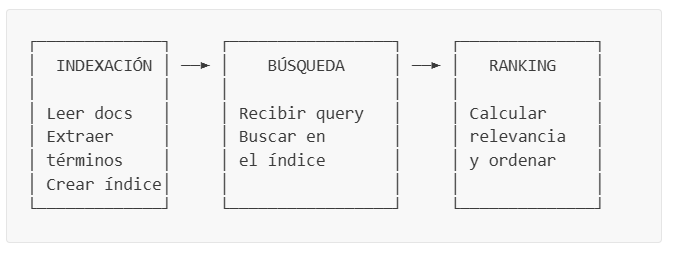
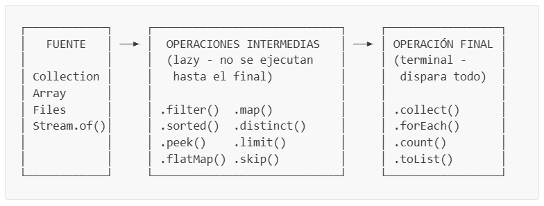

## Tabla de Contenidos

- [Objetivos de Aprendizaje](#objetivos-de-aprendizaje)
- [Introducción](#introducción)
- [Conceptos Previos](#conceptos-previos)
  - [¿Qué es un Motor de Búsqueda?](#qué-es-un-motor-de-búsqueda)
  - [¿Qué es un Índice Invertido?](#qué-es-un-índice-invertido)
  - [Programación Funcional en Java](#programación-funcional-en-java)
  - [Streams en Java](#streams-en-java)
  - [Optional en Java](#optional-en-java)
  - [Records en Java](#records-en-java)
  - [Interfaces Funcionales](#interfaces-funcionales)
- [Estructura del Proyecto](#estructura-del-proyecto)
- [Parte 1 — Definición de Contratos (Interfaces)](#parte-1--definición-de-contratos-interfaces)
  - [Paso 1.1: Crear la interfaz IDocument](#paso-11-crear-la-interfaz-idocument)
  - [Paso 1.2: Crear la interfaz ITextProcessor](#paso-12-crear-la-interfaz-itextprocessor)
  - [Paso 1.3: Crear la interfaz IDocumentReader](#paso-13-crear-la-interfaz-idocumentreader)
  - [Paso 1.4: Crear la interfaz IIndexer](#paso-14-crear-la-interfaz-iindexer)
  - [Paso 1.5: Crear la interfaz IRanker](#paso-15-crear-la-interfaz-iranker)
  - [Paso 1.6: Crear la interfaz ISearcher](#paso-16-crear-la-interfaz-isearcher)
- [Parte 2 — Modelos de Datos](#parte-2--modelos-de-datos)
  - [Paso 2.1: Crear el record Document](#paso-21-crear-el-record-document)
  - [Paso 2.2: Crear el record SearchResult](#paso-22-crear-el-record-searchresult)
  - [Paso 2.3: Crear la clase TextProcessor](#paso-23-crear-la-clase-textprocessor)
- [Parte 3 — Lectura de Archivos](#parte-3--lectura-de-archivos)
  - [Paso 3.1: Crear la clase FileDocumentReader](#paso-31-crear-la-clase-filedocumentreader)
- [Parte 4 — Índice Invertido](#parte-4--índice-invertido)
  - [Paso 4.1: Crear la clase HashTableIndexer](#paso-41-crear-la-clase-hashtableindexer)
- [Parte 5 — Algoritmos de Ranking](#parte-5--algoritmos-de-ranking)
  - [Paso 5.1: Crear TermFrequencyRanker](#paso-51-crear-termfrequencyranker)
  - [Paso 5.2: Crear TfIdfRanker](#paso-52-crear-tfidfranker)
- [Parte 6 — Motor de Búsqueda](#parte-6--motor-de-búsqueda)
  - [Paso 6.1: Crear la clase BasicSearcher](#paso-61-crear-la-clase-basicsearcher)
- [Parte 7 — Aplicación de Consola](#parte-7--aplicación-de-consola)
  - [Paso 7.1: Crear la clase App](#paso-71-crear-la-clase-app)
- [Parte 8 — Documentos de Prueba](#parte-8--documentos-de-prueba)
- [Parte 9 — Compilación y Ejecución](#parte-9--compilación-y-ejecución)
- [Criterios de Evaluación](#criterios-de-evaluación)

---

## Objetivos de Aprendizaje

Al completar esta práctica, el estudiante será capaz de:

1. Comprender y aplicar los conceptos fundamentales de la **programación funcional** en Java.
2. Utilizar la API de **Streams** para procesar colecciones de datos sin bucles explícitos.
3. Emplear **Optional** para manejar valores nulos de forma segura.
4. Diseñar sistemas modulares usando **interfaces** como contratos entre componentes.
5. Implementar un **índice invertido** y comprender su rol en la búsqueda de información.
6. Aplicar los algoritmos de ranking **TF** y **TF-IDF** para ordenar resultados por relevancia.
7. Utilizar **records** de Java para crear objetos de datos inmutables.

---

## Introducción

En esta práctica construiremos un **motor de búsqueda de documentos de texto** desde cero. La aplicación permitirá al usuario indexar archivos `.txt` desde su sistema de archivos, buscar por palabras clave y obtener resultados ordenados por relevancia.

Lo que hace especial a este proyecto es que **toda la lógica** se implementará usando **programación funcional**: Streams, lambdas, method references, Optional y composición de funciones. No usaremos bucles `for` ni `while` para procesar datos; en su lugar, usaremos pipelines funcionales.

> **¿Por qué es importante?**  
> La programación funcional es un paradigma ampliamente utilizado en la industria moderna. Frameworks como Spring WebFlux, Apache Spark y las propias colecciones de Java la incorporan de forma nativa. Aprender a pensar de forma funcional te preparará para escribir código más conciso, legible y menos propenso a errores.

---

## Conceptos Previos

Antes de comenzar a programar, es importante comprender algunos conceptos clave que usaremos a lo largo de toda la práctica.

---

### ¿Qué es un Motor de Búsqueda?

Un **motor de búsqueda** es un sistema que permite encontrar información relevante dentro de un conjunto de documentos. El proceso general consta de tres etapas:



1. **Indexación**: se leen los documentos, se extraen las palabras clave y se construye una estructura de datos que permite búsquedas rápidas.
2. **Búsqueda**: el usuario escribe una consulta (*query*) y el sistema encuentra todos los documentos que contienen esas palabras.
3. **Ranking**: los documentos encontrados se ordenan por relevancia según un algoritmo de puntuación.

---

### ¿Qué es un Índice Invertido?

Un **índice invertido** es una estructura de datos que mapea cada **palabra** (término) a la **lista de documentos** que la contienen. Es la estructura fundamental detrás de motores de búsqueda como Google.

**Ejemplo:** Supongamos que tenemos 3 documentos:

| Doc ID | Contenido |
|--------|-----------|
| doc1 | "java es un lenguaje de programación" |
| doc2 | "python es un lenguaje interpretado" |
| doc3 | "java y python son lenguajes populares" |

El índice invertido resultante sería:

```
"java"          → {doc1, doc3}
"lenguaje"      → {doc1, doc2}
"programación"  → {doc1}
"python"        → {doc2, doc3}
"interpretado"  → {doc2}
"lenguajes"     → {doc3}
"populares"     → {doc3}
```

> **¿Por qué es eficiente?**  
> Sin un índice invertido, para buscar "java" tendríamos que recorrer **todos** los documentos palabra por palabra. Con el índice, simplemente buscamos la clave "java" en el mapa y obtenemos instantáneamente `{doc1, doc3}`. Esto convierte una operación O(n × m) en O(1).

En Java, representamos esta estructura con un `Map<String, Set<String>>`:
- La **clave** (`String`) es el término/palabra.
- El **valor** (`Set<String>`) es el conjunto de IDs de documentos que contienen ese término.

---

### Programación Funcional en Java

La **programación funcional** es un paradigma donde el código se organiza alrededor de **funciones puras** y **datos inmutables**, en lugar de objetos con estado mutable.

**Principios clave que usaremos:**

| Principio | Descripción | Ejemplo en Java |
|-----------|-------------|-----------------|
| **Funciones como valores** | Las funciones se pueden pasar como argumentos | `list.forEach(System.out::println)` |
| **Inmutabilidad** | Los datos no se modifican después de crearse | `record Document(...)` |
| **Composición** | Encadenar funciones pequeñas para crear operaciones complejas | `stream.filter(...).map(...).collect(...)` |
| **Sin efectos secundarios** | Las funciones no modifican estado externo | `stream.map(x -> x * 2)` |

**Lambdas** — Son funciones anónimas (sin nombre) que se pueden escribir de forma compacta:

```java
// Forma tradicional (clase anónima):
Comparator<String> comp = new Comparator<String>() {
    @Override
    public int compare(String a, String b) {
        return a.length() - b.length();
    }
};

// Forma funcional (lambda):
Comparator<String> comp = (a, b) -> a.length() - b.length();
```

**Method references** — Son una forma aún más compacta cuando la lambda simplemente llama a un método existente:

```java
// Lambda:
list.forEach(item -> System.out.println(item));

// Method reference (equivalente):
list.forEach(System.out::println);
```

Existen 4 tipos de method references:

| Tipo | Sintaxis | Ejemplo |
|------|----------|---------|
| A un método estático | `Clase::metodoEstatico` | `Integer::parseInt` |
| A un método de instancia de un objeto | `objeto::metodo` | `System.out::println` |
| A un método de instancia de un tipo | `Tipo::metodo` | `String::toLowerCase` |
| A un constructor | `Clase::new` | `ArrayList::new` |

---

### Streams en Java

Un **Stream** es una secuencia de elementos que soporta operaciones funcionales para procesar datos de forma declarativa. No es una estructura de datos, sino un **pipeline de operaciones** sobre datos.

**Anatomía de un Stream pipeline:**



**Ejemplo comparativo — Filtrar nombres que empiezan con "A" y convertir a mayúsculas:**

```java
// Forma imperativa (con bucle for):
List<String> nombres = List.of("Ana", "Bob", "Alberto", "Carlos");
List<String> resultado = new ArrayList<>();
for (String nombre : nombres) {
    if (nombre.startsWith("A")) {
        resultado.add(nombre.toUpperCase());
    }
}

// Forma funcional (con Stream):
List<String> resultado = nombres.stream()
        .filter(nombre -> nombre.startsWith("A"))
        .map(String::toUpperCase)
        .toList();
// resultado = ["ANA", "ALBERTO"]
```

**Operaciones intermedias más usadas:**

| Operación | ¿Qué hace? | Ejemplo |
|-----------|-------------|---------|
| `filter(predicate)` | Conserva solo los elementos que cumplen la condición | `.filter(x -> x > 5)` |
| `map(function)` | Transforma cada elemento | `.map(String::toUpperCase)` |
| `flatMap(function)` | Transforma cada elemento en un stream y los combina en uno solo | `.flatMap(list -> list.stream())` |
| `distinct()` | Elimina duplicados | `.distinct()` |
| `sorted()` | Ordena los elementos | `.sorted(Comparator.reverseOrder())` |
| `peek(consumer)` | Ejecuta una acción sin modificar el stream (útil para debugging) | `.peek(System.out::println)` |
| `limit(n)` | Toma solo los primeros n elementos | `.limit(10)` |

**Operaciones terminales más usadas:**

| Operación | ¿Qué hace? | Ejemplo |
|-----------|-------------|---------|
| `toList()` | Recopila todos los elementos en una lista | `.toList()` |
| `forEach(consumer)` | Ejecuta una acción por cada elemento | `.forEach(System.out::println)` |
| `count()` | Cuenta los elementos | `.count()` |
| `sum()` | Suma los elementos (solo en IntStream, LongStream, DoubleStream) | `.mapToInt(...).sum()` |
| `anyMatch(predicate)` | ¿Algún elemento cumple la condición? | `.anyMatch(x -> x > 10)` |
| `collect(collector)` | Recolecta elementos en una estructura específica | `.collect(Collectors.toSet())` |

> **Concepto clave: Evaluación perezosa (lazy)**  
> Las operaciones intermedias como `filter()` y `map()` **no se ejecutan inmediatamente**. Solo se ejecutan cuando se invoca una operación terminal como `toList()` o `forEach()`. Esto permite optimizaciones internas y evita procesamiento innecesario.

---

### Optional en Java

`Optional<T>` es un contenedor que puede o no contener un valor. Fue diseñado para **eliminar los errores de `NullPointerException`** y hacer explícito cuándo un valor podría estar ausente.

```java
// ❌ Forma tradicional (propenso a NullPointerException):
String valor = mapa.get("clave");
if (valor != null) {
    System.out.println(valor.toUpperCase());
} else {
    System.out.println("No encontrado");
}

// ✅ Forma funcional con Optional:
Optional.ofNullable(mapa.get("clave"))
        .map(String::toUpperCase)
        .ifPresentOrElse(
                System.out::println,
                () -> System.out.println("No encontrado"));
```

**Métodos más usados de Optional:**

| Método | ¿Qué hace? |
|--------|-------------|
| `Optional.of(valor)` | Crea un Optional con un valor (no puede ser null) |
| `Optional.ofNullable(valor)` | Crea un Optional que podría contener null |
| `Optional.empty()` | Crea un Optional vacío |
| `.isPresent()` | ¿Contiene un valor? |
| `.ifPresent(consumer)` | Ejecuta una acción si hay valor |
| `.ifPresentOrElse(consumer, runnable)` | Ejecuta una acción si hay valor, u otra si está vacío |
| `.map(function)` | Transforma el valor si existe |
| `.filter(predicate)` | Conserva el valor solo si cumple la condición |
| `.orElse(default)` | Devuelve el valor o un valor por defecto |

---

### Records en Java

Un **record** es un tipo especial de clase introducido en Java 16 que sirve para representar **datos inmutables**. Java genera automáticamente:
- El constructor
- Los métodos de acceso (getters sin el prefijo `get`)
- `equals()`, `hashCode()` y `toString()`

```java
// Clase tradicional (mucho código repetitivo):
public class Persona {
    private final String nombre;
    private final int edad;

    public Persona(String nombre, int edad) {
        this.nombre = nombre;
        this.edad = edad;
    }

    public String getNombre() { return nombre; }
    public int getEdad() { return edad; }
    // + equals(), hashCode(), toString()...
}

// Record (equivalente en una sola línea):
public record Persona(String nombre, int edad) {}
```

> **¿Por qué usar records?**  
> Son ideales para representar "portadores de datos" (*data carriers*) como resultados de búsqueda, documentos o configuraciones. Al ser inmutables, son seguros para usar en entornos multi-hilo y más fáciles de razonar.

---

### Interfaces Funcionales

Una **interfaz funcional** es una interfaz que tiene **exactamente un método abstracto**. Esto permite que se pueda representar con una lambda o method reference.

```java
@FunctionalInterface
public interface IRanker {
    double calculateScore(IDocument document, List<String> queryTerms, Map<String, Set<String>> index);
}
```

La anotación `@FunctionalInterface` es opcional pero recomendada: le indica al compilador que verifique que la interfaz tiene exactamente un método abstracto.

> **Nota:** Una interfaz funcional puede tener métodos `default` y `static` adicionales. Solo se requiere **un único** método abstracto.

---

## Estructura del Proyecto

Antes de comenzar a programar, crea la siguiente estructura de carpetas en tu proyecto Java. Si estás usando VS Code con la extensión de Java, la estructura base ya estará creada; solo necesitas agregar los subpaquetes.

```
SearchEngine/
├── src/
│   ├── App.java
│   ├── core/
│   │   ├── interfaces/
│   │   │   ├── IDocument.java
│   │   │   ├── IDocumentReader.java
│   │   │   ├── IIndexer.java
│   │   │   ├── IRanker.java
│   │   │   ├── ISearcher.java
│   │   │   └── ITextProcessor.java
│   │   └── models/
│   │       ├── Document.java
│   │       ├── SearchResult.java
│   │       └── TextProcessor.java
│   ├── indexing/
│   │   └── HashTableIndexer.java
│   ├── io/
│   │   └── FileDocumentReader.java
│   ├── ranking/
│   │   ├── TermFrequencyRanker.java
│   │   └── TfIdfRanker.java
│   └── search/
│       └── BasicSearcher.java
├── sample_documents/
│   ├── cloud_computing.txt
│   ├── data_structures.txt
│   ├── programming.txt
│   ├── search_engines.txt
│   └── technology.txt
├── bin/
└── lib/
```

> **Convención de paquetes:**  
> Cada subcarpeta dentro de `src/` representa un **paquete** Java. Los archivos dentro de `core/interfaces/` pertenecen al paquete `core.interfaces`, los de `core/models/` al paquete `core.models`, y así sucesivamente.

---

## Parte 1 — Definición de Contratos (Interfaces)

> **¿Por qué empezamos con interfaces?**  
> En ingeniería de software, un buen diseño comienza definiendo los **contratos** (qué hace cada componente) antes de escribir la implementación (cómo lo hace). Las interfaces nos permiten:
> - Definir qué métodos debe tener cada componente
> - Permitir múltiples implementaciones (por ejemplo, dos algoritmos de ranking diferentes)
> - Facilitar las pruebas y el mantenimiento del código

---

### Paso 1.1: Crear la interfaz `IDocument`

📄 **Archivo:** `src/core/interfaces/IDocument.java`

Esta interfaz define el contrato que debe cumplir cualquier documento en nuestro sistema. Un documento tiene un identificador único, un título, contenido, la ruta del archivo de donde proviene y la fecha/hora en que fue indexado.

```java
package core.interfaces;

import java.time.LocalDateTime;

public interface IDocument {
    String getId();

    String getTitle();

    String getContent();

    String getFilePath();

    LocalDateTime indexedAt();
}
```

> **Nota sobre `LocalDateTime`:**  
> Java tiene dos APIs para manejar fechas: la antigua (`java.util.Date`) y la moderna (`java.time.*`). En este proyecto usamos `LocalDateTime` de la API moderna porque es **inmutable**, más legible y tiene mejor soporte para operaciones de fecha/hora.

---

### Paso 1.2: Crear la interfaz `ITextProcessor`

📄 **Archivo:** `src/core/interfaces/ITextProcessor.java`

El procesador de texto es responsable de transformar texto crudo en una lista de términos normalizados, listos para ser indexados o buscados. El procesamiento consta de 3 pasos:

1. **Tokenizar** — Separar el texto en palabras individuales
2. **Normalizar** — Convertir a minúsculas y eliminar espacios
3. **Eliminar stop words** — Remover palabras muy comunes que no aportan significado (como "el", "de", "the", "is")

```java
package core.interfaces;

import java.util.List;
import java.util.stream.Stream;

public interface ITextProcessor {
    Stream<String> tokenize(String text);

    String normalize(String term);

    Stream<String> removeStopWords(Stream<String> terms);

    /**
     * Pipeline completo: tokeniza, normaliza y elimina stop words.
     * Composición funcional de tokenize + removeStopWords.
     */
    default List<String> process(String text) {
        return removeStopWords(tokenize(text)).toList();
    }
}
```

> **Concepto clave: Método `default`**  
> Un método `default` en una interfaz proporciona una **implementación predeterminada**. Las clases que implementen `ITextProcessor` heredan este método automáticamente sin necesidad de sobreescribirlo. Observa cómo `process()` **compone** dos operaciones (`tokenize` y `removeStopWords`) en un solo pipeline. Esto es **composición funcional**.

> **¿Qué son las *stop words*?**  
> Las *stop words* son palabras extremadamente comunes en un idioma que no aportan significado útil para la búsqueda. Por ejemplo, en español: "el", "la", "de", "en", "y". En inglés: "the", "a", "is", "and", "of". Si no las eliminamos, casi todos los documentos coincidirían con cualquier consulta.

---

### Paso 1.3: Crear la interfaz `IDocumentReader`

📄 **Archivo:** `src/core/interfaces/IDocumentReader.java`

Este contrato define cómo se leen documentos desde el sistema de archivos. Tiene dos métodos: uno para leer un archivo individual y otro para leer todos los archivos de un directorio.

```java
package core.interfaces;

import java.util.stream.Stream;

public interface IDocumentReader {
    IDocument readDocument(String filePath);

    Stream<IDocument> readDocuments(String directoryPath);
}
```

> **¿Por qué `readDocuments` retorna `Stream<IDocument>` en vez de `List<IDocument>`?**  
> Retornar un `Stream` permite **evaluación perezosa**: los documentos se leen uno a uno conforme se necesitan, en lugar de cargar todos en memoria de una vez. Además, el consumidor puede encadenar operaciones funcionales directamente sobre el resultado, como `.filter()`, `.map()` o `.peek()`.

---

### Paso 1.4: Crear la interfaz `IIndexer`

📄 **Archivo:** `src/core/interfaces/IIndexer.java`

El indexador es el corazón del motor de búsqueda. Es responsable de construir y mantener el **índice invertido** y el registro de documentos.

```java
package core.interfaces;

import java.util.Map;
import java.util.Optional;
import java.util.Set;

public interface IIndexer {
    void indexDocument(IDocument document);

    void removeDocument(String documentId);

    void clear();

    Map<String, Set<String>> getIndex();

    Map<String, IDocument> getDocuments();

    Optional<IDocument> findDocument(String documentId);

    int getDocumentCount();

    int getTermCount();
}
```

> **Observa el uso de `Optional<IDocument>`** en `findDocument()`. En lugar de retornar `null` cuando no se encuentra un documento (lo cual podría causar un `NullPointerException`), retornamos un `Optional` que hace **explícito** que el resultado podría estar vacío.

---

### Paso 1.5: Crear la interfaz `IRanker`

📄 **Archivo:** `src/core/interfaces/IRanker.java`

El *ranker* es el componente que calcula la **relevancia** de un documento respecto a una consulta. Es una **interfaz funcional** porque tiene un único método abstracto.

```java
package core.interfaces;

import java.util.List;
import java.util.Map;
import java.util.Set;

@FunctionalInterface
public interface IRanker {
    double calculateScore(IDocument document, List<String> queryTerms, Map<String, Set<String>> index);

    default String getName() {
        return getClass().getSimpleName();
    }

    default String getDescription() {
        return "Ranking algorithm: " + getName();
    }
}
```

> **¿Por qué `@FunctionalInterface`?**  
> La anotación `@FunctionalInterface` le dice al compilador que esta interfaz debe tener **exactamente un método abstracto** (`calculateScore`). Los métodos `default` (`getName`, `getDescription`) no cuentan como abstractos porque ya tienen implementación. Esto nos permitiría, si quisiéramos, crear un ranker usando una lambda directamente:
>
> ```java
> IRanker simpleRanker = (doc, terms, index) -> terms.size();
> ```

---

### Paso 1.6: Crear la interfaz `ISearcher`

📄 **Archivo:** `src/core/interfaces/ISearcher.java`

El *searcher* coordina todo el proceso de búsqueda: recibe la consulta del usuario, busca documentos candidatos en el índice, calcula la relevancia con el ranker y retorna los resultados ordenados.

```java
package core.interfaces;

import core.models.SearchResult;

import java.util.List;

public interface ISearcher {
    List<SearchResult> search(String query);

    List<SearchResult> search(String query, int maxResults);
}
```

> **Sobrecarga de métodos:**  
> Observa que hay dos versiones de `search()`: una que recibe solo la consulta y otra que además recibe un límite de resultados. Esto se llama **sobrecarga** (*method overloading*) y permite al usuario elegir el nivel de control que necesita.

---

## Parte 2 — Modelos de Datos

Con los contratos definidos, ahora implementaremos las clases que representan los **datos** de nuestro sistema.

---

### Paso 2.1: Crear el record `Document`

📄 **Archivo:** `src/core/models/Document.java`

El `Document` es un **record** que implementa `IDocument`. Almacena los datos de un documento de forma inmutable.

```java
package core.models;

import core.interfaces.IDocument;

import java.time.LocalDateTime;
import java.util.UUID;

/**
 * Documento inmutable representado como record.
 * Usa LocalDateTime en vez de Date para API moderna de fechas.
 */
public record Document(
        String id,
        String title,
        String content,
        String filePath,
        LocalDateTime indexedAt
) implements IDocument {

    /**
     * Factory method: crea un Document con ID auto-generado y timestamp actual.
     */
    public static Document of(String title, String content, String filePath) {
        return new Document(
                UUID.randomUUID().toString(),
                title,
                content,
                filePath,
                LocalDateTime.now()
        );
    }

    @Override
    public String getId() { return id; }

    @Override
    public String getTitle() { return title; }

    @Override
    public String getContent() { return content; }

    @Override
    public String getFilePath() { return filePath; }
}
```

> **Concepto: Factory Method**  
> El método estático `Document.of(title, content, filePath)` es un **factory method** — un patrón de diseño que encapsula la lógica de creación. En este caso, genera automáticamente un `UUID` como identificador único y marca la fecha/hora actual. Así, el código cliente no necesita preocuparse por estos detalles:
>
> ```java
> // En vez de:
> Document doc = new Document(UUID.randomUUID().toString(), "Título", "Contenido", "ruta", LocalDateTime.now());
>
> // Simplemente escribimos:
> Document doc = Document.of("Título", "Contenido", "ruta");
> ```

> **Concepto: UUID**  
> `UUID` (*Universally Unique Identifier*) genera un identificador único de 128 bits como `"550e8400-e29b-41d4-a716-446655440000"`. Es prácticamente imposible que se generen dos UUIDs iguales, lo que lo hace ideal para identificar documentos sin necesidad de un contador global.

---

### Paso 2.2: Crear el record `SearchResult`

📄 **Archivo:** `src/core/models/SearchResult.java`

Cada resultado de búsqueda contiene el documento encontrado, su puntaje de relevancia y la lista de términos que coincidieron.

```java
package core.models;

import core.interfaces.IDocument;

import java.util.Comparator;
import java.util.List;

/**
 * Resultado de búsqueda inmutable.
 * Implementa Comparable para ordenamiento natural por score descendente.
 */
public record SearchResult(
        IDocument document,
        double score,
        List<String> matchedTerms
) implements Comparable<SearchResult> {

    /** Comparador por score descendente (mayor relevancia primero). */
    public static final Comparator<SearchResult> BY_SCORE_DESC =
            Comparator.comparingDouble(SearchResult::score).reversed();

    @Override
    public int compareTo(SearchResult other) {
        return BY_SCORE_DESC.compare(this, other);
    }
}
```

**Desglosemos esta clase:**

- `record SearchResult(IDocument document, double score, List<String> matchedTerms)` — Almacena tres datos: el documento, su puntaje y los términos que coincidieron.
- `implements Comparable<SearchResult>` — Permite comparar resultados entre sí para ordenarlos.
- `BY_SCORE_DESC` — Un `Comparator` estático que ordena por puntaje de mayor a menor. Lo usamos como constante para no recrearlo cada vez.
- `Comparator.comparingDouble(SearchResult::score).reversed()` — Crea un comparador funcional que:
  1. Extrae el `score` de cada `SearchResult` usando un method reference
  2. Lo invierte con `.reversed()` para que el mayor puntaje aparezca primero

---

### Paso 2.3: Crear la clase `TextProcessor`

📄 **Archivo:** `src/core/models/TextProcessor.java`

Esta es la implementación concreta de `ITextProcessor`. Procesa texto crudo convirtiéndolo en una lista de términos normalizados y filtrados.

```java
package core.models;

import core.interfaces.ITextProcessor;

import java.util.Set;
import java.util.regex.Pattern;
import java.util.stream.Stream;

/**
 * Procesador de texto con pipeline funcional.
 * Usa Pattern compilado (cached) y composición de streams.
 */
public class TextProcessor implements ITextProcessor {

    /** Patrón compilado una sola vez (thread-safe e inmutable). */
    private static final Pattern WORD_PATTERN = Pattern.compile("\\b[\\w]+\\b");

    private static final Set<String> STOP_WORDS = Set.of(
            "a", "an", "the", "and", "or", "but", "in", "on", "at", "to", "for",
            "of", "with", "by", "from", "as", "is", "was", "are", "were", "been",
            "be", "have", "has", "had", "do", "does", "did", "will", "would", "could",
            "should", "may", "might", "must", "shall", "can", "need", "it", "its",
            "this", "that", "these", "those", "i", "you", "he", "she", "we", "they",
            "what", "which", "who", "whom", "where", "when", "why", "how", "all",
            "each", "every", "both", "few", "more", "most", "other", "some", "such",
            "no", "nor", "not", "only", "own", "same", "so", "than", "too", "very",
            "el", "la", "los", "las", "un", "una", "de", "del", "en", "con", "por",
            "para", "que", "es", "son", "se", "como", "pero", "si", "su", "sus");

    @Override
    public Stream<String> tokenize(String text) {
        if (text == null || text.isBlank()) {
            return Stream.empty();
        }
        return WORD_PATTERN.matcher(text)
                .results()
                .map(match -> normalize(match.group()))
                .filter(token -> token.length() > 1);
    }

    @Override
    public String normalize(String term) {
        return term.toLowerCase().trim();
    }

    @Override
    public Stream<String> removeStopWords(Stream<String> terms) {
        return terms.filter(term -> !STOP_WORDS.contains(term));
    }
}
```

**Analicemos los aspectos funcionales:**

1. **`Pattern.compile("\\b[\\w]+\\b")`** — Esta expresión regular captura todas las "palabras" de un texto. `\\b` indica un límite de palabra y `[\\w]+` captura uno o más caracteres alfanuméricos.

2. **`WORD_PATTERN.matcher(text).results()`** — El método `.results()` (Java 9+) retorna un `Stream<MatchResult>` con todas las coincidencias. Esto es funcional: en vez de iterar manualmente con un `while(matcher.find())`, obtenemos un stream.

3. **`.map(match -> normalize(match.group()))`** — Transforma cada coincidencia extrayendo el texto (`match.group()`) y normalizándolo a minúsculas.

4. **`.filter(token -> token.length() > 1)`** — Descarta tokens de un solo carácter (como "a", "y") que no son útiles para la búsqueda.

5. **`Set.of(...)`** — Crea un `Set` inmutable. Usamos `Set` en vez de `List` porque la operación `.contains()` en un `Set` es O(1), mientras que en un `List` es O(n).

> **¿Por qué compilar el Pattern como `static final`?**  
> Compilar una expresión regular es una operación costosa. Al declararla como `static final`, se compila **una sola vez** cuando se carga la clase y se reutiliza en todas las llamadas. Esto es un patrón de optimización muy común en Java.

---

## Parte 3 — Lectura de Archivos

### Paso 3.1: Crear la clase `FileDocumentReader`

📄 **Archivo:** `src/io/FileDocumentReader.java`

Esta clase se encarga de leer archivos del sistema de archivos y convertirlos en objetos `Document`. Usa la API **NIO.2** de Java, que es la API moderna para operaciones de archivo.

```java
package io;

import core.interfaces.IDocument;
import core.interfaces.IDocumentReader;
import core.models.Document;

import java.io.IOException;
import java.io.UncheckedIOException;
import java.nio.file.Files;
import java.nio.file.Path;
import java.util.Set;
import java.util.stream.Stream;

/**
 * Lector de documentos basado en NIO.2.
 * Usa streams de archivos y manejo funcional de errores.
 */
public class FileDocumentReader implements IDocumentReader {

    private static final Set<String> SUPPORTED_EXTENSIONS = Set.of(".txt", ".pdf", ".docx", ".html", ".md", ".csv");

    @Override
    public IDocument readDocument(String filePath) {
        Path path = Path.of(filePath);

        if (!Files.exists(path) || !Files.isRegularFile(path)) {
            throw new IllegalArgumentException("Archivo no encontrado: " + filePath);
        }

        try {
            String title = path.getFileName().toString();
            String content = Files.readString(path);
            return Document.of(title, content, filePath);
        } catch (IOException e) {
            throw new UncheckedIOException("Error al leer archivo: " + filePath, e);
        }
    }

    @Override
    public Stream<IDocument> readDocuments(String directoryPath) {
        Path dirPath = Path.of(directoryPath);

        if (!Files.exists(dirPath) || !Files.isDirectory(dirPath)) {
            throw new IllegalArgumentException("Directorio no encontrado: " + directoryPath);
        }

        try {
            // NIO.2 stream: listar → filtrar por extensión → mapear a Document
            return Files.list(dirPath)
                    .filter(Files::isRegularFile)
                    .filter(path -> hasSupportedExtension(path.getFileName().toString()))
                    .map(path -> readDocument(path.toString()));
        } catch (IOException e) {
            throw new UncheckedIOException("Error al listar directorio: " + directoryPath, e);
        }
    }

    /**
     * Verifica extensión soportada usando stream funcional.
     */
    private boolean hasSupportedExtension(String fileName) {
        String lowerName = fileName.toLowerCase();
        return SUPPORTED_EXTENSIONS.stream()
                .anyMatch(lowerName::endsWith);
    }
}
```

**Desglosemos el pipeline de `readDocuments()`:**

```java
Files.list(dirPath)                                                  // 1. Listar todos los archivos del directorio
    .filter(Files::isRegularFile)                                    // 2. Solo archivos (no subdirectorios)
    .filter(path -> hasSupportedExtension(path.getFileName().toString()))  // 3. Solo extensiones soportadas
    .map(path -> readDocument(path.toString()));                     // 4. Convertir cada archivo en un Document
```

Este es un **pipeline funcional clásico**: fuente → filtro → filtro → transformación. No hay bucles, no hay variables intermedias, no hay listas temporales.

> **Concepto: `Files.list()` retorna un `Stream<Path>`**  
> A diferencia de `File.listFiles()` (API antigua) que retorna un array, `Files.list()` retorna un `Stream` que podemos procesar de forma funcional.

> **Concepto: Method reference `Files::isRegularFile`**  
> `Files::isRegularFile` es una referencia al método estático `Files.isRegularFile(Path)`. Es equivalente a la lambda `path -> Files.isRegularFile(path)`.

> **Concepto: Method reference `lowerName::endsWith`**  
> Esta es una referencia a un método de instancia del objeto `lowerName`. Es equivalente a `ext -> lowerName.endsWith(ext)`. Esto hace que `.anyMatch(lowerName::endsWith)` verifique si el nombre del archivo termina con alguna de las extensiones soportadas.

---

## Parte 4 — Índice Invertido

### Paso 4.1: Crear la clase `HashTableIndexer`

📄 **Archivo:** `src/indexing/HashTableIndexer.java`

Esta es la implementación del índice invertido. Usa un `HashMap` para almacenar el mapeo término → conjunto de IDs de documentos.

```java
package indexing;

import core.interfaces.IDocument;
import core.interfaces.IIndexer;
import core.interfaces.ITextProcessor;

import java.util.*;

/**
 * Indexador invertido basado en HashMap.
 * Usa streams para construir el índice y computeIfAbsent para inserción
 * atómica.
 */
public class HashTableIndexer implements IIndexer {

    private final Map<String, Set<String>> invertedIndex = new HashMap<>();
    private final Map<String, IDocument> documents = new HashMap<>();
    private final ITextProcessor textProcessor;

    public HashTableIndexer(ITextProcessor textProcessor) {
        this.textProcessor = textProcessor;
    }

    @Override
    public void indexDocument(IDocument document) {
        // Re-index: si ya existe, limpia las entradas anteriores
        if (documents.containsKey(document.getId())) {
            removeDocument(document.getId());
        }

        documents.put(document.getId(), document);

        // Pipeline funcional: combinar texto → procesar → indexar
        String combinedText = document.getTitle() + " " + document.getContent();

        textProcessor.process(combinedText)
                .forEach(term -> invertedIndex
                        .computeIfAbsent(term, _k -> new HashSet<>())
                        .add(document.getId()));
    }

    @Override
    public void removeDocument(String documentId) {
        if (!documents.containsKey(documentId)) {
            return;
        }

        documents.remove(documentId);

        // Stream: eliminar el docId de cada posting list y remover términos vacíos
        List<String> emptyTerms = invertedIndex.entrySet().stream()
                .peek(entry -> entry.getValue().remove(documentId))
                .filter(entry -> entry.getValue().isEmpty())
                .map(Map.Entry::getKey)
                .toList();

        emptyTerms.forEach(invertedIndex::remove);
    }

    @Override
    public void clear() {
        invertedIndex.clear();
        documents.clear();
    }

    /** Retorna vista no modificable del índice invertido. */
    @Override
    public Map<String, Set<String>> getIndex() {
        return Collections.unmodifiableMap(invertedIndex);
    }

    /** Retorna vista no modificable del mapa de documentos. */
    @Override
    public Map<String, IDocument> getDocuments() {
        return Collections.unmodifiableMap(documents);
    }

    @Override
    public Optional<IDocument> findDocument(String documentId) {
        return Optional.ofNullable(documents.get(documentId));
    }

    @Override
    public int getDocumentCount() {
        return documents.size();
    }

    @Override
    public int getTermCount() {
        return invertedIndex.size();
    }
}
```

**Analicemos los patrones funcionales en esta clase:**

**1. `computeIfAbsent` — Inserción atómica y funcional:**

```java
invertedIndex.computeIfAbsent(term, _k -> new HashSet<>()).add(document.getId());
```

Este método hace lo siguiente en una sola línea:
- Si la clave `term` **no existe** en el mapa, crea un nuevo `HashSet<>()` y lo asocia a esa clave.
- Si la clave `term` **ya existe**, simplemente retorna el `Set` existente.
- En ambos casos, retorna el `Set`, sobre el cual llamamos `.add(document.getId())`.

Esto reemplaza el patrón imperativo:

```java
// Equivalente imperativo (más verboso y propenso a errores):
if (!invertedIndex.containsKey(term)) {
    invertedIndex.put(term, new HashSet<>());
}
invertedIndex.get(term).add(document.getId());
```

> **Nota:** El parámetro `_k` con guion bajo es una convención para indicar que no usamos ese parámetro. Es la clave del mapa (el término), pero como ya lo tenemos en la variable `term`, no lo necesitamos.

**2. Pipeline de eliminación en `removeDocument()`:**

```java
List<String> emptyTerms = invertedIndex.entrySet().stream()
        .peek(entry -> entry.getValue().remove(documentId))    // 1. Eliminar el docId de cada posting list
        .filter(entry -> entry.getValue().isEmpty())            // 2. Quedarse solo con los que quedaron vacíos
        .map(Map.Entry::getKey)                                 // 3. Extraer la clave (término)
        .toList();                                              // 4. Recopilar en lista

emptyTerms.forEach(invertedIndex::remove);                     // 5. Eliminar términos vacíos del índice
```

> **¿Por qué no eliminamos directamente dentro del stream?**  
> No podemos modificar un `Map` mientras lo estamos recorriendo con un stream (lanzaría `ConcurrentModificationException`). Por eso primero recopilamos los términos vacíos en una lista y luego los eliminamos en un paso separado.

**3. `Collections.unmodifiableMap()` — Encapsulación defensiva:**

```java
return Collections.unmodifiableMap(invertedIndex);
```

Retorna una **vista de solo lectura** del mapa. Si alguien intenta modificarlo externamente, recibirá una `UnsupportedOperationException`. Esto protege la integridad del índice.

**4. `Optional.ofNullable()` en `findDocument()`:**

```java
return Optional.ofNullable(documents.get(documentId));
```

`documents.get(documentId)` podría retornar `null` si el documento no existe. `Optional.ofNullable()` envuelve ese posible `null` en un `Optional`, obligando al código cliente a manejar explícitamente la ausencia del valor.

---

## Parte 5 — Algoritmos de Ranking

> **¿Qué es el ranking?**  
> Cuando buscamos "java programming" y obtenemos 50 documentos que contienen esas palabras, necesitamos decidir **cuáles son más relevantes**. El algoritmo de ranking asigna un **puntaje numérico** a cada documento y los ordena de mayor a menor relevancia.

---

### Paso 5.1: Crear `TermFrequencyRanker`

📄 **Archivo:** `src/ranking/TermFrequencyRanker.java`

El algoritmo más simple: cuenta cuántas veces aparecen los términos de la consulta dentro del documento. A mayor frecuencia, mayor relevancia.

**Fórmula:**

```
Score = Σ count(queryTerm_i en documento)
```

**Ejemplo:** Si buscamos "java programming" y un documento contiene "java" 5 veces y "programming" 3 veces, su puntaje es 5 + 3 = **8**.

```java
package ranking;

import core.interfaces.IDocument;
import core.interfaces.IRanker;
import core.interfaces.ITextProcessor;

import java.util.List;
import java.util.Map;
import java.util.Set;

/**
 * Calcula relevancia por frecuencia de términos del query en el documento.
 * Implementación puramente funcional con streams.
 */
public class TermFrequencyRanker implements IRanker {

    private final ITextProcessor textProcessor;

    public TermFrequencyRanker(ITextProcessor textProcessor) {
        this.textProcessor = textProcessor;
    }

    @Override
    public double calculateScore(IDocument document, List<String> queryTerms, Map<String, Set<String>> index) {
        String combinedText = document.getTitle() + " " + document.getContent();
        List<String> docTerms = textProcessor.process(combinedText);

        // Stream: por cada queryTerm, contar ocurrencias en docTerms
        return queryTerms.stream()
                .mapToLong(queryTerm -> docTerms.stream()
                        .filter(queryTerm::equalsIgnoreCase)
                        .count())
                .sum();
    }

    @Override
    public String getName() {
        return "Term Frequency Ranker";
    }

    @Override
    public String getDescription() {
        return "Ranks documents based on the frequency of query terms within the document.";
    }
}
```

**Desglose del pipeline funcional:**

```java
queryTerms.stream()                                      // 1. Stream de términos de la consulta
        .mapToLong(queryTerm -> docTerms.stream()        // 2. Para cada término de la consulta...
                .filter(queryTerm::equalsIgnoreCase)     //    ...filtrar los términos del doc que coinciden
                .count())                                //    ...contar las coincidencias
        .sum();                                          // 3. Sumar todas las frecuencias
```

> **Nota sobre `mapToLong`:**  
> `mapToLong` convierte el stream a un `LongStream`, que tiene operaciones numéricas como `.sum()`, `.average()`, `.max()`. Usamos `Long` porque `.count()` retorna un `long`.

> **Nota sobre `queryTerm::equalsIgnoreCase`:**  
> Es un method reference a un método de instancia. Es equivalente a `docTerm -> queryTerm.equalsIgnoreCase(docTerm)`.

---

### Paso 5.2: Crear `TfIdfRanker`

📄 **Archivo:** `src/ranking/TfIdfRanker.java`

**TF-IDF** (*Term Frequency — Inverse Document Frequency*) es un algoritmo más sofisticado que no solo cuenta las ocurrencias, sino que también pondera la **rareza** de cada término en el corpus completo.

**Intuición:** Si la palabra "java" aparece en solo 2 de 100 documentos, es muy específica y debería tener más peso. Pero si la palabra "software" aparece en 80 de 100 documentos, es muy común y debería tener menos peso.

**Fórmulas:**

```
TF(term, doc)  = número de veces que 'term' aparece en 'doc'
IDF(term)      = log(N / (1 + DF(term)))
TF-IDF(term)   = TF(term, doc) × IDF(term)

Score del documento = Σ TF-IDF(queryTerm_i)
```

Donde:
- **N** = número total de documentos en el corpus
- **DF(term)** = número de documentos que contienen el término (*Document Frequency*)

```java
package ranking;

import core.interfaces.IDocument;
import core.interfaces.IRanker;
import core.interfaces.ITextProcessor;

import java.util.List;
import java.util.Map;
import java.util.Set;

/**
 * Calcula relevancia usando TF-IDF (Term Frequency - Inverse Document Frequency).
 * Pipeline funcional completo con streams.
 */
public class TfIdfRanker implements IRanker {

    private final ITextProcessor textProcessor;

    public TfIdfRanker(ITextProcessor textProcessor) {
        this.textProcessor = textProcessor;
    }

    @Override
    public double calculateScore(IDocument document, List<String> queryTerms, Map<String, Set<String>> index) {
        String combinedText = document.getTitle() + " " + document.getContent();
        List<String> docTerms = textProcessor.process(combinedText);

        // Número total de documentos distintos en el corpus
        long totalDocuments = index.values().stream()
                .flatMap(Set::stream)
                .distinct()
                .count();

        // Stream: calcular TF-IDF para cada queryTerm y sumar
        return queryTerms.stream()
                .mapToDouble(queryTerm -> {
                    long tf = docTerms.stream()
                            .filter(queryTerm::equalsIgnoreCase)
                            .count();

                    if (tf == 0) return 0.0;

                    int df = index.getOrDefault(queryTerm, Set.of()).size();
                    double idf = Math.log((double) totalDocuments / (1 + df));

                    return tf * idf;
                })
                .sum();
    }

    @Override
    public String getName() {
        return "TF-IDF Ranker";
    }

    @Override
    public String getDescription() {
        return "Ranks documents based on Term Frequency-Inverse Document Frequency (TF-IDF) scoring.";
    }
}
```

**Desglose paso a paso:**

**1. Contar documentos totales con `flatMap`:**

```java
long totalDocuments = index.values().stream()   // Stream de Set<String> (cada set = IDs de docs para un término)
        .flatMap(Set::stream)                   // "Aplanar": convertir Stream<Set<String>> en Stream<String>
        .distinct()                             // Eliminar duplicados (un doc puede aparecer en muchos términos)
        .count();                               // Contar documentos únicos
```

> **Concepto: `flatMap`**  
> `flatMap` es una de las operaciones más poderosas de Streams. Cuando tienes un "stream de colecciones" y quieres un "stream de elementos", `flatMap` los "aplana":
>
> ```
> Stream<Set<String>>  →  flatMap(Set::stream)  →  Stream<String>
>
> {{"doc1","doc2"}, {"doc2","doc3"}, {"doc1"}}
>                  ↓  flatMap + distinct
> {"doc1", "doc2", "doc3"}
> ```

**2. Calcular TF-IDF para cada término:**

```java
queryTerms.stream()
        .mapToDouble(queryTerm -> {
            // TF: frecuencia del término en el documento
            long tf = docTerms.stream()
                    .filter(queryTerm::equalsIgnoreCase)
                    .count();

            if (tf == 0) return 0.0;  // Optimización: si no aparece, score = 0

            // DF: en cuántos documentos aparece este término
            int df = index.getOrDefault(queryTerm, Set.of()).size();

            // IDF: logaritmo del inverso de la frecuencia del documento
            double idf = Math.log((double) totalDocuments / (1 + df));

            return tf * idf;  // TF-IDF para este término
        })
        .sum();  // Sumar TF-IDF de todos los query terms
```

> **¿Por qué `1 + df` en vez de solo `df`?**  
> Para evitar la división por cero. Si un término del query no aparece en ningún documento del índice (`df = 0`), la fórmula sin el `+1` sería `log(N/0)` = infinito. El `+1` es una técnica de **suavizado** (*smoothing*) común en recuperación de información.

> **¿Por qué `Math.log` (logaritmo natural)?**  
> El logaritmo comprime la escala: si un término aparece en 1 de 1000 documentos (`IDF = log(1000/2) ≈ 6.2`) vs. en 500 de 1000 (`IDF = log(1000/501) ≈ 0.69`), el término raro obtiene un peso ~9 veces mayor que el común, en lugar de 500 veces mayor sin el logaritmo. Esto evita que la rareza domine excesivamente el puntaje.

---

## Parte 6 — Motor de Búsqueda

### Paso 6.1: Crear la clase `BasicSearcher`

📄 **Archivo:** `src/search/BasicSearcher.java`

El `BasicSearcher` orquesta todo el proceso de búsqueda en un **único pipeline funcional**, sin variables intermedias mutables.

```java
package search;

import core.interfaces.IIndexer;
import core.interfaces.IRanker;
import core.interfaces.ISearcher;
import core.interfaces.ITextProcessor;
import core.models.SearchResult;

import java.util.List;
import java.util.Map;
import java.util.Set;

/**
 * Motor de búsqueda con pipeline funcional puro.
 * Toda la operación search() es un único stream pipeline sin variables intermedias mutables.
 */
public class BasicSearcher implements ISearcher {

    private final IIndexer indexer;
    private final IRanker ranker;
    private final ITextProcessor textProcessor;

    public BasicSearcher(IIndexer indexer, IRanker ranker, ITextProcessor textProcessor) {
        this.indexer = indexer;
        this.ranker = ranker;
        this.textProcessor = textProcessor;
    }

    @Override
    public List<SearchResult> search(String query) {
        return search(query, 10);
    }

    @Override
    public List<SearchResult> search(String query, int maxResults) {
        if (query == null || query.isBlank()) {
            return List.of();
        }

        List<String> queryTerms = textProcessor.process(query);

        if (queryTerms.isEmpty()) {
            return List.of();
        }

        Map<String, Set<String>> index = indexer.getIndex();

        // Pipeline funcional puro:
        // 1. Stream de queryTerms → obtener docIds candidatos
        // 2. Para cada docId → buscar documento (Optional) → calcular score
        // 3. Construir SearchResult → ordenar por score desc → limitar
        return queryTerms.stream()
                .filter(index::containsKey)
                .flatMap(term -> index.get(term).stream())
                .distinct()
                .flatMap(docId -> indexer.findDocument(docId).stream())
                .map(document -> {
                    List<String> matched = queryTerms.stream()
                            .filter(term -> index.containsKey(term)
                                    && index.get(term).contains(document.getId()))
                            .toList();

                    double score = ranker.calculateScore(document, queryTerms, index);

                    return new SearchResult(document, score, matched);
                })
                .sorted(SearchResult.BY_SCORE_DESC)
                .limit(maxResults)
                .toList();
    }
}
```

**Este es el pipeline más importante del proyecto. Analicémoslo paso a paso:**

```java
queryTerms.stream()                                          // 1. ["java", "programming"]
    .filter(index::containsKey)                              // 2. Solo términos que existen en el índice
    .flatMap(term -> index.get(term).stream())                // 3. Obtener todos los docIds candidatos
    .distinct()                                              // 4. Eliminar duplicados (un doc puede contener ambos términos)
    .flatMap(docId -> indexer.findDocument(docId).stream())   // 5. Buscar cada documento por su ID
    .map(document -> {                                        // 6. Para cada documento...
        List<String> matched = queryTerms.stream()            //    a. Determinar qué términos del query coincidieron
                .filter(term -> index.containsKey(term)
                        && index.get(term).contains(document.getId()))
                .toList();

        double score = ranker.calculateScore(...);            //    b. Calcular el puntaje de relevancia

        return new SearchResult(document, score, matched);    //    c. Construir el resultado
    })
    .sorted(SearchResult.BY_SCORE_DESC)                       // 7. Ordenar por puntaje descendente
    .limit(maxResults)                                        // 8. Tomar solo los top N resultados
    .toList();                                                // 9. Recopilar en lista
```

> **Concepto clave: `Optional.stream()`**  
> En el paso 5, `indexer.findDocument(docId)` retorna un `Optional<IDocument>`. El método `.stream()` de `Optional` convierte:
> - `Optional.of(doc)` → `Stream.of(doc)` (stream con un elemento)
> - `Optional.empty()` → `Stream.empty()` (stream vacío)
>
> Esto permite usar `flatMap` para "saltar" los documentos no encontrados sin necesidad de un `if (doc != null)`.

---

## Parte 7 — Aplicación de Consola

### Paso 7.1: Crear la clase `App`

📄 **Archivo:** `src/App.java`

La clase `App` es el punto de entrada de la aplicación. Implementa una interfaz de consola interactiva usando un **dispatch table** — un patrón funcional que reemplaza las cadenas de `if-else` o `switch-case` con un `Map<String, Runnable>`.

> **Concepto: Dispatch Table**  
> Un *dispatch table* es un `Map` que asocia una **clave** (la opción del menú) con una **acción** (la función a ejecutar). En vez de escribir:
>
> ```java
> // ❌ Forma imperativa
> switch (choice) {
>     case "1": searchDocuments(); break;
>     case "2": indexDocuments();  break;
>     case "3": viewDocuments();   break;
>     // ...
> }
> ```
>
> Usamos:
>
> ```java
> // ✅ Forma funcional
> Map<String, Runnable> actions = new LinkedHashMap<>();
> actions.put("1", App::searchDocuments);
> actions.put("2", App::indexDocuments);
> actions.put("3", App::viewDocuments);
>
> // Ejecutar:
> Optional.ofNullable(actions.get(choice))
>         .ifPresentOrElse(Runnable::run, () -> System.out.println("Opción inválida"));
> ```
>
> **Ventajas:**
> - Agregar una nueva opción es solo agregar una línea al mapa.
> - La lógica de despacho es genérica y no cambia.
> - Es más fácil de mantener y extender.

Implementa la clase `App` completa con las siguientes secciones. Esta clase es extensa, pero cada sección aplica los patrones funcionales que hemos aprendido:

```java

import core.interfaces.IDocument;
import core.interfaces.IDocumentReader;
import core.interfaces.IIndexer;
import core.interfaces.IRanker;
import core.interfaces.ISearcher;
import core.interfaces.ITextProcessor;
import core.models.SearchResult;
import core.models.TextProcessor;
import indexing.HashTableIndexer;
import io.FileDocumentReader;
import ranking.TermFrequencyRanker;
import ranking.TfIdfRanker;
import search.BasicSearcher;

import java.nio.file.Files;
import java.nio.file.Path;
import java.util.*;
import java.util.stream.IntStream;
import java.util.stream.Stream;

/**
 * Motor de búsqueda con interfaz de consola.
 *
 * Diseñado con programación funcional:
 * - Dispatch table (Map) en vez de switch/case
 * - Streams para toda la presentación de datos
 * - Optional para validación de entrada
 * - Consumer/Runnable para las acciones del menú
 * - Composición funcional en pipelines de procesamiento
 */
public class App {

    // ─── Servicios del sistema ───────────────────────────────────────────

    private static IIndexer indexer;
    private static ISearcher searcher;
    private static IDocumentReader documentReader;
    private static ITextProcessor textProcessor;
    private static IRanker currentRanker;
    private static List<IRanker> availableRankers;

    private static final Scanner scanner = new Scanner(System.in);

    // ─── Dispatch table: mapea opción → acción ──────────────────────────

    private static final Map<String, Runnable> MAIN_ACTIONS = new LinkedHashMap<>();
    private static final Map<String, Runnable> INDEX_ACTIONS = new LinkedHashMap<>();

    // ─── Entry point ────────────────────────────────────────────────────

    public static void main(String[] args) {
        initializeServices();
        initializeActions();
        showWelcomeScreen();
        runMainLoop();
    }

    // ─── Inicialización ─────────────────────────────────────────────────

    private static void initializeServices() {
        textProcessor = new TextProcessor();
        indexer = new HashTableIndexer(textProcessor);
        documentReader = new FileDocumentReader();

        availableRankers = List.of(
                new TermFrequencyRanker(textProcessor),
                new TfIdfRanker(textProcessor));

        currentRanker = availableRankers.get(1);

        searcher = new BasicSearcher(indexer, currentRanker, textProcessor);
    }

    private static void initializeActions() {
        MAIN_ACTIONS.put("1", App::searchDocuments);
        MAIN_ACTIONS.put("2", App::indexDocuments);
        MAIN_ACTIONS.put("3", App::viewIndexedDocuments);
        MAIN_ACTIONS.put("4", App::changeRankingAlgorithm);
        MAIN_ACTIONS.put("5", App::viewStatistics);
        MAIN_ACTIONS.put("6", App::clearIndex);

        INDEX_ACTIONS.put("1", App::indexFromFolder);
        INDEX_ACTIONS.put("2", App::indexSingleFile);
        INDEX_ACTIONS.put("3", App::indexSampleDocuments);
    }

    // ─── Pantalla de bienvenida ─────────────────────────────────────────

    private static void showWelcomeScreen() {
        System.out.println("""
                ============================================================
                              SEARCH // ENGINE
                ============================================================
                """);

        System.out.println("NEURAL SEARCH INTERFACE");
        printSeparator();

        System.out.println(">> Quantum-indexed document retrieval system");
        System.out.println(">> Built with Functional Programming & Streams");
        System.out.println();

        System.out.println("SYSTEM STATUS");
        printSeparator();

        // Stream de pares clave-valor para el estado
        Stream.of(
                Map.entry("Ranking Protocol", currentRanker.getName()),
                Map.entry("Indexed Nodes   ", String.valueOf(indexer.getDocumentCount())),
                Map.entry("Neural Terms    ", String.valueOf(indexer.getTermCount())))
                .forEach(e -> System.out.println(e.getKey() + " : " + e.getValue()));

        System.out.println();
    }

    // ─── Loop principal (dispatch funcional) ────────────────────────────

    private static void runMainLoop() {
        while (true) {
            String choice = showMainMenu();

            if ("0".equals(choice)) {
                showExitMessage();
                return;
            }

            // Dispatch funcional: buscar la acción o mostrar error
            Optional.ofNullable(MAIN_ACTIONS.get(choice))
                    .ifPresentOrElse(
                            Runnable::run,
                            () -> System.out.println("\n⚠ Opción no válida: " + choice));
        }
    }

    // ─── Menú principal ─────────────────────────────────────────────────

    private static String showMainMenu() {
        System.out.println();
        System.out.println("=============== COMMAND INTERFACE ===============");

        // Stream para renderizar las opciones del menú
        Stream.of(
                "1. SEARCH DATABANKS",
                "2. INDEX DOCUMENTS",
                "3. VIEW INDEXED NODES",
                "4. CHANGE RANKING PROTOCOL",
                "5. SYSTEM STATISTICS",
                "6. PURGE INDEX",
                "0. DISCONNECT").forEach(System.out::println);

        System.out.print("\nSelect operation: ");
        return scanner.nextLine();
    }

    // ─── Búsqueda ───────────────────────────────────────────────────────

    private static void searchDocuments() {
        if (indexer.getDocumentCount() == 0) {
            System.out.println("\n⚠ WARNING: No documents indexed.");
            waitForEnter();
            return;
        }

        System.out.println("\n=============== NEURAL SEARCH ===============");
        System.out.print("Enter query: ");

        String query = scanner.nextLine();
        System.out.println("\nSearching...\n");

        List<SearchResult> results = searcher.search(query, 10);
        displaySearchResults(query, results);
    }

    private static void displaySearchResults(String query, List<SearchResult> results) {
        // Header con metadata de la búsqueda
        Stream.of(
                Map.entry("QUERY   ", query),
                Map.entry("MATCHES ", String.valueOf(results.size())),
                Map.entry("PROTOCOL", currentRanker.getName()))
                .forEach(e -> System.out.println(e.getKey() + " : " + e.getValue()));

        System.out.println();

        if (results.isEmpty()) {
            System.out.println("NO MATCHING DOCUMENTS FOUND");
            waitForEnter();
            return;
        }

        // Stream con índice para renderizar resultados rankeados
        IntStream.range(0, results.size())
                .forEach(i -> {
                    SearchResult result = results.get(i);
                    printSeparator();
                    Stream.of(
                            Map.entry("Rank  ", String.valueOf(i + 1)),
                            Map.entry("Title ", result.document().getTitle()),
                            Map.entry("Score ", String.format("%.3f", result.score())),
                            Map.entry("Terms ", String.join(", ", result.matchedTerms())))
                            .forEach(e -> System.out.println(e.getKey() + " : " + e.getValue()));
                });

        System.out.println();
        System.out.print("Open document preview? (y/n): ");

        if (scanner.nextLine().equalsIgnoreCase("y")) {
            System.out.print("Select rank number: ");

            parseIntSafe(scanner.nextLine())
                    .filter(n -> n > 0 && n <= results.size())
                    .map(n -> results.get(n - 1).document())
                    .ifPresentOrElse(
                            App::showDocumentPreview,
                            () -> System.out.println("⚠ Invalid selection."));
        }

        waitForEnter();
    }

    private static void showDocumentPreview(IDocument document) {
        System.out.println();
        System.out.println("=============== DOCUMENT PREVIEW ===============");

        String content = document.getContent();

        // Preview funcional con truncamiento
        String preview = Optional.of(content)
                .filter(c -> c.length() > 500)
                .map(c -> c.substring(0, 500) + "...")
                .orElse(content);

        System.out.println("Title : " + document.getTitle());
        System.out.println();
        System.out.println(preview);
        System.out.println();

        Stream.of(
                Map.entry("Path   ", document.getFilePath()),
                Map.entry("Indexed", String.valueOf(document.indexedAt())))
                .forEach(e -> System.out.println(e.getKey() + " : " + e.getValue()));
    }

    // ─── Indexación ─────────────────────────────────────────────────────

    private static void indexDocuments() {
        System.out.println();
        System.out.println("=============== INDEXING PROTOCOL ===============");

        Stream.of(
                "1. Index from folder",
                "2. Index single file",
                "3. Index sample documents",
                "0. Back").forEach(System.out::println);

        System.out.print("\nSelect option: ");
        String choice = scanner.nextLine();

        // Dispatch funcional para sub-menú de indexación
        Optional.ofNullable(INDEX_ACTIONS.get(choice))
                .ifPresent(Runnable::run);
    }

    private static void indexFromFolder() {
        System.out.print("Enter folder path: ");
        String path = scanner.nextLine();

        if (!Files.exists(Path.of(path))) {
            System.out.println("ERROR: Folder not found.");
            return;
        }

        // Stream pipeline: leer documentos → indexar cada uno → contar
        long count = documentReader.readDocuments(path)
                .peek(doc -> System.out.println("Indexing: " + doc.getTitle()))
                .peek(indexer::indexDocument)
                .count();

        System.out.println("\nINDEX COMPLETED");

        Stream.of(
                Map.entry("Documents indexed", String.valueOf(count)),
                Map.entry("Total nodes     ", String.valueOf(indexer.getDocumentCount())),
                Map.entry("Neural terms    ", String.valueOf(indexer.getTermCount())))
                .forEach(e -> System.out.println(e.getKey() + " : " + e.getValue()));
    }

    private static void indexSingleFile() {
        System.out.print("Enter file path: ");
        String path = scanner.nextLine();

        if (!Files.exists(Path.of(path))) {
            System.out.println("ERROR: File not found.");
            return;
        }

        // Pipeline: leer → indexar → reportar
        IDocument document = documentReader.readDocument(path);
        indexer.indexDocument(document);

        System.out.println("FILE INDEXED SUCCESSFULLY: " + document.getTitle());
    }

    private static void indexSampleDocuments() {
        String samplePath = "sample_documents";

        if (!Files.exists(Path.of(samplePath))) {
            System.out.println("Sample folder not found.");
            return;
        }

        // Stream pipeline completo: leer → loggear → indexar → contar
        long count = documentReader.readDocuments(samplePath)
                .peek(doc -> System.out.println("Indexing: " + doc.getTitle()))
                .peek(indexer::indexDocument)
                .count();

        System.out.println("Loaded " + count + " sample documents.");
    }

    // ─── Ver documentos indexados ───────────────────────────────────────

    private static void viewIndexedDocuments() {
        if (indexer.getDocumentCount() == 0) {
            System.out.println("\nDATABANK EMPTY");
            waitForEnter();
            return;
        }

        System.out.println();
        System.out.println("=============== INDEXED DOCUMENTS ===============");

        // Stream sobre el mapa de documentos
        indexer.getDocuments().entrySet().stream()
                .forEach(entry -> {
                    IDocument doc = entry.getValue();
                    printSeparator();
                    Stream.of(
                            Map.entry("ID       ", entry.getKey()),
                            Map.entry("Title    ", doc.getTitle()),
                            Map.entry("Size     ", doc.getContent().length() + " bytes"),
                            Map.entry("IndexedAt", String.valueOf(doc.indexedAt())))
                            .forEach(e -> System.out.println(e.getKey() + " : " + e.getValue()));
                });

        waitForEnter();
    }

    // ─── Cambiar algoritmo de ranking ───────────────────────────────────

    private static void changeRankingAlgorithm() {
        System.out.println();
        System.out.println("=============== RANKING PROTOCOLS ===============");

        // Stream con índice para listar rankers disponibles
        IntStream.range(0, availableRankers.size())
                .forEach(i -> {
                    IRanker ranker = availableRankers.get(i);
                    System.out.println(
                            (i + 1) + ". " + ranker.getName() + " - " + ranker.getDescription());
                });

        System.out.print("\nSelect algorithm: ");

        parseIntSafe(scanner.nextLine())
                .filter(n -> n > 0 && n <= availableRankers.size())
                .ifPresentOrElse(
                        selected -> {
                            currentRanker = availableRankers.get(selected - 1);
                            searcher = new BasicSearcher(indexer, currentRanker, textProcessor);
                            System.out.println("Protocol changed to: " + currentRanker.getName());
                        },
                        () -> System.out.println("⚠ Invalid selection."));
    }

    // ─── Estadísticas ───────────────────────────────────────────────────

    private static void viewStatistics() {
        var index = indexer.getIndex();

        System.out.println();
        System.out.println("=============== SYSTEM ANALYTICS ===============");

        Stream.of(
                Map.entry("Indexed Nodes", String.valueOf(indexer.getDocumentCount())),
                Map.entry("Neural Terms ", String.valueOf(indexer.getTermCount())),
                Map.entry("Protocol     ", currentRanker.getName()),
                Map.entry("Description  ", currentRanker.getDescription()))
                .forEach(e -> System.out.println(e.getKey() + " : " + e.getValue()));

        System.out.println();
        System.out.println("── Top 10 Terms by Document Frequency ──");

        // Stream pipeline: ordenar por frecuencia desc → limitar a 10 → formatear
        index.entrySet().stream()
                .sorted(Comparator.<Map.Entry<String, ?>, Integer>comparing(
                        entry -> ((Set<?>) entry.getValue()).size()).reversed())
                .limit(10)
                .forEach(entry -> System.out.println(
                        "  " + entry.getKey() + " → " + entry.getValue().size() + " docs"));

        waitForEnter();
    }

    // ─── Purgar índice ──────────────────────────────────────────────────

    private static void clearIndex() {
        if (indexer.getDocumentCount() == 0) {
            System.out.println("\nDATABANK ALREADY EMPTY");
            return;
        }

        System.out.print("Confirm purge? (y/n): ");

        Optional.of(scanner.nextLine())
                .filter(a -> a.equalsIgnoreCase("y"))
                .ifPresent(_answer -> {
                    indexer.clear();
                    System.out.println("DATABANK PURGED SUCCESSFULLY");
                });
    }

    // ─── Salida ─────────────────────────────────────────────────────────

    private static void showExitMessage() {
        System.out.println();
        System.out.println("""
                ============================================================
                    DISCONNECTING FROM NEURAL NETWORK
                ============================================================
                """);
        System.out.println("Thank you for using SEARCH // ENGINE");
    }

    // ─── Utilidades funcionales ─────────────────────────────────────────

    private static void waitForEnter() {
        System.out.println("\nPress ENTER to continue...");
        scanner.nextLine();
    }

    private static void printSeparator() {
        System.out.println("--------------------------------------------");
    }

    /**
     * Parseo seguro de enteros envuelto en Optional.
     * Elimina la necesidad de try-catch en el flujo principal.
     */
    private static Optional<Integer> parseIntSafe(String input) {
        try {
            return Optional.of(Integer.parseInt(input.trim()));
        } catch (NumberFormatException e) {
            return Optional.empty();
        }
    }
}
```

**Patrones funcionales destacados en la clase `App`:**

| Patrón | Dónde se usa | Explicación |
|--------|-------------|-------------|
| **Dispatch table** | `MAIN_ACTIONS`, `INDEX_ACTIONS` | Mapas que asocian opciones del menú con acciones |
| **Method references** | `App::searchDocuments`, `System.out::println` | Referencias a métodos como valores del mapa |
| **Optional + ifPresentOrElse** | `runMainLoop()` | Ejecuta la acción si la opción es válida, o muestra error |
| **Stream.of + forEach** | Menús, headers, status | Renderizar listas de información sin bucles |
| **IntStream.range** | `displaySearchResults()` | Iterar con índice de forma funcional |
| **Optional + filter + map** | `showDocumentPreview()` | Truncamiento condicional del contenido |
| **parseIntSafe → Optional** | Selección de ranking/preview | Parseo seguro sin try-catch en el flujo principal |
| **peek + count** | `indexFromFolder()` | Pipeline de indexación con logging lateral |
| **Text blocks (""")** | Pantallas de bienvenida/salida | Strings multilinea (Java 15+) |

---

## Parte 8 — Documentos de Prueba

Crea la carpeta `sample_documents/` en la raíz del proyecto y añade los siguientes archivos de texto. Estos servirán como corpus de prueba para el motor de búsqueda.

📄 **Archivo:** `sample_documents/programming.txt`

```text
Introduction to Programming

Programming is the process of creating a set of instructions that tell a computer how to perform a task. Programming languages like Java, Python, JavaScript, and C++ allow developers to write software applications.

Key concepts in programming include:
- Variables and data types
- Control structures (if/else, loops)
- Functions and methods
- Object-oriented programming (OOP)
- Data structures and algorithms

Modern programming practices emphasize clean code, version control with Git, automated testing, and continuous integration. Developers use integrated development environments (IDEs) like Visual Studio Code, IntelliJ IDEA, and Eclipse to write and debug code efficiently.

Programming paradigms include imperative, functional, object-oriented, and declarative programming. Each paradigm offers different approaches to solving problems and organizing code.
```

📄 **Archivo:** `sample_documents/search_engines.txt`

```text
How Search Engines Work

Search engines like Google, Bing, and DuckDuckGo use sophisticated algorithms to index and retrieve information from billions of web pages. The core components of a search engine include:

1. Web Crawler (Spider)
The crawler systematically browses the web, following links to discover new pages. It downloads page content for processing and indexing.

2. Indexer
The indexer processes crawled pages, extracting text content and building an inverted index. An inverted index maps each word to the list of documents containing it, enabling fast keyword lookups.

3. Query Processor
When a user enters a search query, the query processor tokenizes and normalizes the input, then looks up matching documents in the inverted index.

4. Ranking Algorithm
The ranking algorithm scores and sorts matching documents by relevance. Factors include:
- Term frequency (TF) - How often query terms appear in a document
- Inverse document frequency (IDF) - How rare terms are across all documents
- TF-IDF combines these metrics for relevance scoring
- PageRank evaluates page authority based on incoming links

5. Results Presentation
Finally, search results are displayed with titles, snippets, and URLs, allowing users to find the most relevant information quickly.

Modern search engines also incorporate machine learning, semantic understanding, and personalization to improve result quality.
```

📄 **Archivo:** `sample_documents/data_structures.txt`

```text
Essential Data Structures

Data structures are specialized formats for organizing, processing, and storing data. Choosing the right data structure is crucial for writing efficient programs.

Common data structures include:

Arrays: Fixed-size collections of elements stored in contiguous memory. They provide O(1) random access but O(n) insertion and deletion.

Linked Lists: Dynamic collections where each element points to the next. They offer O(1) insertion/deletion but O(n) access time.

Hash Tables: Key-value stores that use hash functions for near O(1) average lookup, insertion, and deletion. They are fundamental to database indexing and caching.

Trees: Hierarchical structures with a root node and children. Binary search trees enable O(log n) search, insertion, and deletion. Balanced trees like AVL and Red-Black trees maintain efficiency.

Graphs: Networks of nodes connected by edges. Used in social networks, routing algorithms, and dependency resolution.

Understanding data structures and their trade-offs is essential for software engineering and technical interviews.
```

📄 **Archivo:** `sample_documents/cloud_computing.txt`

```text
Cloud Computing Fundamentals

Cloud computing delivers computing services over the internet, including servers, storage, databases, networking, software, and analytics. Major cloud providers include Amazon Web Services (AWS), Microsoft Azure, and Google Cloud Platform (GCP).

Service Models:
- IaaS (Infrastructure as a Service): Virtual machines, storage, and networking
- PaaS (Platform as a Service): Development platforms and tools
- SaaS (Software as a Service): Ready-to-use applications

Deployment Models:
- Public Cloud: Shared infrastructure managed by cloud providers
- Private Cloud: Dedicated infrastructure for a single organization
- Hybrid Cloud: Combination of public and private clouds

Key benefits include scalability, cost efficiency, global availability, and disaster recovery. Cloud-native applications use microservices architecture, containers (Docker), orchestration (Kubernetes), and serverless computing.

Security considerations include data encryption, access management, compliance, and shared responsibility models between providers and customers.
```

📄 **Archivo:** `sample_documents/technology.txt`

```text
Technology Trends

Technology continues to evolve rapidly, transforming how we live and work. Key trends include:

Artificial Intelligence and Machine Learning are revolutionizing industries from healthcare to finance. Deep learning models power natural language processing, computer vision, and autonomous systems.

Blockchain technology enables decentralized, transparent transactions without intermediaries. Applications extend beyond cryptocurrency to supply chain management, digital identity, and smart contracts.

The Internet of Things (IoT) connects billions of devices, creating smart homes, cities, and industrial systems. Edge computing processes data closer to IoT devices for faster response times.

Quantum computing promises exponential speedups for specific problems like cryptography, drug discovery, and optimization.
```

---

## Parte 9 — Compilación y Ejecución

### Requisitos

- **Java 17** o superior (el proyecto usa *records*, *text blocks* y `Pattern.results()`)

### Compilar desde la terminal

```bash
javac -d bin src/core/interfaces/*.java src/core/models/*.java src/io/*.java src/indexing/*.java src/ranking/*.java src/search/*.java src/App.java
```

### Ejecutar

```bash
java -cp bin App
```

### Prueba funcional

Una vez que la aplicación esté corriendo:

1. Selecciona la opción **2** (INDEX DOCUMENTS)
2. Luego la opción **3** (Index sample documents)
3. Verás los 5 documentos siendo indexados
4. Vuelve al menú principal y selecciona **1** (SEARCH DATABANKS)
5. Escribe una consulta como `search engine ranking`
6. Observa los resultados ordenados por relevancia con puntajes TF-IDF
7. Prueba cambiar el algoritmo de ranking con la opción **4** y busca de nuevo para comparar los puntajes

---

## Criterios de Evaluación

| Criterio | Puntos | Descripción |
|----------|--------|-------------|
| **Interfaces completas** | 15 | Las 6 interfaces están correctamente definidas con sus métodos y documentación |
| **Modelos de datos** | 15 | `Document` y `SearchResult` implementados como records, `TextProcessor` con pipeline funcional |
| **Lectura de archivos** | 10 | `FileDocumentReader` usa NIO.2 y retorna `Stream<IDocument>` |
| **Índice invertido** | 15 | `HashTableIndexer` construye y mantiene el índice correctamente con `computeIfAbsent` |
| **Algoritmos de ranking** | 15 | Ambos rankers (`TF` y `TF-IDF`) calculan puntajes correctamente con streams |
| **Motor de búsqueda** | 15 | `BasicSearcher` implementa el pipeline completo de búsqueda funcional |
| **Aplicación de consola** | 10 | `App` funciona correctamente con dispatch table y todas las opciones del menú |
| **Estilo funcional** | 5 | Uso consistente de streams, lambdas, method references y Optional en todo el proyecto |
| **Total** | **100** | |
