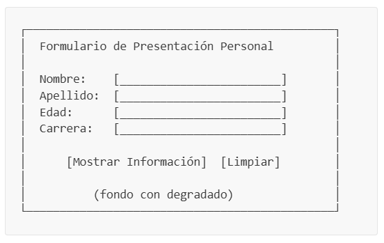
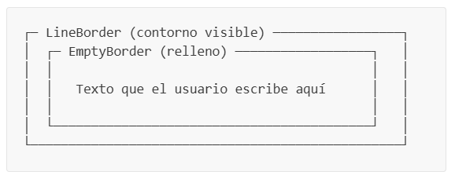
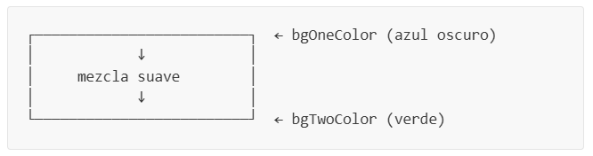

# Formulario de Presentación Personal con Java Swing

**Materia:** SIS-211  
**Tema:** Interfaces Gráficas de Usuario — Fundamentos de Java Swing  

---

## Tabla de Contenidos

- [Objetivos de Aprendizaje](#objetivos-de-aprendizaje)
- [Introducción](#introducción)
- [Conceptos Previos](#conceptos-previos)
  - [¿Qué es Java Swing?](#qué-es-java-swing)
  - [La Jerarquía de Componentes](#la-jerarquía-de-componentes)
  - [¿Qué es un JFrame?](#qué-es-un-jframe)
  - [¿Qué es un JPanel?](#qué-es-un-jpanel)
  - [¿Qué es un Layout Manager?](#qué-es-un-layout-manager)
  - [¿Qué son los Eventos y Listeners?](#qué-son-los-eventos-y-listeners)
  - [¿Qué es un JOptionPane?](#qué-es-un-joptionpane)
  - [¿Qué es la Herencia y por qué la usamos aquí?](#qué-es-la-herencia-y-por-qué-la-usamos-aquí)
- [Estructura del Proyecto](#estructura-del-proyecto)
- [Parte 1 — Componentes de UI Personalizados](#parte-1--componentes-de-ui-personalizados)
  - [Paso 1.1: Crear el componente Label](#paso-11-crear-el-componente-label)
  - [Paso 1.2: Crear el componente InputField](#paso-12-crear-el-componente-inputfield)
  - [Paso 1.3: Crear el componente Button](#paso-13-crear-el-componente-button)
  - [Paso 1.4: Crear el componente Panel](#paso-14-crear-el-componente-panel)
- [Parte 2 — La Ventana Principal](#parte-2--la-ventana-principal)
  - [Paso 2.1: Crear la clase Window](#paso-21-crear-la-clase-window)
  - [Paso 2.2: Construir el layout del formulario](#paso-22-construir-el-layout-del-formulario)
  - [Paso 2.3: Implementar la lógica de envío](#paso-23-implementar-la-lógica-de-envío)
  - [Paso 2.4: Implementar la lógica de limpieza](#paso-24-implementar-la-lógica-de-limpieza)
- [Parte 3 — Punto de Entrada de la Aplicación](#parte-3--punto-de-entrada-de-la-aplicación)
  - [Paso 3.1: Crear la clase App](#paso-31-crear-la-clase-app)
- [Parte 4 — Compilación y Pruebas](#parte-4--compilación-y-pruebas)
- [Parte 5 — Desafíos](#parte-5--desafíos)
  - [Desafío 1: Agregar un nuevo campo (Email)](#desafío-1-agregar-un-nuevo-campo-email)
  - [Desafío 2: Cambiar los colores del degradado](#desafío-2-cambiar-los-colores-del-degradado)
  - [Desafío 3: Agregar un contador de envíos](#desafío-3-agregar-un-contador-de-envíos)
  - [Desafío 4: Reemplazar el campo Carrera con un dropdown](#desafío-4-reemplazar-el-campo-carrera-con-un-dropdown)
- [Criterios de Evaluación](#criterios-de-evaluación)

---

## Objetivos de Aprendizaje

Al completar esta práctica, el estudiante será capaz de:

1. Crear ventanas e interfaces gráficas usando **Java Swing**.
2. Utilizar componentes básicos de Swing: `JLabel`, `JTextField`, `JButton`, `JPanel`.
3. Organizar componentes visualmente usando **Layout Managers** (`GridBagLayout`, `BorderLayout`).
4. Capturar la interacción del usuario mediante **eventos** y **listeners** (`ActionListener`).
5. Mostrar información al usuario usando **cuadros de diálogo** (`JOptionPane`).
6. Aplicar **herencia** para crear componentes de UI personalizados y reutilizables.

---

## Introducción

En esta práctica construiremos un **Formulario de Presentación Personal** — una aplicación de escritorio con interfaz gráfica (GUI). La aplicación permitirá al usuario ingresar su nombre, apellido, edad y carrera universitaria, y luego mostrará la información ingresada en un cuadro de diálogo emergente.

A lo largo del camino, aprenderemos cómo crear componentes personalizados extendiendo clases de Swing, organizarlos en un diseño visualmente atractivo, y responder a los clics de botones con manejo de eventos.

La aplicación final se verá así:



---

## Conceptos Previos

Antes de empezar a programar, comprendamos los conceptos fundamentales detrás de las aplicaciones Java Swing. Lee cada sección con atención — estas definiciones te ayudarán a entender **por qué** escribimos el código de cierta manera.

---

### ¿Qué es Java Swing?

**Java Swing** es un toolkit para construir interfaces gráficas de usuario (GUI) que viene incluido en la biblioteca estándar de Java. Proporciona un conjunto de componentes — botones, campos de texto, etiquetas, paneles, ventanas — que puedes combinar para crear aplicaciones de escritorio con interfaces visuales.

Los componentes de Swing se encuentran en el paquete `javax.swing`. Algunas clases clave incluyen:

| Clase | Propósito |
|-------|-----------|
| `JFrame` | La ventana principal de la aplicación |
| `JPanel` | Un contenedor para agrupar y organizar otros componentes |
| `JLabel` | Muestra texto o una imagen (no editable) |
| `JTextField` | Un campo de entrada de texto de una sola línea |
| `JButton` | Un botón que se puede hacer clic |
| `JOptionPane` | Cuadros de diálogo predefinidos (alertas, confirmaciones, entrada) |

> **Idea clave:** Cada elemento visual que ves en una aplicación Swing es un **componente**. Los componentes se organizan en una jerarquía tipo árbol: el `JFrame` es la raíz, los `JPanel` son las ramas, y los componentes individuales (etiquetas, botones, campos) son las hojas.

---

### La Jerarquía de Componentes

Los componentes de Swing siguen una jerarquía padre-hijo. Cada componente debe colocarse dentro de un **contenedor** (como un `JPanel` o `JFrame`). Así es como funciona en nuestra aplicación:

```
JFrame (Window)
 └── JPanel (backgroundPanel — fondo con degradado)
      └── JPanel (formPanel — contiene el formulario)
           ├── JLabel  (título)
           ├── JLabel  (Nombre:)
           ├── JTextField (entrada de nombre)
           ├── JLabel  (Apellido:)
           ├── JTextField (entrada de apellido)
           ├── JLabel  (Edad:)
           ├── JTextField (entrada de edad)
           ├── JLabel  (Carrera:)
           ├── JTextField (entrada de carrera)
           └── JPanel (buttonPanel)
                ├── JButton (Enviar)
                └── JButton (Limpiar)
```

> **Piénsalo como cajas anidadas:** una caja grande (JFrame) contiene una caja mediana (panel de fondo), que contiene una caja más pequeña (panel del formulario), que contiene elementos individuales (etiquetas, campos, botones).

---

### ¿Qué es un JFrame?

Un **`JFrame`** es la **ventana** principal de una aplicación Swing. Proporciona la barra de título, los botones de minimizar/maximizar/cerrar, y el área donde colocas tu contenido.

```java
JFrame frame = new JFrame("My Window Title");
frame.setSize(500, 400);                          // Ancho × Alto en píxeles
frame.setDefaultCloseOperation(JFrame.EXIT_ON_CLOSE); // Cerrar programa al cerrar ventana
frame.setLocationRelativeTo(null);                 // Centrar la ventana en pantalla
frame.setVisible(true);                            // Mostrar la ventana
```

**Métodos importantes:**

| Método | Qué hace |
|--------|----------|
| `setTitle(String)` | Establece el texto de la barra de título |
| `setSize(width, height)` | Establece las dimensiones de la ventana en píxeles |
| `setDefaultCloseOperation(...)` | Define qué sucede cuando el usuario hace clic en ✕ |
| `setLocationRelativeTo(null)` | Centra la ventana en la pantalla |
| `setVisible(true)` | Hace que la ventana aparezca |
| `setLayout(LayoutManager)` | Establece cómo se organizan los componentes hijos |
| `add(Component)` | Agrega un componente hijo a la ventana |

> **Importante:** `setDefaultCloseOperation(JFrame.EXIT_ON_CLOSE)` asegura que el proceso Java termine cuando se cierra la ventana. Sin esto, el programa seguiría ejecutándose invisiblemente en segundo plano.

---

### ¿Qué es un JPanel?

Un **`JPanel`** es un contenedor invisible utilizado para **agrupar y organizar** otros componentes. Piénsalo como una caja transparente que mantiene juntos los elementos relacionados.

```java
JPanel panel = new JPanel();
panel.setLayout(new GridBagLayout());  // Elegir cómo se organizan los hijos
panel.add(new JLabel("Hello"));        // Agregar componentes al panel
panel.add(new JButton("Click me"));
```

**¿Por qué usar paneles?**
- **Organización:** Agrupar componentes relacionados (por ejemplo, una etiqueta y su campo de texto juntos).
- **Control de layout:** Cada panel puede tener su propio `LayoutManager`, permitiendo que diferentes secciones de tu ventana usen diferentes arreglos.
- **Estilo visual:** Los paneles pueden tener fondos, bordes y pintura personalizada (como nuestro fondo con degradado).

---

### ¿Qué es un Layout Manager?

Un **Layout Manager** es un objeto que controla **cómo se posicionan y dimensionan los componentes** dentro de un contenedor (como un `JPanel` o `JFrame`). En lugar de especificar manualmente coordenadas en píxeles para cada componente (lo cual es frágil y no se adapta al redimensionamiento de la ventana), dejas que un Layout Manager maneje el posicionamiento automáticamente.

**Layout Managers comunes:**

| Layout | Descripción | Ideal para |
|--------|-------------|------------|
| `FlowLayout` | Coloca componentes de izquierda a derecha, saltando a la siguiente línea | Filas simples de botones |
| `GridLayout(rows, cols)` | Organiza componentes en una cuadrícula de celdas iguales | Tablas, calculadoras |
| `BorderLayout` | Divide el contenedor en 5 regiones: NORTH, SOUTH, EAST, WEST, CENTER | Estructura de ventana principal |
| `GridBagLayout` | El más flexible — cada componente tiene su propio tamaño y restricciones de posición | Formularios complejos |
| `null` (sin layout) | Estableces posiciones exactas en píxeles con `setBounds()` | ❌ Evitar — no se redimensiona |

**En este proyecto usamos:**
- **`BorderLayout`** para la estructura de la ventana principal (el fondo llena todo el centro).
- **`GridBagLayout`** para el formulario, porque nos permite alinear etiquetas en una columna y campos de texto en otra, con control total sobre el espaciado.

> **Regla de oro:** Nunca uses layout `null` en código de producción. Puede parecer más fácil al principio, pero tu interfaz se romperá cuando el usuario redimensione la ventana o use una resolución de pantalla diferente.

**Guía rápida de GridBagLayout:**

`GridBagLayout` trabaja con un objeto auxiliar llamado `GridBagConstraints` (frecuentemente abreviado `gbc`). Este objeto le dice al layout dónde colocar cada componente:

```java
GridBagConstraints gbc = new GridBagConstraints();
gbc.gridx = 0;          // Columna (0 = primera columna)
gbc.gridy = 0;          // Fila (0 = primera fila)
gbc.gridwidth = 2;      // Abarcar 2 columnas
gbc.weightx = 1.0;      // Cuánto espacio horizontal extra absorber (0.0 a 1.0)
gbc.fill = GridBagConstraints.HORIZONTAL;  // Estirar para llenar el espacio horizontal
gbc.insets = new Insets(8, 10, 8, 10);     // Relleno: arriba, izquierda, abajo, derecha

panel.add(myComponent, gbc);  // Agregar componente con estas restricciones
```

Piénsalo como una hoja de cálculo: `gridx` es la columna, `gridy` es la fila, `gridwidth` es cuántas columnas abarca la celda, e `insets` es el relleno alrededor de la celda.

---

### ¿Qué son los Eventos y Listeners?

En Swing, las acciones del usuario (hacer clic en un botón, escribir texto, mover el mouse) generan **eventos**. Para responder a estos eventos, registras un **listener** — un objeto que "escucha" un tipo específico de evento y ejecuta código cuando ocurre.

**El patrón más común: ActionListener en un botón**

```java
// Forma tradicional (clase anónima):
button.addActionListener(new ActionListener() {
    @Override
    public void actionPerformed(ActionEvent e) {
        System.out.println("Button was clicked!");
    }
});

// Forma moderna (expresión lambda — mucho más corta):
button.addActionListener(e -> System.out.println("Button was clicked!"));
```

**El flujo es:**

```
Usuario hace clic → Swing crea un ActionEvent → Se ejecuta el código de tu listener
```

> **¿Por qué lambdas?** La interfaz `ActionListener` tiene un solo método (`actionPerformed`), lo que la convierte en una *interfaz funcional*. Java nos permite reemplazar toda la clase anónima con una expresión lambda concisa `e -> { ... }`.

En nuestro proyecto, simplificamos esto aún más con un método personalizado `setOnClickListener(Runnable)` que oculta el parámetro `ActionEvent` ya que no lo usamos:

```java
// Nuestra API simplificada:
button.setOnClickListener(() -> System.out.println("Clicked!"));
```

---

### ¿Qué es un JOptionPane?

**`JOptionPane`** proporciona **cuadros de diálogo** listos para usar que permiten mostrar mensajes, pedir confirmación o solicitar entrada de datos. No necesitas crear una ventana separada — simplemente llama a un método estático:

```java
// Mensaje informativo (ícono ℹ):
JOptionPane.showMessageDialog(parentFrame, "Hello World!", "Title", JOptionPane.INFORMATION_MESSAGE);

// Mensaje de advertencia (ícono ⚠):
JOptionPane.showMessageDialog(parentFrame, "Please fill all fields", "Warning", JOptionPane.WARNING_MESSAGE);

// Mensaje de error (ícono ✕):
JOptionPane.showMessageDialog(parentFrame, "Invalid input!", "Error", JOptionPane.ERROR_MESSAGE);
```

**Parámetros de `showMessageDialog`:**

| Parámetro | Qué significa |
|-----------|---------------|
| `parentFrame` | La ventana "dueña" del diálogo (se centra sobre ella). Usa `this` dentro de un JFrame. |
| `message` | El texto a mostrar |
| `title` | El texto de la barra de título del diálogo |
| `messageType` | El ícono a mostrar (`INFORMATION_MESSAGE`, `WARNING_MESSAGE`, `ERROR_MESSAGE`) |

---

### ¿Qué es la Herencia y por qué la usamos aquí?

La **herencia** es un concepto fundamental en la Programación Orientada a Objetos donde una nueva clase **extiende** una clase existente, heredando todas sus propiedades y métodos mientras agrega nueva funcionalidad.

En este proyecto, creamos componentes personalizados extendiendo clases de Swing:

```java
public class Button extends JButton { ... }     // Nuestro Button ES un JButton con extras
public class Label extends JLabel { ... }         // Nuestro Label ES un JLabel con extras
public class InputField extends JTextField { ... } // Nuestro InputField ES un JTextField con extras
public class Panel extends JPanel { ... }         // Nuestro Panel ES un JPanel con extras
```

**¿Por qué hacemos esto?**

1. **Estilos consistentes:** En lugar de configurar la fuente, color y borde en cada `JButton` que creamos, definimos el estilo una vez en nuestra clase `Button`. Cada `Button` que creemos obtiene automáticamente el mismo aspecto.

2. **Comportamiento personalizado:** Podemos agregar nuevos métodos como `setOnClickListener(Runnable)` que no existen en el `JButton` original.

3. **Reutilización:** Si necesitamos 10 botones en nuestra app, todos se ven iguales sin repetir código.

```java
// Sin herencia (repetitivo):
JButton btn1 = new JButton("Save");
btn1.setFont(new Font("Segoe UI", Font.BOLD, 14));
btn1.setForeground(Color.WHITE);
btn1.setBackground(new Color(60, 90, 180));

JButton btn2 = new JButton("Cancel");
btn2.setFont(new Font("Segoe UI", Font.BOLD, 14));  // ¡Mismo código repetido!
btn2.setForeground(Color.WHITE);
btn2.setBackground(new Color(60, 90, 180));

// Con herencia (limpio):
Button btn1 = new Button("Save");     // Estilizado automáticamente
Button btn2 = new Button("Cancel");   // Estilizado automáticamente
```

---

## Estructura del Proyecto

Crea la siguiente estructura de carpetas para tu proyecto. Si estás usando VS Code con el Java Extension Pack, las carpetas `src/`, `bin/` y `lib/` ya deberían existir.

```
PersonalForm/
├── src/
│   ├── App.java              ← Punto de entrada
│   ├── Window.java           ← Ventana principal con el formulario
│   └── ui/
│       ├── Button.java       ← JButton personalizado
│       ├── InputField.java   ← JTextField personalizado
│       ├── Label.java        ← JLabel personalizado
│       └── Panel.java        ← JPanel personalizado con degradado
├── bin/                      ← Archivos .class compilados (auto-generados)
└── lib/                      ← Dependencias (vacío para este proyecto)
```

> **Nota sobre paquetes:** La carpeta `ui/` dentro de `src/` es un **paquete** Java. Los archivos dentro de ella deben comenzar con `package ui;` en la parte superior. Los archivos directamente en `src/` (como `App.java` y `Window.java`) pertenecen al **paquete por defecto** y no tienen declaración `package`.

---

## Parte 1 — Componentes de UI Personalizados

Comenzamos construyendo nuestros propios componentes reutilizables. Cada uno extiende una clase de Swing y aplica un estilo visual consistente.

---

### Paso 1.1: Crear el componente `Label`

📄 **Archivo:** `src/ui/Label.java`

Nuestro `Label` extiende `JLabel` y aplica una fuente y color por defecto para que cada etiqueta en la aplicación se vea consistente.

```java
package ui;

import java.awt.Color;
import java.awt.Font;

import javax.swing.JLabel;

/**
 * Custom label with default styling.
 * Extends JLabel to provide consistent font and color.
 */
public class Label extends JLabel {

    public Label(String text) {
        super(text);
        applyStyle();
    }

    public Label() {
        super();
        applyStyle();
    }

    /**
     * Applies consistent visual styles to the label.
     */
    private void applyStyle() {
        this.setFont(new Font("Segoe UI", Font.BOLD, 14));
        this.setForeground(Color.WHITE);
    }
}
```

**Entendamos cada parte:**

- **`package ui;`** — Este archivo pertenece al paquete `ui` (la carpeta `ui/`).
- **`extends JLabel`** — Nuestro `Label` hereda todo de `JLabel` (todos sus métodos y propiedades).
- **`super(text)`** — Llama al constructor de la clase padre (`JLabel`), pasándole el texto a mostrar.
- **`applyStyle()`** — Un método auxiliar privado que establece la fuente y el color. Se llama desde ambos constructores para que cada `Label` que creemos tenga el mismo estilo.
- **`new Font("Segoe UI", Font.BOLD, 14)`** — Crea una fuente con familia "Segoe UI", peso negrita y tamaño 14 puntos.
- **`Color.WHITE`** — Establece el color del texto en blanco (para que sea visible sobre nuestro fondo oscuro con degradado).

> **¿Por qué `private`?** El método `applyStyle()` está marcado como `private` porque es un detalle de implementación interna. Nadie fuera de esta clase necesita llamarlo — se ejecuta automáticamente cuando se crea un `Label`.

---

### Paso 1.2: Crear el componente `InputField`

📄 **Archivo:** `src/ui/InputField.java`

El `InputField` extiende `JTextField` y aplica estilos visuales. De forma crítica, **no** sobreescribe `getText()` — dejamos que el método integrado de `JTextField` se encargue de leer el texto que el usuario ha escrito.

```java
package ui;

import java.awt.Color;
import java.awt.Font;

import javax.swing.JTextField;
import javax.swing.border.CompoundBorder;
import javax.swing.border.EmptyBorder;
import javax.swing.border.LineBorder;

/**
 * Custom text field with default styling.
 * Extends JTextField without breaking its contract (getText returns the real text).
 */
public class InputField extends JTextField {

    public InputField(String text) {
        super(text);
        applyStyle();
    }

    public InputField() {
        super();
        applyStyle();
    }

    /**
     * Applies consistent visual styles to the text field.
     */
    private void applyStyle() {
        this.setFont(new Font("Segoe UI", Font.PLAIN, 14));
        this.setForeground(new Color(33, 33, 33));
        this.setBackground(new Color(245, 245, 250));
        this.setCaretColor(new Color(60, 90, 180));
        this.setBorder(new CompoundBorder(
                new LineBorder(new Color(180, 180, 200), 1, true),
                new EmptyBorder(6, 10, 6, 10)));
    }
}
```

**Conceptos nuevos aquí:**

- **`setCaretColor()`** — El *caret* es el cursor parpadeante dentro del campo de texto. Lo configuramos en un tono azul.

- **`CompoundBorder`** — Combina dos bordes en uno. Aquí combinamos:
  - Un `LineBorder` exterior (una línea delgada de color alrededor del campo)
  - Un `EmptyBorder` interior (relleno invisible para que el texto no toque los bordes)

  

- **`new LineBorder(color, grosor, esquinasRedondeadas)`** — El tercer parámetro `true` hace que las esquinas sean ligeramente redondeadas.

> **Regla de diseño importante:** **No** sobreescribimos `getText()` ni `setText()`. La clase `JTextField` ya sabe cómo leer lo que el usuario ha escrito. Si sobreescribimos `getText()` incorrectamente, podríamos romper esto — por ejemplo, devolviendo siempre el texto inicial en lugar de lo que realmente se escribió. Deja que la clase padre maneje lo que ya hace bien; solo agrega comportamiento nuevo.

---

### Paso 1.3: Crear el componente `Button`

📄 **Archivo:** `src/ui/Button.java`

Nuestro `Button` extiende `JButton` con estilos y agrega un método conveniente `setOnClickListener` que simplifica el manejo de eventos.

```java
package ui;

import java.awt.Color;
import java.awt.Cursor;
import java.awt.Font;

import javax.swing.JButton;
import javax.swing.border.CompoundBorder;
import javax.swing.border.EmptyBorder;
import javax.swing.border.LineBorder;

/**
 * Custom button with default styling and click listener support.
 * Extends JButton with a simplified API for assigning actions.
 */
public class Button extends JButton {

    public Button(String text) {
        super(text);
        applyStyle();
    }

    public Button() {
        super();
        applyStyle();
    }

    /**
     * Registers an action to execute when the user clicks the button.
     *
     * @param onClick the action to execute
     */
    public void setOnClickListener(Runnable onClick) {
        this.addActionListener(e -> onClick.run());
    }

    /**
     * Applies consistent visual styles to the button.
     */
    private void applyStyle() {
        this.setFont(new Font("Segoe UI", Font.BOLD, 14));
        this.setForeground(Color.WHITE);
        this.setBackground(new Color(60, 90, 180));
        this.setFocusPainted(false);
        this.setCursor(new Cursor(Cursor.HAND_CURSOR));
        this.setBorder(new CompoundBorder(
                new LineBorder(new Color(45, 70, 150), 1, true),
                new EmptyBorder(8, 20, 8, 20)));
    }
}
```

**Conceptos nuevos aquí:**

- **`setOnClickListener(Runnable onClick)`** — Este es nuestro método personalizado. `Runnable` es una interfaz funcional que representa "una acción sin parámetros y sin valor de retorno". Internamente, la convertimos en un `ActionListener` de Swing:

  ```java
  this.addActionListener(e -> onClick.run());
  //                     ↑ ActionEvent (ignorado)
  //                          ↑ ejecuta el Runnable
  ```

  Esto permite a los usuarios escribir código limpio como:
  ```java
  button.setOnClickListener(() -> System.out.println("Clicked!"));
  ```

- **`setFocusPainted(false)`** — Elimina el rectángulo punteado que Swing dibuja alrededor de un botón enfocado. Se ve más limpio sin él.

- **`new Cursor(Cursor.HAND_CURSOR)`** — Cambia el cursor del mouse a una mano señaladora al pasar sobre el botón, como hacen los enlaces web. Este es un detalle pequeño pero importante de **accesibilidad** — le dice al usuario "este elemento se puede hacer clic".

---

### Paso 1.4: Crear el componente `Panel`

📄 **Archivo:** `src/ui/Panel.java`

Nuestro `Panel` extiende `JPanel` con la capacidad de pintar un **fondo con degradado** — una transición suave de color de uno a otro.

```java
package ui;

import java.awt.Color;
import java.awt.Component;
import java.awt.GradientPaint;
import java.awt.Graphics;
import java.awt.Graphics2D;
import java.awt.RenderingHints;

import javax.swing.JPanel;

/**
 * Custom panel with gradient background support.
 * When isGradient is true, paints a vertical gradient between two colors.
 * When false, the panel is transparent so the parent's background shows through.
 */
public class Panel extends JPanel {
    private boolean isGradient;
    private Color bgOneColor;
    private Color bgTwoColor;

    /**
     * Creates a panel with a custom gradient.
     *
     * @param bgOneColor starting color of the gradient (top)
     * @param bgTwoColor ending color of the gradient (bottom)
     * @param isGradient true to enable the gradient background
     */
    public Panel(Color bgOneColor, Color bgTwoColor, boolean isGradient) {
        this.bgOneColor = bgOneColor;
        this.bgTwoColor = bgTwoColor;
        this.isGradient = isGradient;
    }

    /**
     * Creates a panel with or without gradient using default colors.
     *
     * @param isGradient true to enable the gradient background with default colors
     */
    public Panel(boolean isGradient) {
        this.bgOneColor = new Color(5, 25, 55);
        this.bgTwoColor = new Color(168, 235, 18);
        this.isGradient = isGradient;
    }

    /**
     * Adds a generic Swing component to the panel.
     *
     * @param component the component to add (must extend java.awt.Component)
     */
    public void addComponent(Component component) {
        this.add(component);
    }

    @Override
    protected void paintComponent(Graphics g) {
        super.paintComponent(g);
        if (isGradient) {
            Graphics2D g2d = (Graphics2D) g;
            g2d.setRenderingHint(
                    RenderingHints.KEY_RENDERING,
                    RenderingHints.VALUE_RENDER_QUALITY);
            GradientPaint gradient = new GradientPaint(
                    0, 0, this.bgOneColor,
                    0, getHeight(), this.bgTwoColor);
            g2d.setPaint(gradient);
            g2d.fillRect(0, 0, getWidth(), getHeight());
        }
    }
}
```

**Este es el componente más avanzado. Desglosemos `paintComponent`:**

- **`@Override protected void paintComponent(Graphics g)`** — Este método es llamado por Swing **cada vez que el panel necesita ser dibujado** (cuando la ventana aparece, cuando se redimensiona, cuando se des-minimiza, etc.). Al sobreescribirlo, podemos dibujar gráficos personalizados.

- **`super.paintComponent(g)`** — Siempre llama primero al método del padre. Este limpia el panel y pinta el fondo por defecto. Omitir esto causa artefactos visuales (imágenes fantasma).

- **`Graphics2D g2d = (Graphics2D) g`** — Hacemos un cast del objeto `Graphics` a `Graphics2D`, que proporciona capacidades de dibujo más avanzadas como degradados y antialiasing.

- **`RenderingHints.VALUE_RENDER_QUALITY`** — Le dice a Java que priorice la calidad visual sobre la velocidad al renderizar. Esto hace que el degradado se vea más suave.

- **`GradientPaint`** — Define un degradado que transiciona de `bgOneColor` en la posición `(0, 0)` (esquina superior izquierda) a `bgTwoColor` en la posición `(0, getHeight())` (parte inferior). Esto crea un degradado **vertical**:

  

- **`g2d.fillRect(0, 0, getWidth(), getHeight())`** — Rellena toda el área del panel con el degradado.

> **Sobrecarga de constructores:** Observa que tenemos dos constructores. `Panel(Color, Color, boolean)` te permite especificar colores personalizados, mientras que `Panel(boolean)` usa colores por defecto. Esto es **sobrecarga de métodos** — mismo nombre de método, diferentes parámetros.

---

## Parte 2 — La Ventana Principal

Ahora construimos la clase `Window`, que es el corazón de nuestra aplicación. Crea el formulario, organiza todos los componentes y maneja la interacción del usuario.

---

### Paso 2.1: Crear la clase `Window`

📄 **Archivo:** `src/Window.java`

Comienza creando la estructura de la clase, el constructor y los métodos de inicialización. Nota que este archivo **no tiene declaración `package`** porque está en el paquete por defecto (directamente en `src/`).

```java
import java.awt.BorderLayout;
import java.awt.Color;
import java.awt.GridBagConstraints;
import java.awt.GridBagLayout;
import java.awt.Insets;
import java.util.LinkedHashMap;
import java.util.Map;
import java.util.stream.Stream;

import javax.swing.BorderFactory;
import javax.swing.JFrame;
import javax.swing.JOptionPane;
import javax.swing.UIManager;
import javax.swing.UnsupportedLookAndFeelException;
import javax.swing.plaf.nimbus.NimbusLookAndFeel;

import ui.Button;
import ui.InputField;
import ui.Label;
import ui.Panel;

public class Window extends JFrame {

    // ─── Form fields stored by key ──────────────────────────────────────

    private final Map<String, InputField> fields = new LinkedHashMap<>();

    // ─── Constructor ────────────────────────────────────────────────────

    public Window(String title, int width, int height) {
        applyLookAndFeel();
        initializeFrame(title, width, height);
        buildFormPanel();
    }
```

**Entendamos el diseño:**

- **`extends JFrame`** — Nuestra `Window` ES un `JFrame`, así que hereda toda la funcionalidad de ventana (barra de título, botón de cerrar, redimensionamiento, etc.).

- **`Map<String, InputField> fields`** — Almacenamos referencias a los campos de texto en un `Map` usando claves descriptivas (`"nombre"`, `"apellido"`, `"edad"`, `"carrera"`). Esto nos permite acceder a ellos fácilmente más tarde cuando leamos la entrada del usuario. Usamos `LinkedHashMap` para preservar el orden de inserción.

- El constructor llama a tres métodos en secuencia:
  1. `applyLookAndFeel()` — Establece el tema visual
  2. `initializeFrame()` — Configura las propiedades de la ventana
  3. `buildFormPanel()` — Crea y organiza todos los componentes del formulario

Ahora agrega los métodos de inicialización:

```java
    // ─── Look & Feel configuration ──────────────────────────────────────

    private void applyLookAndFeel() {
        try {
            UIManager.setLookAndFeel(new NimbusLookAndFeel());
        } catch (UnsupportedLookAndFeelException e) {
            System.err.println("Nimbus L&F not available, using default.");
        }
    }

    // ─── JFrame configuration ───────────────────────────────────────────

    private void initializeFrame(String title, int width, int height) {
        this.setTitle(title);
        this.setSize(width, height);
        this.setMinimumSize(new java.awt.Dimension(400, 500));
        this.setDefaultCloseOperation(JFrame.EXIT_ON_CLOSE);
        this.setLocationRelativeTo(null);
        this.setLayout(new BorderLayout());
    }
```

> **¿Qué es un Look & Feel?**  
> Un *Look & Feel* (L&F) define la apariencia visual de todos los componentes de Swing — fuentes, colores, formas de botones, estilos de barras de desplazamiento, etc. `NimbusLookAndFeel` es un tema moderno y multiplataforma incluido en Java que hace que las aplicaciones se vean más pulidas que el aspecto "Metal" por defecto. El `try-catch` es necesario porque el L&F podría no estar disponible en todos los sistemas.

> **`setMinimumSize`** evita que el usuario reduzca la ventana a un tamaño donde el formulario se vuelva inutilizable. Esta es una buena práctica de **accesibilidad**.

---

### Paso 2.2: Construir el layout del formulario

Este es el método más largo. Crea todos los componentes visuales y los organiza usando `GridBagLayout`. Agrega este método a la clase `Window`:

```java
    // ─── Build the form ─────────────────────────────────────────────────

    private void buildFormPanel() {
        // Background panel with gradient
        Panel backgroundPanel = new Panel(
                new Color(15, 32, 68),
                new Color(38, 100, 60),
                true);
        backgroundPanel.setLayout(new BorderLayout());

        // Form panel with GridBagLayout
        Panel formPanel = new Panel(false);
        formPanel.setOpaque(false);
        formPanel.setLayout(new GridBagLayout());
        formPanel.setBorder(BorderFactory.createEmptyBorder(30, 50, 30, 50));

        GridBagConstraints gbc = new GridBagConstraints();
        gbc.insets = new Insets(8, 10, 8, 10);
        gbc.fill = GridBagConstraints.HORIZONTAL;

        // ─── Form title ─────────────────────────────────────────────
        Label titleLabel = new Label("Formulario de Presentación Personal");
        titleLabel.setFont(titleLabel.getFont().deriveFont(20f));
        titleLabel.setHorizontalAlignment(Label.CENTER);

        gbc.gridx = 0;
        gbc.gridy = 0;
        gbc.gridwidth = 2;
        gbc.weightx = 1.0;
        gbc.insets = new Insets(10, 10, 25, 10);
        formPanel.add(titleLabel, gbc);

        // ─── Form fields ────────────────────────────────────────────
        String[] labelTexts = { "Nombre:", "Apellido:", "Edad:", "Carrera:" };
        String[] fieldKeys = { "nombre", "apellido", "edad", "carrera" };
        String[] tooltips = {
                "Ingrese su nombre",
                "Ingrese su apellido",
                "Ingrese su edad (número entero)",
                "Ingrese su carrera universitaria"
        };

        gbc.gridwidth = 1;
        gbc.insets = new Insets(8, 10, 8, 10);

        Stream.iterate(0, i -> i + 1).limit(labelTexts.length).forEach(i -> {
            // Label
            Label label = new Label(labelTexts[i]);
            gbc.gridx = 0;
            gbc.gridy = i + 1;
            gbc.weightx = 0.3;
            formPanel.add(label, gbc);

            // Text field (empty, ready for user input)
            InputField inputField = new InputField();
            inputField.setToolTipText(tooltips[i]);
            inputField.getAccessibleContext().setAccessibleName(labelTexts[i]);
            label.setLabelFor(inputField);

            gbc.gridx = 1;
            gbc.weightx = 0.7;
            formPanel.add(inputField, gbc);

            fields.put(fieldKeys[i], inputField);
        });

        // ─── Buttons ────────────────────────────────────────────────
        Panel buttonPanel = new Panel(false);
        buttonPanel.setOpaque(false);

        Button submitButton = new Button("Mostrar Información");
        submitButton.setToolTipText("Muestra los datos ingresados en una ventana emergente");
        submitButton.setOnClickListener(this::handleSubmit);

        Button clearButton = new Button("Limpiar");
        clearButton.setToolTipText("Borra todos los campos del formulario");
        clearButton.setBackground(new Color(120, 130, 145));
        clearButton.setOnClickListener(this::handleClear);

        buttonPanel.add(submitButton);
        buttonPanel.add(clearButton);

        gbc.gridx = 0;
        gbc.gridy = labelTexts.length + 1;
        gbc.gridwidth = 2;
        gbc.weightx = 1.0;
        gbc.insets = new Insets(20, 10, 10, 10);
        formPanel.add(buttonPanel, gbc);

        // ─── Assemble ───────────────────────────────────────────────
        backgroundPanel.add(formPanel, BorderLayout.CENTER);
        this.add(backgroundPanel, BorderLayout.CENTER);
    }
```

**Este método es largo, así que recorrámoslo sección por sección:**

**1. Crear dos paneles anidados:**
```java
Panel backgroundPanel = new Panel(..., true);   // Fondo con degradado — visible
Panel formPanel = new Panel(false);              // Contenedor del formulario — transparente
formPanel.setOpaque(false);                      // Hacerlo verdaderamente transparente
```
El panel del formulario se ubica encima del panel de fondo. Al hacerlo transparente (`setOpaque(false)`), el degradado se ve a través.

**2. Crear los campos del formulario usando arrays y un Stream:**
```java
String[] labelTexts = { "Nombre:", "Apellido:", "Edad:", "Carrera:" };
String[] fieldKeys  = { "nombre", "apellido", "edad", "carrera" };
String[] tooltips   = { "Ingrese su nombre", ... };

Stream.iterate(0, i -> i + 1).limit(labelTexts.length).forEach(i -> {
    // Para cada índice i, crear una etiqueta y un campo de texto
    Label label = new Label(labelTexts[i]);
    InputField inputField = new InputField();
    ...
    fields.put(fieldKeys[i], inputField);  // Guardar referencia para después
});
```

En lugar de repetir el mismo código 4 veces, usamos arrays paralelos e iteramos sobre ellos. Este es el **principio DRY** (*Don't Repeat Yourself* — No te repitas).

**3. Características de accesibilidad:**
```java
inputField.setToolTipText(tooltips[i]);                           // Muestra pista al pasar mouse
inputField.getAccessibleContext().setAccessibleName(labelTexts[i]); // Para lectores de pantalla
label.setLabelFor(inputField);                                     // Asocia etiqueta con campo
```

Estas tres líneas hacen el formulario más **accesible** para usuarios con discapacidades. Los lectores de pantalla pueden anunciar "Nombre: campo de texto" cuando el usuario navega hacia él.

**4. Method references para las acciones de los botones:**
```java
submitButton.setOnClickListener(this::handleSubmit);
clearButton.setOnClickListener(this::handleClear);
```

`this::handleSubmit` es un **method reference** — le dice al botón "cuando te hagan clic, llama al método `handleSubmit` de este objeto Window". Es equivalente a escribir `() -> this.handleSubmit()`.

---

### Paso 2.3: Implementar la lógica de envío

Agrega este método a la clase `Window`. Lee todos los campos, valida la entrada y muestra la información en un diálogo:

```java
    // ─── Submit button logic ────────────────────────────────────────────

    private void handleSubmit() {
        String nombre = fields.get("nombre").getText().trim();
        String apellido = fields.get("apellido").getText().trim();
        String edad = fields.get("edad").getText().trim();
        String carrera = fields.get("carrera").getText().trim();

        // Validation: empty fields
        if (nombre.isEmpty() || apellido.isEmpty() || edad.isEmpty() || carrera.isEmpty()) {
            JOptionPane.showMessageDialog(
                    this,
                    "Por favor, complete todos los campos.",
                    "Campos incompletos",
                    JOptionPane.WARNING_MESSAGE);
            return;
        }

        // Validation: age must be a positive integer
        try {
            int edadNum = Integer.parseInt(edad);
            if (edadNum <= 0 || edadNum > 120) {
                JOptionPane.showMessageDialog(
                        this,
                        "La edad debe ser un número entre 1 y 120.",
                        "Edad inválida",
                        JOptionPane.WARNING_MESSAGE);
                return;
            }
        } catch (NumberFormatException e) {
            JOptionPane.showMessageDialog(
                    this,
                    "La edad debe ser un número entero válido.",
                    "Edad inválida",
                    JOptionPane.ERROR_MESSAGE);
            return;
        }

        // Show information in a dialog
        String message = String.format(
                """
                Nombre: %s
                Apellido: %s
                Edad: %s
                Carrera: %s
                """,
                nombre, apellido, edad, carrera);

        JOptionPane.showMessageDialog(
                this,
                message,
                "Información Personal",
                JOptionPane.INFORMATION_MESSAGE);
    }
```

**El flujo de validación:**

```
Leer todos los campos → recortar espacios en blanco
         │
         ▼
   ¿Algún campo vacío? ──SÍ──► Mostrar diálogo de advertencia → PARAR
         │
         NO
         ▼
   ¿La edad es un número? ──NO──► Mostrar diálogo de error → PARAR
         │
         SÍ
         ▼
   ¿Edad en rango 1-120? ──NO──► Mostrar diálogo de advertencia → PARAR
         │
         SÍ
         ▼
   Mostrar diálogo de información ✓
```

**Conceptos clave:**

- **`.trim()`** — Elimina espacios en blanco al inicio y final. Sin esto, un usuario podría escribir "   " (solo espacios) y pasaría la verificación de vacío.

- **`Integer.parseInt(edad)`** — Intenta convertir el string de edad a un entero. Si el usuario escribió "abc" o "12.5", esto lanza una `NumberFormatException`.

- **`try-catch`** — Capturamos la `NumberFormatException` para mostrar un mensaje de error amigable en lugar de que la aplicación se cierre inesperadamente.

- **Text block (`""" ... """`)** — Un string multilínea (Java 15+). Esto es más limpio que concatenar strings con `+` y `\n`.

- **`return;`** — Después de mostrar un error de validación, hacemos `return` inmediatamente para evitar que el método continúe hasta el diálogo de éxito.

---

### Paso 2.4: Implementar la lógica de limpieza

Agrega este último método a la clase `Window` y cierra la clase con `}`:

```java
    // ─── Clear button logic ─────────────────────────────────────────────

    private void handleClear() {
        fields.values().forEach(field -> field.setText(""));
        fields.get("nombre").requestFocusInWindow();
    }
}
```

**Qué hace esto:**

1. **`fields.values().forEach(field -> field.setText(""))`** — Itera sobre todos los valores `InputField` en el mapa y establece cada uno como string vacío. Este es un enfoque de estilo funcional usando una lambda.

2. **`fields.get("nombre").requestFocusInWindow()`** — Mueve el cursor al campo "Nombre" para que el usuario pueda empezar a escribir inmediatamente de nuevo. Esta es una pequeña mejora de **usabilidad** — le ahorra al usuario un clic extra.

---

## Parte 3 — Punto de Entrada de la Aplicación

### Paso 3.1: Crear la clase `App`

📄 **Archivo:** `src/App.java`

Esta es la clase más simple del proyecto. Contiene el método `main` que inicia la aplicación.

```java
import javax.swing.SwingUtilities;

/**
 * Application entry point.
 *
 * Uses SwingUtilities.invokeLater to create the window on the
 * Swing Event Dispatch Thread (EDT), which is the recommended
 * way to initialize graphical interfaces in Java Swing.
 */
public class App {
    public static void main(String[] args) {
        SwingUtilities.invokeLater(() -> {
            Window window = new Window("Formulario de Presentación Personal", 520, 450);
            window.setVisible(true);
        });
    }
}
```

> **¿Por qué `SwingUtilities.invokeLater`?**  
> Swing **no es thread-safe**. Todas las operaciones de GUI deben ocurrir en un hilo especial llamado **Event Dispatch Thread (EDT)**. El método `main` se ejecuta en el hilo principal, así que usamos `invokeLater` para programar la creación de la ventana en el EDT. Esto previene errores sutiles como fallos visuales, congelamientos o componentes que no aparecen correctamente.
>
> **Piénsalo así:** El EDT es el "único mesero" en un restaurante. Todos los pedidos (actualizaciones de GUI) deben pasar por este mesero. Si intentas servir comida tú mismo (actualizar la GUI desde un hilo diferente), se produce el caos.

---

## Parte 4 — Compilación y Pruebas

### Requisitos

- **Java 17** o superior (usa *text blocks*)

### Compilar desde la terminal

```bash
javac -d bin src/ui/*.java src/Window.java src/App.java
```

### Ejecutar

```bash
java -cp bin App
```

### Probar la aplicación

Una vez que la aplicación esté corriendo, verifica lo siguiente:

1. ✅ La ventana aparece centrada en la pantalla con un fondo degradado.
2. ✅ Las 4 etiquetas y los 4 campos de texto son visibles y están correctamente alineados.
3. ✅ Haz clic en **"Mostrar Información"** con campos vacíos → aparece un diálogo de advertencia.
4. ✅ Escribe un valor no numérico en el campo Edad y haz clic en enviar → aparece un diálogo de error.
5. ✅ Escribe una edad válida fuera del rango 1-120 (ej: `999`) → aparece un diálogo de advertencia.
6. ✅ Llena todos los campos correctamente y haz clic en enviar → un diálogo informativo muestra todos los datos.
7. ✅ Haz clic en **"Limpiar"** → todos los campos se vacían y el cursor se mueve a "Nombre".
8. ✅ Pasa el mouse sobre cualquier campo o botón → aparece un tooltip.
9. ✅ Redimensiona la ventana → el formulario se adapta al nuevo tamaño (ningún componente desaparece).

---

## Parte 5 — Desafíos

Los siguientes desafíos deben ser implementados y serán evaluados durante la revisión. Cada desafío se construye sobre el proyecto base que acabas de completar.

---

### Desafío 1: Agregar un nuevo campo (Email)

**Dificultad:** ⭐ Fácil  
**Puntos:** 5

Agrega un quinto campo al formulario: **Email** (`Correo electrónico`).

**Requisitos:**
- Agrega una nueva etiqueta `"Email:"` y un nuevo `InputField` al formulario.
- El campo de email debe incluirse en la validación (no puede estar vacío).
- El valor del email debe aparecer en el diálogo `JOptionPane` de información junto con los demás campos.
- El layout debe mantenerse limpio y alineado.

**Pistas:**
- Mira los arrays `labelTexts`, `fieldKeys` y `tooltips` en `buildFormPanel()`. ¿Qué necesitas agregar a cada uno?
- Recuerda actualizar el formato del mensaje en `handleSubmit()`.

---

### Desafío 2: Cambiar los colores del degradado

**Dificultad:** ⭐ Fácil  
**Puntos:** 5

Cambia el degradado del fondo para usar un **par de colores diferente** a tu elección.

**Requisitos:**
- Los dos colores del degradado deben ser visiblemente diferentes a los actuales.
- El texto (etiquetas, título) debe seguir siendo claramente legible sobre el nuevo fondo.
- Incluye un breve comentario en el código explicando qué colores elegiste y por qué.

**Pistas:**
- Busca `new Panel(new Color(...), new Color(...), true)` en `buildFormPanel()`.
- El constructor de `Color` recibe valores RGB de 0 a 255: `new Color(rojo, verde, azul)`.
- Puedes usar una herramienta como [Google Color Picker](https://g.co/kgs/FjZFzM) para encontrar colores que te gusten.
- Prueba con combinaciones de colores claros y oscuros — asegúrate de que el texto blanco sea legible.

---

### Desafío 3: Agregar un contador de envíos

**Dificultad:** ⭐⭐ Intermedio  
**Puntos:** 7

Agrega un contador que rastree **cuántas veces** el formulario ha sido enviado exitosamente, y muéstralo en la ventana.

**Requisitos:**
- Agrega un `Label` en la parte inferior del formulario que muestre: `"Envíos exitosos: 0"`.
- Cada vez que `handleSubmit()` tenga éxito (pase todas las validaciones y muestre el diálogo de información), el contador aumenta en 1 y la etiqueta se actualiza.
- El contador solo debe aumentar en envíos **exitosos** (no cuando la validación falla).

**Pistas:**
- Necesitarás una nueva variable de instancia: `private int submitCount = 0;`
- Necesitarás una referencia de `Label` almacenada como variable de instancia para que `handleSubmit()` pueda actualizarla.
- Usa `label.setText("Envíos exitosos: " + submitCount)` para actualizar el texto.
- Coloca la etiqueta después del panel de botones en el `GridBagLayout` (incrementa `gridy`).

---

### Desafío 4: Reemplazar el campo Carrera con un dropdown

**Dificultad:** ⭐⭐⭐ Difícil  
**Puntos:** 8

Reemplaza el campo de texto de Carrera (`InputField`) con una **lista desplegable** (`JComboBox`) que contenga opciones de carrera predefinidas.

**Requisitos:**
- El dropdown debe contener al menos 5 opciones de carrera (ej: "Ingeniería de Sistemas", "Ingeniería Industrial", "Medicina", "Derecho", "Arquitectura").
- La carrera seleccionada debe aparecer en el diálogo `JOptionPane` de información.
- El dropdown debe ser visualmente consistente con el resto del formulario (fuente, tamaño).
- El botón "Limpiar" debe reiniciar el dropdown a su primera opción.

**Pistas:**
- `JComboBox<String>` es el componente dropdown de Swing:
  ```java
  String[] careers = {"Ingeniería de Sistemas", "Medicina", ...};
  JComboBox<String> comboBox = new JComboBox<>(careers);
  ```
- Para obtener el valor seleccionado: `(String) comboBox.getSelectedItem()`
- Para reiniciarlo: `comboBox.setSelectedIndex(0)`
- Necesitarás manejar el campo "carrera" de forma diferente ya que ya no es un `InputField`. Considera almacenarlo como una variable separada en lugar de en el mapa `fields`.

---

## Criterios de Evaluación

| Criterio | Puntos | Descripción |
|----------|--------|-------------|
| **Creación correcta de la interfaz** | 30 | La ventana se muestra correctamente con todos los componentes requeridos: 4 etiquetas, 4 campos de entrada, título, fondo con degradado y jerarquía de paneles bien estructurada. La ventana se cierra correctamente. |
| **Uso adecuado de componentes** | 20 | Uso correcto de `JLabel`, `JTextField`, `JButton`, `JPanel`. Los componentes están organizados con un Layout Manager (no layout `null`). Los componentes personalizados extienden clases de Swing correctamente con herencia. |
| **Evento funcional** | 25 | El botón "Mostrar Información" funciona correctamente: valida campos vacíos, valida edad numérica y muestra la información en un `JOptionPane`. El botón "Limpiar" vacía todos los campos. |
| **Desafío 1** — Agregar campo Email | 5 | El campo de email está agregado, validado y mostrado en el diálogo de salida. |
| **Desafío 2** — Cambiar colores del degradado | 5 | El degradado usa nuevos colores legibles con un comentario justificativo. |
| **Desafío 3** — Contador de envíos | 7 | La etiqueta del contador se actualiza correctamente solo en envíos exitosos. |
| **Desafío 4** — Dropdown de carrera | 8 | `JComboBox` reemplaza el campo de texto, funciona con la validación, salida y limpieza. |
| **Total** | **100** | |
