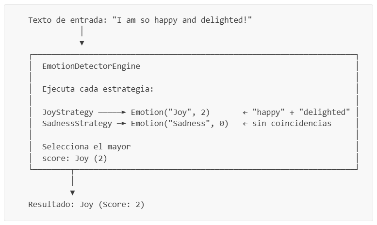
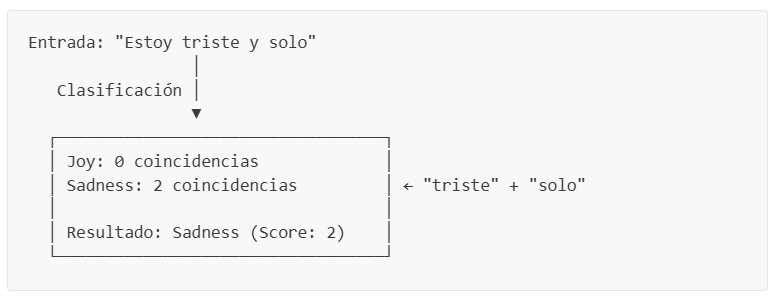
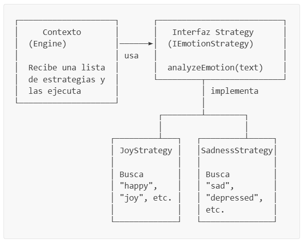
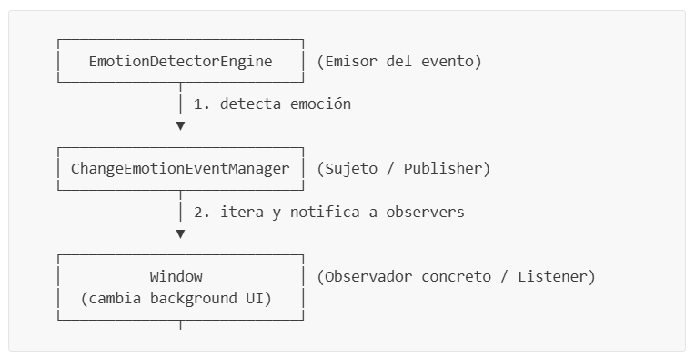

# Práctica de Laboratorio: Detector Básico de Emociones

**Materia:** SIS-211  
**Tema:** Patrón Strategy, Interfaces, Streams y Clasificación Heurística  

---

## Tabla de Contenidos

- [Objetivos de Aprendizaje](#objetivos-de-aprendizaje)
- [Introducción](#introducción)
- [Conceptos Previos](#conceptos-previos)
  - [¿Qué es el Procesamiento de Lenguaje Natural (NLP)?](#qué-es-el-procesamiento-de-lenguaje-natural-nlp)
  - [¿Qué es una Clasificación?](#qué-es-una-clasificación)
  - [¿Qué son las Reglas Heurísticas?](#qué-son-las-reglas-heurísticas)
  - [¿Qué es una Interfaz en Java?](#qué-es-una-interfaz-en-java)
  - [¿Qué es el Patrón de Diseño Strategy?](#qué-es-el-patrón-de-diseño-strategy)
  - [¿Qué es el Patrón de Diseño Observer?](#qué-es-el-patrón-de-diseño-observer)
  - [Layout Managers en Java Swing — BorderLayout](#layout-managers-en-java-swing--borderlayout)
  - [Streams en Java — Repaso Rápido](#streams-en-java--repaso-rápido)
  - [Method References en Java](#method-references-en-java)
- [Estructura del Proyecto](#estructura-del-proyecto)
- [Parte 1 — El Modelo de Datos](#parte-1--el-modelo-de-datos)
  - [Paso 1.1: Crear la clase Emotion](#paso-11-crear-la-clase-emotion)
- [Parte 2 — Definición de Contratos (Interfaces)](#parte-2--definición-de-contratos-interfaces)
  - [Paso 2.1: Crear la interfaz IEmotionStrategy](#paso-21-crear-la-interfaz-iemotionstrategy)
  - [Paso 2.2: Crear la interfaz IEmotionDetector](#paso-22-crear-la-interfaz-iemotiondetector)
- [Parte 3 — Estrategias de Detección](#parte-3--estrategias-de-detección)
  - [Paso 3.1: Crear JoyStrategy](#paso-31-crear-joystrategy)
  - [Paso 3.2: Crear SadnessStrategy](#paso-32-crear-sadnessstrategy)
- [Parte 4 — El Motor de Detección](#parte-4--el-motor-de-detección)
  - [Paso 4.1: Crear EmotionDetectorEngine](#paso-41-crear-emotiondetectorengine)
- [Parte 5 — Infraestructura del Patrón Observer y Componentes Visuales](#parte-5--infraestructura-del-patrón-observer-y-componentes-visuales)
  - [Paso 5.1: Crear la utilidad Pair](#paso-51-crear-la-utilidad-pair)
  - [Paso 5.2: Crear la interfaz del Observer](#paso-52-crear-la-interfaz-del-observer)
  - [Paso 5.3: Crear el gestor de eventos (ChangeEmotionEventManager)](#paso-53-crear-el-gestor-de-eventos-changeemotioneventmanager)
  - [Paso 5.4: Crear los componentes estilizados personalizados](#paso-54-crear-los-componentes-estilizados-personalizados)
- [Parte 6 — Ventana Principal de la Aplicación](#parte-6--ventana-principal-de-la-aplicación)
  - [Paso 6.1: Crear la interfaz gráfica (Window)](#paso-61-crear-la-interfaz-gráfica-window)
- [Parte 7 — Punto de Entrada Gráfico](#parte-7--punto-de-entrada-gráfico)
  - [Paso 7.1: Crear la clase App](#paso-71-crear-la-clase-app)
- [Parte 8 — Compilación y Ejecución de la UI](#parte-8--compilación-y-ejecución-de-la-ui)
- [Parte 9 — Desafíos](#parte-9--desafíos)
  - [Desafío 1: Agregar la emoción Enojo (AngerStrategy) y su color en la UI](#desafío-1-agregar-la-emoción-enojo-angerstrategy-y-su-color-en-the-ui)
  - [Desafío 2: Porcentaje de confianza dinámico en el UI](#desafío-2-porcentaje-de-confianza-dinámico-en-el-ui)
  - [Desafío 3: Historial de detecciones en la interfaz gráfica](#desafío-3-historial-de-detecciones-en-la-interfaz-gráfica)
  - [Desafío 4: Animación de parpadeo suave al resetear (Clear)](#desafío-4-animación-de-parpadeo-suave-al-resetear-clear)
- [Criterios de Evaluación](#criterios-de-evaluación)

---

## Objetivos de Aprendizaje

Al completar esta práctica, el estudiante será capaz de:

1. Comprender y aplicar el **patrón de diseño Strategy** para crear sistemas extensibles.
2. Definir **interfaces** como contratos entre componentes de software.
3. Utilizar **Streams** y **method references** para procesar datos de forma funcional.
4. Implementar un sistema básico de **clasificación por reglas heurísticas**.
5. Comprender los fundamentos del **Procesamiento de Lenguaje Natural (NLP)**.
6. Diseñar código que cumpla con el **Principio Abierto/Cerrado** (abierto a extensión, cerrado a modificación).
7. Comprender y aplicar el **patrón de diseño Observer** para comunicar componentes de forma reactiva y desacoplada.
8. Diseñar interfaces gráficas de usuario (GUI) responsivas en **Java Swing** estructuradas mediante **BorderLayout**.

---

## Introducción

En esta práctica construiremos un **Detector Básico de Emociones** — una aplicación gráfica de escritorio (**GUI en Java Swing**) que recibe un texto escrito por el usuario y determina la emoción predominante (alegría, tristeza o neutral) usando palabras clave, cambiando dinámicamente el fondo de la ventana para reflejar el estado de ánimo detectado.

Aunque parezca simple, este proyecto introduce conceptos fundamentales de **Inteligencia Artificial** y **arquitectura de software** que se usan en sistemas del mundo real:

- Los asistentes virtuales (Siri, Alexa, ChatGPT) analizan texto para detectar el *sentimiento* del usuario.
- Las redes sociales clasifican comentarios como positivos, negativos o neutros.
- Los sistemas de atención al cliente detectan enojo o frustración para priorizar tickets.

Nuestro detector es una versión simplificada de estos sistemas, pero utiliza la misma idea central: **buscar patrones en el texto para clasificarlo en una categoría**.

### ¿Cómo funciona?



---

## Conceptos Previos

Antes de empezar a programar, comprendamos los conceptos clave que usaremos a lo largo de toda la práctica.

---

### ¿Qué es el Procesamiento de Lenguaje Natural (NLP)?

El **Procesamiento de Lenguaje Natural** (*Natural Language Processing* o NLP) es una rama de la Inteligencia Artificial que se enfoca en la interacción entre computadoras y el lenguaje humano. Su objetivo es que las máquinas puedan "entender", interpretar y generar texto.

Es tal como lo hace ChatGPT: recibe texto, lo analiza para extraer significado, y genera una respuesta coherente. En nuestro proyecto, aplicamos NLP de forma muy básica: buscamos palabras clave en el texto para inferir la emoción.

**Algunos usos comunes de NLP:**

| Aplicación | Ejemplo |
|------------|---------|
| Análisis de sentimiento | Detectar si una reseña de producto es positiva o negativa |
| Chatbots | Comprender preguntas del usuario y responder |
| Traducción automática | Google Translate |
| Corrector ortográfico | Sugerencias de escritura en el teclado del celular |
| Búsqueda web | Entender qué busca el usuario cuando escribe una consulta |

En nuestro proyecto aplicamos NLP de forma muy básica:
1. **Normalización:** Convertimos el texto a minúsculas (`.toLowerCase()`) para que "FELIZ", "Feliz" y "feliz" sean tratados igual.
2. **Búsqueda de patrones léxicos:** Buscamos si ciertas palabras clave aparecen en el texto.

> **Nota:** Los sistemas de NLP del mundo real usan técnicas mucho más avanzadas como redes neuronales, embeddings y transformers. Nuestra implementación con palabras clave es una simplificación pedagógica, pero el concepto central — analizar texto para extraer significado — es el mismo.

---

### ¿Qué es una Clasificación?

**Clasificar** significa asignar una **categoría** (clase) a un dato de entrada según ciertas reglas o patrones aprendidos.

En nuestro caso:
- **Dato de entrada:** Un texto escrito por el usuario
- **Categorías posibles:** Joy (Alegría), Sadness (Tristeza), Neutral
- **Regla de clasificación:** Contar palabras clave de cada emoción y asignar la que tenga más coincidencias



> **Analogía:** Piensa en un clasificador como un buzón de correo con compartimentos etiquetados. Cada carta (texto) se coloca en el compartimento (emoción) que mejor le corresponde según su contenido.

---

### ¿Qué son las Reglas Heurísticas?

Una **heurística** es una regla práctica o "atajo" que nos permite llegar a una solución razonable sin necesidad de un análisis exhaustivo. No garantiza la respuesta perfecta, pero funciona bien en la mayoría de los casos.

En nuestro detector, las heurísticas son:
- "Si el texto contiene las palabras *happy*, *joy* o *delighted*, probablemente expresa **alegría**."
- "Si contiene *sad*, *depressed* o *unhappy*, probablemente expresa **tristeza**."
- "Si no contiene ninguna palabra clave, es **neutral**."

**Ventajas de las heurísticas:**
- Son fáciles de entender e implementar
- No requieren datos de entrenamiento (a diferencia del machine learning)
- Son rápidas de ejecutar

**Limitaciones:**
- No capturan contexto ("No estoy feliz" contiene "feliz" pero expresa tristeza)
- Dependen de un diccionario predefinido (si falta una palabra, no se detecta)
- No entienden ironía ni sarcasmo

---

### ¿Qué es una Interfaz en Java?

Una **interfaz** en Java es un **contrato** que define qué métodos debe tener una clase, sin especificar *cómo* los implementa. Es como un plano o acuerdo: "cualquier clase que firme este contrato debe proveer estos métodos".

```java
// Contrato: todo detector de emociones DEBE tener un método detectEmotion
public interface IEmotionDetector {
    Emotion detectEmotion(String text);
}
```

**¿Por qué usar interfaces?**

1. **Desacoplamiento:** El código que usa un `IEmotionDetector` no necesita saber *qué clase concreta* es. Solo sabe que tiene el método `detectEmotion()`.
2. **Extensibilidad:** Puedes crear múltiples implementaciones (un detector simple, uno avanzado con IA, uno para otro idioma) sin cambiar el código que las consume.
3. **Testabilidad:** Puedes crear implementaciones "falsas" (*mocks*) para pruebas.

```java
// Cualquier clase que implemente esta interfaz DEBE tener el método analyzeEmotion:
public interface IEmotionStrategy {
    Emotion analyzeEmotion(String text);
}

// JoyStrategy "firma el contrato" y provee su implementación:
public class JoyStrategy implements IEmotionStrategy {
    @Override
    public Emotion analyzeEmotion(String text) {
        // ... lógica específica para detectar alegría
    }
}
```

> **Convención de nombres:** En Java, es común usar el prefijo `I` para interfaces (como `IEmotionDetector`, `IEmotionStrategy`). Esto facilita distinguir interfaces de clases concretas al leer el código.

---

### ¿Qué es el Patrón de Diseño Strategy?

El **patrón Strategy** es uno de los patrones de diseño más importantes en programación orientada a objetos. Permite definir una **familia de algoritmos**, encapsular cada uno en su propia clase, y hacerlos **intercambiables** sin modificar el código que los usa.

**El patrón tiene 3 participantes:**



**¿Por qué es poderoso?**

Imagina que tu jefe te pide agregar detección de "enojo". Con el patrón Strategy:

1. Creas una nueva clase `AngerStrategy implements IEmotionStrategy`
2. La agregas a la lista de estrategias: `strategies.add(new AngerStrategy())`
3. **¡Listo!** No modificaste `EmotionDetectorEngine` ni ninguna otra clase existente.

Esto cumple con el **Principio Abierto/Cerrado (OCP):**
- **Abierto** a extensión: puedes agregar nuevas emociones fácilmente
- **Cerrado** a modificación: no necesitas cambiar código existente

> **Analogía:** Piensa en un reproductor de música. El reproductor (Contexto) puede tocar diferentes formatos: MP3, WAV, FLAC. Cada formato tiene su propio decodificador (Strategy). Para agregar soporte para un nuevo formato, solo agregas un nuevo decodificador — no modificas el reproductor.

---

### ¿Qué es el Patrón de Diseño Observer?

El **patrón Observer** (Observador) es un patrón de diseño de comportamiento que define una relación de dependencia de uno a muchos entre objetos, de forma que cuando un objeto (el **Sujeto** o *Subject*) cambia su estado, todos sus dependientes (los **Observadores** o *Observers*) son notificados y actualizados automáticamente.

Este patrón permite el **desacoplamiento total**: el sujeto que emite el evento no sabe quién lo está escuchando ni cómo reaccionará, solo se encarga de avisar.

**Componentes en nuestro proyecto:**
- **Sujeto/Publisher (`ChangeEmotionEventManager`):** Mantiene el registro de los escuchas y les distribuye las notificaciones.
- **Interfaz Observer (`ChangeEmotionEventListener`):** Define el contrato que firman los observadores (`onEmotionChanged`).
- **Observador concreto (`Window`):** Implementa la interfaz y actualiza la UI cuando recibe una notificación del motor.



---

### Layout Managers en Java Swing — BorderLayout

En Java Swing, no se posicionan los componentes usando coordenadas fijas (píxeles), ya que las ventanas pueden cambiar de tamaño. En su lugar, se utilizan **Layout Managers** (administradores de diseño) que distribuyen los elementos de forma elástica y adaptativa.

El **`BorderLayout`** divide el contenedor en 5 regiones geográficas:
- **`NORTH` (Norte):** Parte superior. Usualmente para títulos o barras de herramientas.
- **`SOUTH` (Sur):** Parte inferior. Usualmente para pies de página o barras de estado.
- **`EAST` (Este) y `WEST` (Oeste):** Laterales.
- **`CENTER` (Centro):** Ocupa todo el espacio restante. Es el área principal de trabajo.

**Regla de oro de BorderLayout:** Cada región de un `BorderLayout` puede contener **únicamente un componente**. Si agregas más de un componente a la misma posición (por ejemplo, dos elementos en `BorderLayout.CENTER`), el último reemplazará al anterior, provocando que no se muestren o se superpongan incorrectamente. 

Para colocar múltiples componentes en una sola región, debes agruparlos dentro de un sub-panel (`Panel` o `JPanel`) intermedio que administre su propio diseño.

---

### Streams en Java — Repaso Rápido

Los **Streams** permiten procesar colecciones de datos de forma funcional, sin bucles explícitos. Usamos streams extensivamente en este proyecto para contar palabras clave y comparar emociones.

**Operaciones que usaremos:**

| Operación | ¿Qué hace? | Ejemplo |
|-----------|-------------|---------|
| `Stream.of(array)` | Crea un stream a partir de un array | `Stream.of(keywords)` |
| `.filter(predicate)` | Conserva solo elementos que cumplen la condición | `.filter(lowerText::contains)` |
| `.count()` | Cuenta cuántos elementos pasaron el filtro | `.count()` |
| `.map(function)` | Transforma cada elemento | `.map(s -> s.analyzeEmotion(text))` |
| `.max(comparator)` | Encuentra el elemento máximo según un criterio | `.max(comparing score)` |
| `.orElse(default)` | Provee un valor por defecto si el resultado está vacío | `.orElse(new Emotion("Neutral", 0))` |
| `.toList()` | Recopila los resultados en una lista | `.toList()` |

**Ejemplo de nuestro proyecto — contar palabras clave en un texto:**

```java
String[] keywords = { "happy", "joy", "delighted" };
String text = "I am so happy and delighted";

long score = Stream.of(keywords)           // Stream: ["happy", "joy", "delighted"]
    .filter(text::contains)                // Filtro: ["happy", "delighted"] (joy no está)
    .count();                              // Conteo: 2

// score = 2
```

---

### Method References en Java

Un **method reference** es una forma abreviada de escribir una lambda que simplemente llama a un método existente.

En este proyecto usamos un tipo especial: **referencia a método de instancia de un objeto específico**.

```java
String lowerText = "i am so happy and delighted";

// Lambda completa:
Stream.of(keywords).filter(keyword -> lowerText.contains(keyword)).count();

// Method reference (equivalente, más concisa):
Stream.of(keywords).filter(lowerText::contains).count();
```

**¿Cómo funciona `lowerText::contains`?**

- `lowerText` es un objeto `String` específico (el texto del usuario en minúsculas).
- `::contains` es una referencia al método `contains` de ese objeto.
- Para cada keyword del stream, Swing llama `lowerText.contains(keyword)`.
- Si retorna `true`, el keyword pasa el filtro; si retorna `false`, es descartado.

```
Stream: ["happy", "joy", "delighted"]
                │
    lowerText::contains
    "i am so happy and delighted".contains("happy")     → true  ✓
    "i am so happy and delighted".contains("joy")       → false ✗
    "i am so happy and delighted".contains("delighted") → true  ✓
                │
Resultado: ["happy", "delighted"] → count() = 2
```

---

## Estructura del Proyecto

Crea la siguiente estructura de carpetas. Si usas VS Code con la extensión de Java, `src/`, `bin/` y `lib/` ya existirán.

```
BasicEmotionDetector/
├── src/
│   ├── App.java                          ← Punto de entrada (Swing EDT)
│   ├── Window.java                       ← Ventana principal (Observer)
│   ├── core/
│   │   ├── EmotionDetectorEngine.java    ← Motor de detección y sujeto Observer
│   │   ├── ChangeEmotionEventManager.java← Gestor de eventos de cambio de emoción
│   │   ├── EventNotifier.java            ← Notificador auxiliar
│   │   └── utils/
│   │       └── Pair.java                 ← Utilidad para par de elementos
│   ├── domain/
│   │   ├── interfaces/
│   │   │   ├── IEmotionDetector.java     ← Contrato del detector
│   │   │   └── IEmotionStrategy.java     ← Contrato de las estrategias
│   │   ├── listener/
│   │   │   └── ChangeEmotionEventListener.java ← Interfaz Observer
│   │   ├── model/
│   │   │   └── Emotion.java              ← Modelo de datos
│   │   └── strategies/
│   │       ├── JoyStrategy.java          ← Estrategia: Alegría
│   │       └── SadnessStrategy.java      ← Estrategia: Tristeza
│   └── components/
│       ├── Button.java                   ← JButton estilizado
│       ├── InputField.java               ← JTextField estilizado
│       ├── Label.java                    ← JLabel estilizado
│       └── Panel.java                    ← JPanel con fondo degradado dinámico
├── bin/
└── lib/
```

> **Organización de paquetes:**
> - **`domain`** contiene el dominio del problema: modelos, interfaces y estrategias independientes de la presentación.
> - **`core`** contiene la lógica operativa central y la implementación del patrón Observer.
> - **`components`** contiene clases Swing personalizadas reutilizables para garantizar una estética premium.
> - **`Window.java`** y **`App.java`** en la raíz orquestan y lanzan la aplicación gráfica en el hilo adecuado.

---

## Parte 1 — El Modelo de Datos

Empezamos por lo más simple: la clase que representa una emoción detectada.

---

### Paso 1.1: Crear la clase `Emotion`

📄 **Archivo:** `src/domain/model/Emotion.java`

La clase `Emotion` es un simple contenedor de datos que almacena el **nombre** de la emoción y su **puntaje** (cuántas palabras clave coincidieron).

```java
package domain.model;

public class Emotion {
    private String name;
    private Integer score;

    public Emotion(String name, Integer score) {
        this.name = name;
        this.score = score;
    }

    public String getName() {
        return name;
    }

    public Integer getScore() {
        return score;
    }
}
```

**Analicemos cada parte:**

- **`package domain.model;`** — Este archivo pertenece al paquete `domain.model` (carpeta `domain/model/`).

- **`private String name;`** — El nombre de la emoción, por ejemplo `"Joy"` o `"Sadness"`.

- **`private Integer score;`** — El puntaje de detección: cuántas palabras clave de esta emoción se encontraron en el texto. Usamos `Integer` (clase envolvente) en lugar de `int` (primitivo).

- **Constructor `Emotion(String name, Integer score)`** — Recibe ambos valores y los almacena.

- **Getters `getName()` y `getScore()`** — Métodos de acceso para leer los valores. Los atributos son `private`, así que solo se pueden leer a través de estos métodos. Esto es **encapsulamiento**.

> **¿Qué es el encapsulamiento?**  
> Es el principio de ocultar los datos internos de un objeto y proveer acceso controlado a través de métodos públicos. Esto protege la integridad de los datos — nadie puede modificar el `score` de una emoción directamente, solo leerlo.

> **¿Por qué es simple?**  
> Esta clase no tiene lógica — solo almacena datos. En patrones de diseño, esto se conoce como un **Data Transfer Object (DTO)** o **Value Object**. Su única responsabilidad es "llevar" los datos de un lugar a otro.

---

## Parte 2 — Definición de Contratos (Interfaces)

Ahora definimos los contratos que establecen qué métodos deben tener nuestros componentes.

---

### Paso 2.1: Crear la interfaz `IEmotionStrategy`

📄 **Archivo:** `src/domain/interfaces/IEmotionStrategy.java`

Esta interfaz define el contrato para las **estrategias de detección**. Cada estrategia analiza un texto y retorna un objeto `Emotion` con el nombre de la emoción y su puntaje.

```java
package domain.interfaces;

import domain.model.Emotion;

public interface IEmotionStrategy {
    Emotion analyzeEmotion(String text);
}
```

**Solo tiene un método:**
- **`analyzeEmotion(String text)`** — Recibe un texto, lo analiza buscando palabras clave de una emoción específica, y retorna un objeto `Emotion` con el nombre de esa emoción y cuántas palabras clave encontró.

> **Principio de responsabilidad única:** Cada estrategia solo se preocupa por **una emoción**. `JoyStrategy` solo busca alegría, `SadnessStrategy` solo busca tristeza. Esto hace que cada clase sea simple, fácil de entender y fácil de probar.

---

### Paso 2.2: Crear la interfaz `IEmotionDetector`

📄 **Archivo:** `src/domain/interfaces/IEmotionDetector.java`

Esta interfaz define el contrato del **detector general** — el componente que coordina todas las estrategias y determina la emoción ganadora.

```java
package domain.interfaces;

import domain.model.Emotion;

public interface IEmotionDetector {
    Emotion detectEmotion(String text);
}
```

**Solo tiene un método:**
- **`detectEmotion(String text)`** — Recibe un texto, ejecuta todas las estrategias disponibles, y retorna la `Emotion` con el mayor puntaje.

> **¿Cuál es la diferencia entre `IEmotionStrategy` y `IEmotionDetector`?**
>
> | | `IEmotionStrategy` | `IEmotionDetector` |
> |---|---|---|
> | **Responsabilidad** | Analiza **una** emoción | Coordina **todas** las estrategias |
> | **Cantidad** | Múltiples (una por emoción) | Una sola instancia |
> | **Retorna** | El score de **su** emoción | La emoción **ganadora** |
> | **Ejemplo** | `JoyStrategy`, `SadnessStrategy` | `EmotionDetectorEngine` |

---

## Parte 3 — Estrategias de Detección

Aquí implementamos las estrategias concretas. Cada una busca palabras clave de una emoción específica en el texto.

---

### Paso 3.1: Crear `JoyStrategy`

📄 **Archivo:** `src/domain/strategies/JoyStrategy.java`

Esta estrategia detecta **alegría** buscando palabras como "happy", "joy", "delighted" (en inglés) y "feliz", "contento", "alegre" (en español).

```java
package domain.strategies;

import java.util.stream.Stream;

import domain.interfaces.IEmotionStrategy;
import domain.model.Emotion;

public class JoyStrategy implements IEmotionStrategy {

    private final String[] joyKeywords = { "happy", "joy", "delighted", "excited", "pleased", "content", "satisfied",
            "cheerful", "elated", "ecstatic", "feliz", "contento", "alegre", "maravilloso" };

    @Override
    public Emotion analyzeEmotion(String text) {
        int score = 0;
        String lowerText = text.toLowerCase();

        score = (int) Stream.of(joyKeywords).filter(lowerText::contains).count();

        return new Emotion("Joy", score);
    }

}
```

**Desglosemos paso a paso:**

**1. Declaración de palabras clave:**
```java
private final String[] joyKeywords = { "happy", "joy", "delighted", ... };
```
Un array con las palabras que asociamos con alegría. `final` significa que esta referencia no puede cambiar después de la inicialización.

**2. Normalización del texto:**
```java
String lowerText = text.toLowerCase();
```
Convertimos todo el texto a minúsculas. Así, "HAPPY", "Happy" y "happy" se tratan igual. Esta es la operación de NLP más básica: **normalización**.

**3. Pipeline funcional de conteo:**
```java
score = (int) Stream.of(joyKeywords)      // 1. Crear stream del array de keywords
               .filter(lowerText::contains) // 2. Quedarse solo con las que están en el texto
               .count();                    // 3. Contar cuántas pasaron el filtro
```

Veamos cómo funciona con un ejemplo:

```
Texto: "I am so happy and delighted with the results!"
lowerText: "i am so happy and delighted with the results!"

Stream: ["happy", "joy", "delighted", "excited", "pleased", "content",
         "satisfied", "cheerful", "elated", "ecstatic", "feliz",
         "contento", "alegre", "maravilloso"]

Después de filter(lowerText::contains):
  "happy"     → lowerText.contains("happy")     = true  ✓
  "joy"       → lowerText.contains("joy")       = false ✗
  "delighted" → lowerText.contains("delighted") = true  ✓
  "excited"   → lowerText.contains("excited")   = false ✗
  ... (todos los demás = false)

count() = 2

Resultado: new Emotion("Joy", 2)
```

**4. Retornar el resultado:**
```java
return new Emotion("Joy", score);
```
Siempre retorna una emoción con nombre `"Joy"` — la diferencia está en el `score`. Si el texto no contiene ninguna palabra clave de alegría, el score será `0`.

> **`(int)` — ¿Por qué el cast?**  
> El método `.count()` retorna un `long` (entero largo de 64 bits), pero nuestro `Emotion` espera un `Integer` (entero de 32 bits). El cast `(int)` convierte el `long` a `int`. Esto es seguro porque nunca tendremos más de 14 coincidencias (el tamaño de nuestro array de keywords).

---

### Paso 3.2: Crear `SadnessStrategy`

📄 **Archivo:** `src/domain/strategies/SadnessStrategy.java`

Esta estrategia detecta **tristeza** con su propio diccionario de palabras clave, siguiendo exactamente la misma estructura que `JoyStrategy`.

```java
package domain.strategies;

import java.util.stream.Stream;

import domain.interfaces.IEmotionStrategy;
import domain.model.Emotion;

public class SadnessStrategy implements IEmotionStrategy {
    private final String[] sadnessKeywords = { "sad", "depressed", "unhappy", "miserable", "heartbroken", "gloomy",
            "melancholy", "sorrowful", "downcast", "triste", "deprimido", "infeliz", "desdichado", "desolado", "llorar",
            "solo", "desesperado" };

    @Override
    public Emotion analyzeEmotion(String text) {
        Integer score = 0;
        String lowerText = text.toLowerCase();

        score = (int) Stream.of(sadnessKeywords).filter(lowerText::contains).count();

        return new Emotion("Sadness", score);
    }

}
```

**Observaciones:**

- La estructura es **idéntica** a `JoyStrategy` — solo cambian las palabras clave y el nombre de la emoción. Este es el poder del patrón Strategy: cada estrategia tiene la misma forma pero diferente contenido.

- El diccionario de tristeza tiene 17 palabras clave (más que el de alegría con 14). Incluye palabras tanto en inglés como en español.

- Retorna `new Emotion("Sadness", score)` — siempre con nombre `"Sadness"` y el score calculado.

> **¿Notas el patrón?**  
> Ambas estrategias hacen exactamente lo mismo con diferentes datos:
> 1. Definir un array de palabras clave
> 2. Normalizar el texto con `toLowerCase()`
> 3. Contar coincidencias con `Stream.of(...).filter(...).count()`
> 4. Retornar `new Emotion(nombre, score)`
>
> Si necesitaras agregar una nueva emoción, simplemente copiarías esta estructura con nuevas palabras clave. Más adelante, en los desafíos, harás exactamente eso.

---

## Parte 4 — El Motor de Detección

### Paso 4.1: Crear `EmotionDetectorEngine`

📄 **Archivo:** `src/core/EmotionDetectorEngine.java`

El motor es el **Contexto** del patrón Strategy y el punto de integración con el patrón Observer. Recibe una lista de estrategias de detección, procesa el texto ingresado, mapea la emoción resultante a colores de degradado para la UI, y notifica a todos los escuchas registrados.

```java
package core;

import java.awt.Color;
import java.util.List;

import core.utils.Pair;
import domain.interfaces.IEmotionDetector;
import domain.interfaces.IEmotionStrategy;
import domain.listener.ChangeEmotionEventListener;
import domain.model.Emotion;

public class EmotionDetectorEngine implements IEmotionDetector {

    private final List<IEmotionStrategy> strategies;
    private final ChangeEmotionEventManager eventManager;

    public EmotionDetectorEngine(List<IEmotionStrategy> strategies) {
        this.strategies = strategies;
        this.eventManager = new ChangeEmotionEventManager();
    }

    /**
     * Registra un observador que reaccionará a los cambios de emoción.
     */
    public void addEmotionChangeListener(ChangeEmotionEventListener listener) {
        eventManager.addListener(listener);
    }

    /**
     * Remueve un observador previamente registrado.
     */
    public void removeEmotionChangeListener(ChangeEmotionEventListener listener) {
        eventManager.removeListener(listener);
    }

    @Override
    public Emotion detectEmotion(String text) {
        List<Emotion> results = strategies.stream()
                .map(strategy -> strategy.analyzeEmotion(text))
                .toList();

        Emotion detectedEmotion = results.stream()
                .max((e1, e2) -> Integer.compare(e1.getScore(), e2.getScore()))
                .orElse(new Emotion("Neutral", 0));

        // Determinar colores de fondo según la emoción
        Pair<Color, Color> gradientColors = getGradientColors(detectedEmotion);

        // Notificar a los observadores (desacoplamiento total de la UI)
        eventManager.notify(detectedEmotion, gradientColors);

        return detectedEmotion;
    }

    /**
     * Mapea cada emoción a un par de colores (degradado de fondo de la ventana).
     */
    private Pair<Color, Color> getGradientColors(Emotion emotion) {
        return switch (emotion.getName()) {
            case "Joy" -> new Pair<Color, Color>(Color.decode("#006B5A"), Color.decode("#4ECDC4"));
            case "Sadness" -> new Pair<Color, Color>(Color.decode("#1A1A2E"), Color.decode("#6C6383"));
            case "Anger" -> new Pair<Color, Color>(Color.decode("#8B0000"), Color.decode("#FF4444"));
            default -> new Pair<Color, Color>(Color.decode("#2C3E50"), Color.decode("#7F8C8D"));
        };
    }
}
```

---

## Parte 5 — Infraestructura del Patrón Observer y Componentes Visuales

Implementaremos la infraestructura de eventos para el patrón Observer, una utilidad para pares de datos, y los componentes visuales estilizados sobre Swing.

---

### Paso 5.1: Crear la utilidad `Pair`
📄 **Archivo:** `src/core/utils/Pair.java`

Clase genérica para almacenar dos objetos relacionados (como un par de colores de inicio y fin para el degradado).

```java
package core.utils;

public class Pair<K, V> {
    private K first;
    private V second;

    public Pair(K first, V second) {
        this.first = first;
        this.second = second;
    }

    public K getFirst() { return first; }
    public V getSecond() { return second; }
    public void setFirst(K first) { this.first = first; }
    public void setSecond(V second) { this.second = second; }
}
```

---

### Paso 5.2: Crear la interfaz del Observer
📄 **Archivo:** `src/domain/listener/ChangeEmotionEventListener.java`

La interfaz que define qué método debe implementar cualquier observador que desee reaccionar a cambios de emociones detectados.

```java
package domain.listener;

import java.awt.Color;
import core.utils.Pair;
import domain.model.Emotion;

public interface ChangeEmotionEventListener {
    void onEmotionChanged(Emotion detectedEmotion, Pair<Color, Color> colorPair);
}
```

---

### Paso 5.3: Crear el gestor de eventos (`ChangeEmotionEventManager`)
📄 **Archivo:** `src/core/ChangeEmotionEventManager.java`

Esta clase mantiene el listado de observadores registrados (`listeners`) y se encarga de iterar sobre ellos y notificarlos cuando se dispara un evento.

```java
package core;

import java.awt.Color;
import java.util.ArrayList;
import java.util.List;

import core.utils.Pair;
import domain.listener.ChangeEmotionEventListener;
import domain.model.Emotion;

public class ChangeEmotionEventManager {

    private final List<ChangeEmotionEventListener> listeners = new ArrayList<>();

    public void addListener(ChangeEmotionEventListener listener) {
        listeners.add(listener);
    }

    public void removeListener(ChangeEmotionEventListener listener) {
        listeners.remove(listener);
    }

    public void notify(Emotion detectedEmotion, Pair<Color, Color> gradientColors) {
        for (ChangeEmotionEventListener listener : listeners) {
            listener.onEmotionChanged(detectedEmotion, gradientColors);
        }
    }
}
```

---

### Paso 5.4: Crear los componentes estilizados personalizados
Para dar a la interfaz de usuario una apariencia premium moderna, crearemos subclases de Swing con valores de diseño predeterminados coherentes.

#### 1. Botón Personalizado (`Button`)
📄 **Archivo:** `src/components/Button.java`
```java
package components;

import java.awt.Color;
import java.awt.Cursor;
import java.awt.Font;
import javax.swing.JButton;
import javax.swing.border.CompoundBorder;
import javax.swing.border.EmptyBorder;
import javax.swing.border.LineBorder;

public class Button extends JButton {
    public Button(String text) {
        super(text);
        applyStyle();
    }

    public Button() {
        super();
        applyStyle();
    }

    public void setOnClickListener(Runnable onClick) {
        this.addActionListener(e -> onClick.run());
    }

    private void applyStyle() {
        this.setFont(new Font("Segoe UI", Font.BOLD, 14));
        this.setForeground(Color.WHITE);
        this.setBackground(new Color(60, 90, 180));
        this.setFocusPainted(false);
        this.setCursor(new Cursor(Cursor.HAND_CURSOR));
        this.setBorder(new CompoundBorder(
                new LineBorder(new Color(45, 70, 150), 1, true),
                new EmptyBorder(8, 20, 8, 20)));
    }
}
```

#### 2. Etiqueta Personalizada (`Label`)
📄 **Archivo:** `src/components/Label.java`
```java
package components;

import java.awt.Color;
import java.awt.Font;
import javax.swing.JLabel;

public class Label extends JLabel {
    public Label(String text) {
        super(text);
        applyStyle();
    }

    public Label() {
        super();
        applyStyle();
    }

    private void applyStyle() {
        this.setFont(new Font("Segoe UI", Font.BOLD, 14));
        this.setForeground(Color.WHITE);
    }
}
```

#### 3. Panel con Degradado Dinámico (`Panel`)
📄 **Archivo:** `src/components/Panel.java`
```java
package components;

import java.awt.Color;
import java.awt.Component;
import java.awt.GradientPaint;
import java.awt.Graphics;
import java.awt.Graphics2D;
import java.awt.RenderingHints;
import javax.swing.JPanel;

public class Panel extends JPanel {
    private boolean isGradient;
    private Color bgOneColor;
    private Color bgTwoColor;

    public Panel(Color bgOneColor, Color bgTwoColor, boolean isGradient) {
        this.bgOneColor = bgOneColor;
        this.bgTwoColor = bgTwoColor;
        this.isGradient = isGradient;
    }

    public Panel(boolean isGradient) {
        this.bgOneColor = new Color(5, 25, 55);
        this.bgTwoColor = new Color(168, 235, 18);
        this.isGradient = isGradient;
    }

    public void addComponent(Component component) {
        this.add(component);
    }

    public void setGradientColors(Color bgOneColor, Color bgTwoColor) {
        this.bgOneColor = bgOneColor;
        this.bgTwoColor = bgTwoColor;
        this.isGradient = true;
    }

    @Override
    protected void paintComponent(Graphics g) {
        super.paintComponent(g);
        if (isGradient) {
            Graphics2D g2d = (Graphics2D) g;
            g2d.setRenderingHint(
                    RenderingHints.KEY_RENDERING,
                    RenderingHints.VALUE_RENDER_QUALITY);
            GradientPaint gradient = new GradientPaint(
                    0, 0, this.bgOneColor,
                    0, getHeight(), this.bgTwoColor);
            g2d.setPaint(gradient);
            g2d.fillRect(0, 0, getWidth(), getHeight());
        }
    }
}
```

---

## Parte 6 — Ventana Principal de la Aplicación

### Paso 6.1: Crear la interfaz gráfica (`Window`)
📄 **Archivo:** `src/Window.java`

La ventana principal es un observador registrado del motor. Implementa `ChangeEmotionEventListener` para reaccionar al evento de cambio de emoción y aplica `BorderLayout` de forma estricta, usando sub-paneles para evitar colisiones visuales de los componentes.

```java
import java.awt.BorderLayout;
import java.awt.Color;
import java.awt.Dimension;
import java.awt.Font;
import java.util.List;

import javax.swing.BorderFactory;
import javax.swing.JFrame;
import javax.swing.JOptionPane;
import javax.swing.JScrollPane;
import javax.swing.JTextArea;
import javax.swing.UIManager;
import javax.swing.UnsupportedLookAndFeelException;
import javax.swing.plaf.nimbus.NimbusLookAndFeel;

import core.EmotionDetectorEngine;
import core.utils.Pair;
import domain.interfaces.IEmotionStrategy;
import domain.listener.ChangeEmotionEventListener;
import domain.model.Emotion;
import components.Button;
import components.Label;
import components.Panel;

public class Window extends JFrame implements ChangeEmotionEventListener {

    private Panel backgroundPanel;
    private Label resultLabel;
    private Label scoreLabel;
    private JTextArea textArea;
    private EmotionDetectorEngine detector;

    public Window(String title, int width, int height) {
        applyLookAndFeel();
        initializeFrame(title, width, height);
        initializeDetector();
        buildFormPanel();
    }

    private void applyLookAndFeel() {
        try {
            UIManager.setLookAndFeel(new NimbusLookAndFeel());
        } catch (UnsupportedLookAndFeelException e) {
            System.err.println("Nimbus L&F no disponible, usando predeterminado.");
        }
    }

    private void initializeFrame(String title, int width, int height) {
        this.setTitle(title);
        this.setSize(width, height);
        this.setMinimumSize(new Dimension(450, 550));
        this.setDefaultCloseOperation(JFrame.EXIT_ON_CLOSE);
        this.setLocationRelativeTo(null);
        this.setLayout(new BorderLayout());
    }

    private void initializeDetector() {
        List<IEmotionStrategy> strategies = List.of(
                new domain.strategies.JoyStrategy(),
                new domain.strategies.SadnessStrategy());

        detector = new EmotionDetectorEngine(strategies);

        // Registrar la ventana como observador de cambios de emoción
        detector.addEmotionChangeListener(this);
    }

    private void buildFormPanel() {
        // Panel con degradado inicial por defecto (colores neutros)
        backgroundPanel = new Panel(
                new Color(44, 62, 80),
                new Color(127, 140, 141),
                true);
        backgroundPanel.setLayout(new BorderLayout());

        // Panel de formulario transparente que organiza los bloques verticalmente
        Panel formPanel = new Panel(false);
        formPanel.setOpaque(false);
        formPanel.setLayout(new BorderLayout(0, 15));
        formPanel.setBorder(BorderFactory.createEmptyBorder(25, 40, 25, 40));

        // ─── Cabecera (North) ───
        Panel headerPanel = new Panel(false);
        headerPanel.setOpaque(false);
        headerPanel.setLayout(new BorderLayout(0, 5));

        Label titleLabel = new Label("Basic Emotion Detector");
        titleLabel.setFont(new Font("Segoe UI", Font.BOLD, 22));
        titleLabel.setHorizontalAlignment(Label.CENTER);
        headerPanel.add(titleLabel, BorderLayout.NORTH);

        Label subtitleLabel = new Label("Write a sentence and detect its emotion");
        subtitleLabel.setFont(new Font("Segoe UI", Font.PLAIN, 13));
        subtitleLabel.setForeground(new Color(200, 210, 220));
        subtitleLabel.setHorizontalAlignment(Label.CENTER);
        headerPanel.add(subtitleLabel, BorderLayout.CENTER);

        formPanel.add(headerPanel, BorderLayout.NORTH);

        // ─── Área de Entrada y Botones (Center) ───
        Panel inputPanel = new Panel(false);
        inputPanel.setOpaque(false);
        inputPanel.setLayout(new BorderLayout(0, 8));

        Label inputLabel = new Label("Your text:");
        inputPanel.add(inputLabel, BorderLayout.NORTH);

        textArea = new JTextArea(4, 30);
        textArea.setLineWrap(true);
        textArea.setWrapStyleWord(true);
        textArea.setFont(new Font("Segoe UI", Font.PLAIN, 14));
        textArea.setForeground(new Color(33, 33, 33));
        textArea.setBackground(new Color(245, 245, 250));
        textArea.setCaretColor(new Color(60, 90, 180));
        textArea.setBorder(BorderFactory.createEmptyBorder(8, 10, 8, 10));
        textArea.setToolTipText("Write a sentence to analyze its emotion");

        JScrollPane scrollPane = new JScrollPane(textArea);
        scrollPane.setBorder(BorderFactory.createLineBorder(new Color(180, 180, 200), 1, true));
        inputPanel.add(scrollPane, BorderLayout.CENTER);

        // Panel de botones (FlowLayout por defecto)
        Panel buttonPanel = new Panel(false);
        buttonPanel.setOpaque(false);

        Button analyzeButton = new Button("Analyze Emotion");
        analyzeButton.setToolTipText("Detects the predominant emotion in the text");
        analyzeButton.setOnClickListener(this::handleAnalyze);

        Button clearButton = new Button("Clear");
        clearButton.setToolTipText("Clears the text and resets the result");
        clearButton.setBackground(new Color(120, 130, 145));
        clearButton.setOnClickListener(this::handleClear);

        buttonPanel.add(analyzeButton);
        buttonPanel.add(clearButton);
        inputPanel.add(buttonPanel, BorderLayout.SOUTH);

        formPanel.add(inputPanel, BorderLayout.CENTER);

        // ─── Panel de Resultados (South) ───
        Panel resultPanel = new Panel(false);
        resultPanel.setOpaque(false);
        resultPanel.setLayout(new BorderLayout(0, 5));
        resultPanel.setBorder(BorderFactory.createCompoundBorder(
                BorderFactory.createLineBorder(new Color(255, 255, 255, 40), 1, true),
                BorderFactory.createEmptyBorder(15, 20, 15, 20)));

        resultLabel = new Label("No emotion detected yet");
        resultLabel.setFont(new Font("Segoe UI", Font.PLAIN, 18));
        resultLabel.setForeground(new Color(200, 210, 220));
        resultLabel.setHorizontalAlignment(Label.CENTER);

        scoreLabel = new Label("");
        scoreLabel.setFont(new Font("Segoe UI", Font.PLAIN, 14));
        scoreLabel.setForeground(new Color(180, 190, 200));
        scoreLabel.setHorizontalAlignment(Label.CENTER);

        resultPanel.add(resultLabel, BorderLayout.CENTER);
        resultPanel.add(scoreLabel, BorderLayout.SOUTH);

        formPanel.add(resultPanel, BorderLayout.SOUTH);

        // ─── Ensamblado Final ───
        backgroundPanel.add(formPanel, BorderLayout.CENTER);
        this.add(backgroundPanel, BorderLayout.CENTER);
    }

    private void handleAnalyze() {
        String text = textArea.getText().trim();

        if (text.isEmpty()) {
            JOptionPane.showMessageDialog(
                    this,
                    "Please enter some text to analyze.",
                    "Empty text",
                    JOptionPane.WARNING_MESSAGE);
            return;
        }

        // Ejecutar detección (esto notificará automáticamente al Observer)
        detector.detectEmotion(text);
    }

    private void handleClear() {
        textArea.setText("");
        resultLabel.setText("No emotion detected yet");
        resultLabel.setForeground(new Color(200, 210, 220));
        scoreLabel.setText("");

        // Resetear degradado a neutro
        this.backgroundPanel.setGradientColors(
                new Color(44, 62, 80),
                new Color(127, 140, 141));
        backgroundPanel.repaint();

        textArea.requestFocusInWindow();
    }

    // ─── Callback del Observer ───
    @Override
    public void onEmotionChanged(Emotion detectedEmotion, Pair<Color, Color> colorPair) {
        // 1. Cambiar degradado de fondo dinámicamente
        backgroundPanel.setGradientColors(colorPair.getFirst(), colorPair.getSecond());
        backgroundPanel.repaint();

        // 2. Actualizar etiquetas de texto
        String emotionEmoji = getEmotionEmoji(detectedEmotion.getName());
        resultLabel.setText(emotionEmoji + " " + detectedEmotion.getName());
        resultLabel.setForeground(Color.WHITE);

        if (detectedEmotion.getScore() > 0) {
            scoreLabel.setText("Score: " + detectedEmotion.getScore() + " keyword(s) matched");
        } else {
            scoreLabel.setText("No keywords matched");
        }
        scoreLabel.setForeground(new Color(220, 230, 240));
    }

    private String getEmotionEmoji(String emotionName) {
        return switch (emotionName) {
            case "Joy" -> "😊";
            case "Sadness" -> "😔";
            case "Anger" -> "😠";
            default -> "😐";
        };
    }
}
```

---

## Parte 7 — Punto de Entrada Gráfico

### Paso 7.1: Crear la clase `App`
📄 **Archivo:** `src/App.java`

Lanza la interfaz gráfica en el hilo de despacho de eventos de Swing (*Event Dispatch Thread* o EDT) para garantizar la seguridad de hilos (thread-safety).

```java
import javax.swing.SwingUtilities;

public class App {
    public static void main(String[] args) {
        SwingUtilities.invokeLater(() -> {
            Window window = new Window("Basic Emotion Detector", 550, 600);
            window.setVisible(true);
        });
    }
}
```

---

## Parte 8 — Compilación y Ejecución de la UI

### Compilar desde la terminal
```bash
# Compilar todo el código organizado en paquetes
javac -d bin src/core/utils/*.java src/domain/model/*.java src/domain/interfaces/*.java src/domain/listener/*.java src/domain/strategies/*.java src/core/*.java src/components/*.java src/Window.java src/App.java
```

### Ejecutar la aplicación
```bash
java -cp bin App
```

---

## Parte 9 — Desafíos

Los siguientes desafíos aplican al proyecto con interfaz gráfica Swing y el patrón Observer, y serán evaluados durante la revisión.

---

### Desafío 1: Agregar la emoción Enojo (`AngerStrategy`) y su color en la UI
**Dificultad:** ⭐ Fácil | **Puntos:** 5

Crea la estrategia para la emoción de enojo y haz que el degradado cambie a un rojo intenso al detectarse.

**Requisitos:**
1. Crea `src/domain/strategies/AngerStrategy.java` que implemente `IEmotionStrategy` con palabras como `"angry"`, `"furious"`, `"rage"`, `"enojado"`, `"furioso"`, `"molesto"`.
2. Agrégala a la lista de estrategias de `Window.java`.
3. El motor `EmotionDetectorEngine` ya tiene definido el mapeo de color para `"Anger"` (`#8B0000` y `#FF4444`). Asegúrate de que las palabras clave de la estrategia coincidan exactamente con este nombre.
4. Escribe un texto enojado en el área de texto de la aplicación y verifica que el degradado cambie a tonos rojos.

---

### Desafío 2: Porcentaje de confianza dinámico en el UI
**Dificultad:** ⭐⭐ Intermedio | **Puntos:** 7

Muestra qué tan seguro está el detector calculando el porcentaje de palabras coincidentes respecto al diccionario disponible de la emoción.

**Requisitos:**
1. Modifica la clase `Emotion` para guardar un campo `confidence` (de tipo `double`) e inicialízalo en el constructor.
2. Modifica cada estrategia (`JoyStrategy`, `SadnessStrategy`, etc.) para calcular la confianza:
   `double confidence = ((double) score / totalDePalabrasClaveEnDiccionario) * 100;`
3. Modifica la llamada del callback del Observer en `Window.java` para que muestre la confianza formateada en el `scoreLabel` (ej. `Score: 2 keyword(s) matched (14.3% confidence)`).

---

### Desafío 3: Historial de detecciones en la interfaz gráfica
**Dificultad:** ⭐⭐⭐ Difícil | **Puntos:** 7

Crea un historial visual que guarde un registro de las últimas detecciones del usuario dentro de la misma ventana de Swing.

**Requisitos:**
1. Crea una sección pequeña o panel lateral/inferior usando `BorderLayout.EAST` o `BorderLayout.SOUTH` que represente un "Historial".
2. Cada vez que el motor notifique una nueva emoción (`onEmotionChanged`), agrega una etiqueta con el nombre de la emoción y el puntaje a este panel.
3. Asegúrate de limitar el historial para que solo muestre las últimas 3 o 4 emociones para que no sature la ventana de la aplicación.
4. Utiliza `repaint()` y `revalidate()` para actualizar el contenedor dinámicamente tras cada cambio.

---

### Desafío 4: Animación de parpadeo suave al resetear (Clear)
**Dificultad:** ⭐⭐ Intermedio | **Puntos:** 6

Modifica la acción de limpieza para realizar un efecto visual interactivo.

**Requisitos:**
1. Al hacer clic en "Clear", el fondo no debe cambiar bruscamente. Implementa un pequeño `javax.swing.Timer` que cambie temporalmente el fondo a un color grisáceo muy claro y regrese gradualmente (durante unos 300 ms) al degradado neutral.
2. Esto introduce a los estudiantes al concepto de programación asíncrona mediante temporizadores en la cola de eventos de Swing.

---

## Criterios de Evaluación

| Criterio | Puntos | Descripción |
|---|---|---|
| **Creación correcta de la interfaz y layouts** | 30 | Las interfaces `IEmotionStrategy`, `IEmotionDetector` y `ChangeEmotionEventListener` están correctamente creadas. El diseño visual en `Window.java` implementa `BorderLayout` sin superposiciones y con sub-paneles bien estructurados. |
| **Uso adecuado de componentes y diseño Swing** | 20 | Los componentes heredan correctamente de clases nativas de Swing en el paquete `components`. Se aplica encapsulamiento y el look and feel Nimbus correctamente. |
| **Arquitectura de patrones (Strategy y Observer)** | 25 | El motor ejecuta de forma polimórfica las estrategias. El motor es independiente del sistema gráfico y notifica los cambios mediante eventos. El registro y eliminación de observadores funciona correctamente. |
| **Desafío 1** — AngerStrategy | 5 | Nueva estrategia implementada y mapeada visualmente en tonos rojos en la UI al ejecutarse. |
| **Desafío 2** — Confianza en el UI | 7 | Cálculo preciso del porcentaje de palabras clave y renderizado con formato numérico en la UI. |
| **Desafío 3** — Historial en UI | 7 | Lista dinámica de las últimas detecciones mostrada de manera integrada dentro del diseño elástico. |
| **Desafío 4** — Animación con Timer | 6 | Implementación de transición o efecto visual interactivo mediante Swing Timer al resetear. |
| **Total** | **100** | |
