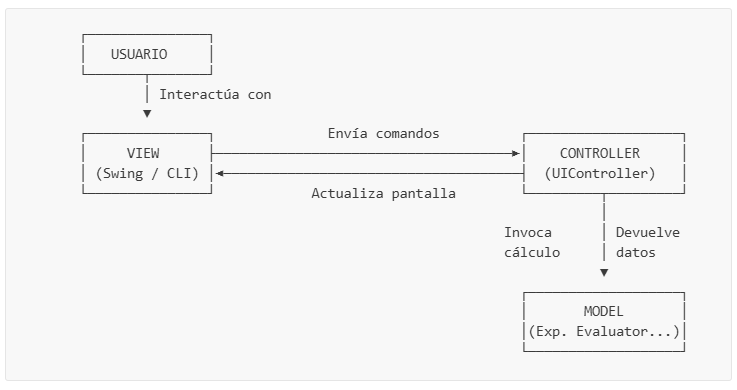

# Práctica de Laboratorio: Calculadora Híbrida en Java (Consola & Swing)

**Materia:** SIS-211  
**Tema:** Patrón de Arquitectura Modelo-Vista-Controlador (MVC), Algoritmo de Shunting Yard de Dijkstra, Evaluación Postfija, Diseño de Interfaces de Usuario con Swing y Principios de Diseño Atómico (Atomic Design)  

---

## Tabla de Contenidos

- [Objetivos de Aprendizaje](#objetivos-de-aprendizaje)
- [Introducción](#introducción)
- [Conceptos Previos y Glosario](#conceptos-previos-y-glosario)
  - [¿Qué es el patrón MVC (Model-View-Controller)?](#qué-es-el-patrón-mvc-model-view-controller)
  - [Notación Infija vs. Postfija (Notación Polaca Inversa)](#notación-infija-vs-postfija-notación-polaca-inversa)
  - [Algoritmo de Shunting Yard de Dijkstra](#algoritmo-de-shunting-yard-de-dijkstra)
  - [Precedencia y Asociatividad de Operadores](#precedencia-y-asociatividad-de-operadores)
  - [Estructuras de Datos: Pila (Stack) vs. Cola (Queue)](#estructuras-de-datos-pila-stack-vs-cola-queue)
  - [Excepciones Controladas (Checked) vs. No Controladas (Unchecked)](#excepciones-controladas-checked-vs-no-controladas-unchecked)
  - [El Hilo de Despacho de Eventos (Event Dispatch Thread - EDT)](#el-hilo-de-despacho-de-eventos-event-dispatch-thread---edt)
  - [El Principio de Diseño Atómico (Atomic Design)](#el-principio-de-diseño-atómico-atomic-design)
- [Pruebas de Escritorio Paso a Paso](#pruebas-de-escritorio-paso-a-paso)
  - [Prueba de Escritorio 1: Conversión de Infijo a Postfijo](#prueba-de-escritorio-1-conversión-de-infijo-a-postfijo)
  - [Prueba de Escritorio 2: Asociatividad por la Derecha (Potencia)](#prueba-de-escritorio-2-asociatividad-por-la-derecha-potencia)
  - [Prueba de Escritorio 3: Evaluación de la Expresión Postfija](#prueba-de-escritorio-3-evaluación-de-la-expresión-postfija)
- [Estructura del Proyecto](#estructura-del-proyecto)
- [Parte 1 — Capa Modelo (Lógica del Negocio)](#parte-1--capa-modelo-lógica-del-negocio)
  - [Paso 1.1: Jerarquía de Excepciones del Dominio](#paso-11-jerarquía-de-excepciones-del-dominio)
  - [Paso 1.2: Definición de Operadores y Precedencia](#paso-12-definición-de-operadores-y-precedencia)
  - [Paso 1.3: El Tokenizador (Analizador Léxico)](#paso-13-el-tokenizador-analizador-léxico)
  - [Paso 1.4: Convertidor Postfijo (Shunting Yard)](#paso-14-convertidor-postfijo-shunting-yard)
  - [Paso 1.5: La Calculadora Postfija](#paso-15-la-calculadora-postfija)
  - [Paso 1.6: Orquestador del Modelo](#paso-16-orquestador-del-modelo)
- [Parte 2 — Capa Utilidades (Validación)](#parte-2--capa-utilidades-validación)
  - [Paso 2.1: Validador de Cadenas de Texto](#paso-21-validador-de-cadenas-de-texto)
- [Parte 3 — Capa Controlador](#parte-3--capa-controlador)
  - [Paso 3.1: Mediador de Flujo MVC](#paso-31-mediador-de-flujo-mvc)
- [Parte 4 — Capa Vista y Diseño Atómico (Componentes GUI)](#parte-4--capa-vista-y-diseño-atómico-componentes-gui)
  - [Paso 4.1: Vista Interactiva por Consola (CLI)](#paso-41-vista-interactiva-por-consola-cli)
  - [Paso 4.2: Átomos de la Interfaz Gráfica](#paso-42-átomos-de-la-interfaz-gráfica)
  - [Paso 4.3: Molécula de la Pantalla de Resultados](#paso-43-molécula-de-la-pantalla-de-resultados)
  - [Paso 4.4: Organismo del Teclado de Operaciones](#paso-44-organismo-del-teclado-de-operaciones)
  - [Paso 4.5: Ensamblado Final en SwingUI](#paso-45-ensamblado-final-en-swingui)
- [Parte 5 — Ejecución de la Aplicación](#parte-5--ejecución-de-la-aplicación)
  - [Paso 5.1: Clase Launcher Principal](#paso-51-clase-launcher-principal)
- [Parte 6 — Desafíos](#parte-6--desafíos)
- [Criterios de Calificación](#criterios-de-calificación)

---

## Objetivos de Aprendizaje

Al finalizar esta práctica, el estudiante será capaz de:
1.  **Estructurar aplicaciones desacopladas:** Aplicar el patrón de diseño MVC de forma que la lógica de cálculo pueda ser probada, mantenida y escalada independientemente de la interfaz.
2.  **Implementar algoritmos de conversión y parsing:** Entender cómo los compiladores e intérpretes analizan sintácticamente las expresiones matemáticas mediante algoritmos clásicos de parsing basados en pilas.
3.  **Gestionar Estructuras de Datos Lineales:** Usar pilas (`java.util.Stack`) y listas (`java.util.List`) de manera eficiente para controlar estados dinámicos.
4.  **Aplicar el Principio de Diseño Atómico (Atomic Design):** Organizar las vistas de escritorio mediante componentes reutilizables divididos en Átomos, Moléculas y Organismos para simplificar la mantenibilidad.
5.  **Diseñar Interfaces GUI Robustas:** Desarrollar interfaces en Java Swing aplicando principios estéticos profesionales (Dracula Theme), modularidad responsiva y manejo de hilos del sistema de ventanas.
6.  **Robustecer el Software:** Definir y propagar excepciones especializadas para evitar la interrupción abrupta del sistema (`crashes`) ante datos inconsistentes provistos por el usuario.

---

## Introducción

En el desarrollo de software profesional, la interfaz de usuario suele cambiar con frecuencia debido a nuevas directrices de diseño, mientras que las reglas y la lógica del negocio se mantienen estables. Programar la lógica de negocio (como las funciones matemáticas) directamente dentro de las clases de la interfaz gráfica es un grave error de diseño conocido como **acoplamiento fuerte**, que impide automatizar pruebas unitarias y reutilizar el código.

En este laboratorio, los estudiantes construirán un motor de cálculo científico desacoplado (el **Modelo**) que traduce expresiones infijas completas, las tokeniza, las transforma a notación polaca inversa (degradando los paréntesis y jerarquizando precedencias) y finalmente las calcula. Luego, se conectarán dos **Vistas** independientes (Consola y Swing) a través de un **Controlador** central que actuará como puente, asegurando que si la interfaz visual se rediseña o se reemplaza por una aplicación web en el futuro, no sea necesario modificar una sola línea de la lógica matemática.

Adicionalmente, se aplicará el principio de **Diseño Atómico** para modularizar los componentes Swing en partes fundamentales reutilizables, logrando una arquitectura de vista limpia y mantenible a largo plazo.

---

## Conceptos Previos y Glosario

### ¿Qué es el patrón MVC (Model-View-Controller)?
Es un patrón de arquitectura de software que separa los datos y la lógica de negocio de la interfaz de usuario.
*   **Modelo (Model):** Contiene la lógica central (operaciones matemáticas, reglas de precedencia, algoritmos de conversión). No tiene conocimiento de la existencia de botones, pantallas o consolas.
*   **Vista (View):** Es la interfaz física que ve y manipula el usuario. Su única responsabilidad es pintar los datos en pantalla y capturar las interacciones físicas (como clics de ratón o teclado) y reportarlas.
*   **Controlador (Controller):** El mediador o puente. Recibe las llamadas procedentes de la vista, extrae la información, la entrega al modelo para su cálculo, recibe la respuesta y la formatea de manera amigable para que la vista la dibuje.



### Notación Infija vs. Postfija (Notación Polaca Inversa)
*   **Notación Infija:** Los operadores se colocan entre los números (ej. `3 + 4`). Es natural para los humanos, pero ambigua para las computadoras, que requieren analizar paréntesis o "mirar hacia adelante" para ver si hay un operador de mayor importancia.
*   **Notación Postfija (Reverse Polish Notation - RPN):** Los operadores se colocan después de los operandos (ej. `3 4 +`).
    *   **Ventaja clave:** No requiere de paréntesis para definir la prioridad de ejecución y puede ser resuelta de manera lineal en un solo paso hacia adelante.
    *   *Ejemplo:* `(3 + 5) * 2` en infijo se convierte en `3 5 + 2 *` en postfijo.

### Algoritmo de Shunting Yard de Dijkstra
Diseñado por Edsger Dijkstra, este algoritmo utiliza una pila de operadores para reordenar los elementos de una expresión infija a una secuencia postfija. Funciona simulando una vía de tren de maniobras donde los números pasan de largo a la salida, pero los operadores deben esperar en una vía de desvío (la pila) según su importancia antes de incorporarse a la vía principal.

### Precedencia y Asociatividad de Operadores
*   **Precedencia:** Es la jerarquía matemática. La multiplicación (`*`) tiene mayor precedencia que la suma (`+`).
*   **Asociatividad:** Indica la dirección del agrupamiento cuando dos operadores contiguos tienen la misma precedencia.
    *   **Asociatividad por la Izquierda:** Los operadores se evalúan de izquierda a derecha. Ej: la resta `-`. La expresión `8 - 3 - 2` se agrupa como `(8 - 3) - 2 = 3`.
    *   **Asociatividad por la Derecha:** Los operadores se agrupan de derecha a izquierda. Ej: la potencia `^`. La expresión `2 ^ 3 ^ 2` se agrupa como `2 ^ (3 ^ 2) = 2 ^ 9 = 512` (si se evaluara por la izquierda daría `(2 ^ 3) ^ 2 = 8 ^ 2 = 64`, lo cual es matemáticamente incorrecto).

### Estructuras de Datos: Pila (Stack) vs. Cola (Queue)
*   **Pila (Stack):** Estructura de tipo **LIFO** (*Last In, First Out* - Último en entrar, Primero en salir). Sus operaciones básicas son `push` (insertar en la cima) y `pop` (quitar de la cima). Es perfecta para recordar operadores y realizar evaluaciones hacia atrás.
*   **Cola (Queue):** Estructura de tipo **FIFO** (*First In, First Out* - Primero en entrar, Primero en salir). Los elementos se insertan por el final y se retiran por el principio, manteniendo el orden cronológico de salida.

### Excepciones Controladas (Checked) vs. No Controladas (Unchecked)
*   **Checked Exceptions (Heredan de `Exception`):** Java obliga al programador a declararlas en la firma del método con `throws` y a capturarlas explícitamente usando un bloque `try-catch`. Usamos esta aproximación para `CalculatorException` porque la entrada del usuario es impredecible, y queremos obligar a la interfaz visual a capturar los errores sintácticos y mostrarlos limpiamente al estudiante en lugar de dejar que el programa aborte con un error de consola (crasheo).
*   **Unchecked Exceptions (Heredan de `RuntimeException`):** Errores de lógica del programador (como acceder a un índice fuera de rango). No es obligatorio capturarlas.

### El Hilo de Despacho de Eventos (Event Dispatch Thread - EDT)
Java Swing es un framework que **no es seguro para subprocesos** (thread-safe). Esto significa que toda interacción visual, creación de ventanas o rediseño de componentes debe ocurrir secuencialmente dentro de un hilo dedicado del sistema llamado **EDT**. Modificar componentes Swing desde otros hilos (como el hilo principal `main`) puede corromper la memoria del sistema gráfico. Por ello, iniciamos la interfaz gráfica usando:
```java
SwingUtilities.invokeLater(() -> {
    // Código seguro dentro del EDT
});
```

### El Principio de Diseño Atómico (Atomic Design)
Creado por Brad Frost, es una metodología para diseñar sistemas de interfaces dividiendo la UI en partes modulares:
1.  **Átomos (Atoms):** Componentes visuales indivisibles de Swing. Ejemplos: botones estilizados, etiquetas simples de resultado, campos de texto personalizados.
2.  **Moléculas (Molecules):** Agrupaciones de dos o más átomos unidos que forman una unidad lógica. Ejemplo: la pantalla de visualización, que une un campo de texto (entrada) y una etiqueta (resultado).
3.  **Organismos (Organisms):** Grupos de moléculas y átomos combinados para formar secciones complejas y completas de la interfaz. Ejemplo: el teclado numérico y operativo de la calculadora.
4.  **Plantillas (Templates) y Páginas (Pages):** El lienzo o contenedor donde se distribuyen y operan los organismos en producción (`SwingUI.java`).

---

## Pruebas de Escritorio Paso a Paso

Para comprender a la perfección el flujo interno de los algoritmos de la calculadora antes de codificarlos, analicemos las siguientes pruebas de escritorio.

### Prueba de Escritorio 1: Conversión de Infijo a Postfijo
*   **Expresión de Entrada:** `3 + 5 * ( 2 - 8 )`
*   **Tokens Identificados:** `["3", "+", "5", "*", "(", "2", "-", "8", ")"]`

| Paso | Token | Tipo | Acción Aplicada | Pila de Operadores (cima a la derecha) | Cola de Salida Postfija |
|:---:|:---:|:---:|---|:---:|---|
| **1** | `"3"` | Operando | Pasar directamente a la salida. | `[]` | `["3"]` |
| **2** | `"+"` | Operador | Apilar (pila vacía). | `["+"]` | `["3"]` |
| **3** | `"5"` | Operando | Pasar directamente a la salida. | `["+"]` | `["3", "5"]` |
| **4** | `"*"` | Operador | Comparar precedencia con cima (`+`). Precedencia de `*` (2) > `+` (1). No desapilar. Apilar `*`. | `["+", "*"]` | `["3", "5"]` |
| **5** | `"("` | Paréntesis | Apilar paréntesis de apertura directamente. | `["+", "*", "("]` | `["3", "5"]` |
| **6** | `"2"` | Operando | Pasar directamente a la salida. | `["+", "*", "("]` | `["3", "5", "2"]` |
| **7** | `"-"` | Operador | Comparar con cima. Como la cima es `(`, detener comparación y apilar `-`. | `["+", "*", "(", "-"]` | `["3", "5", "2"]` |
| **8** | `"8"` | Operando | Pasar directamente a la salida. | `["+", "*", "(", "-"]` | `["3", "5", "2", "8"]` |
| **9** | `")"` | Paréntesis | Desapilar operadores a la salida hasta hallar `(`. Desapila `-`. Elimina `(`. | `["+", "*"]` | `["3", "5", "2", "8", "-"]` |
| **10**| (Fin) | - | No quedan tokens. Desapilar operadores restantes en orden: `*`, luego `+`. | `[]` | `["3", "5", "2", "8", "-", "*", "+"]` |

---

### Prueba de Escritorio 2: Asociatividad por la Derecha (Potencia)
*   **Expresión de Entrada:** `2 ^ 3 ^ 2` (Matemáticamente equivale a `2 ^ (3 ^ 2) = 2 ^ 9 = 512`)
*   **Tokens Identificados:** `["2", "^", "3", "^", "2"]`

| Paso | Token | Tipo | Acción Aplicada | Pila de Operadores | Cola de Salida Postfija |
|:---:|:---:|:---:|---|:---:|---|
| **1** | `"2"` | Operando | Pasar a la salida. | `[]` | `["2"]` |
| **2** | `"^"` | Operador | Apilar (pila vacía). | `["^"]` | `["2"]` |
| **3** | `"3"` | Operando | Pasar a la salida. | `["^"]` | `["2", "3"]` |
| **4** | `"^"` | Operador | Cima es `^` (3) y token es `^` (3). Al ser el token de asociatividad derecha, no se desapila ante precedencia igual. Apilar token `^`. | `["^", "^"]` | `["2", "3"]` |
| **5** | `"2"` | Operando | Pasar a la salida. | `["^", "^"]` | `["2", "3", "2"]` |
| **6** | (Fin) | - | Vaciar pila de operadores a la salida secuencialmente. | `[]` | `["2", "3", "2", "^", "^"]` |

---

### Prueba de Escritorio 3: Evaluación de la Expresión Postfija
*   **Expresión Postfija de Entrada:** `["3", "5", "2", "8", "-", "*", "+"]`

| Paso | Token | Tipo | Acción Realizada | Operando 1 | Operando 2 | Resultado | Estado de la Pila (cima a la derecha) |
|:---:|:---:|:---:|---|:---:|:---:|:---:|---|
| **1** | `"3"` | Operando | Apilar valor numérico `3.0`. | - | - | - | `[3.0]` |
| **2** | `"5"` | Operando | Apilar valor numérico `5.0`. | - | - | - | `[3.0, 5.0]` |
| **3** | `"2"` | Operando | Apilar valor numérico `2.0`. | - | - | - | `[3.0, 5.0, 2.0]` |
| **4** | `"8"` | Operando | Apilar valor numérico `8.0`. | - | - | - | `[3.0, 5.0, 2.0, 8.0]` |
| **5** | `"-"` | Operador | Desapilar dos operandos. Operar: `2.0 - 8.0`. Apilar resultado. | `2.0` | `8.0` | `-6.0` | `[3.0, 5.0, -6.0]` |
| **6** | `"*"` | Operador | Desapilar dos operandos. Operar: `5.0 * -6.0`. Apilar resultado. | `5.0` | `-6.0` | `-30.0`| `[3.0, -30.0]` |
| **7** | `"+"` | Operador | Desapilar dos operandos. Operar: `3.0 + (-30.0)`. Apilar resultado. | `3.0` | `-30.0`| `-27.0`| `[-27.0]` |
| **8** | (Fin) | - | La pila contiene un solo elemento. Desapilar y retornar como respuesta. | - | - | - | `[]` (Respuesta: `-27.0`) |

---

## Estructura del Proyecto

Cree la carpeta `BasicVisualCalculator/` y organice sus directorios de la siguiente manera, observando la distribución granular de las vistas según el diseño atómico:

```
BasicVisualCalculator/
├── src/
│   ├── App.java
│   ├── core/
│   │   ├── model/
│   │   │   ├── Calculator.java
│   │   │   ├── ExpressionEvaluator.java
│   │   │   ├── OperatorPrecedence.java
│   │   │   ├── PostfixConverter.java
│   │   │   ├── Tokenizer.java
│   │   │   └── exception/
│   │   │       ├── CalculatorException.java
│   │   │       ├── DivisionByZeroException.java
│   │   │       ├── InvalidExpressionException.java
│   │   │       └── ParenthesesMismatchException.java
│   │   └── view/
│   │       ├── UIController.java
│   │       └── ui/
│   │           ├── ConsoleUI.java
│   │           ├── SwingUI.java
│   │           └── components/
│   │               ├── atom/
│   │               │   ├── CalculatorButton.java
│   │               │   ├── DisplayField.java
│   │               │   └── ResultLabel.java
│   │               ├── molecule/
│   │               │   └── DisplayPanel.java
│   │               └── organism/
│   │                   └── KeypadPanel.java
│   └── util/
│       └── StringValidator.java
```

---

## Parte 1 — Capa Modelo (Lógica del Negocio)

### Paso 1.1: Jerarquía de Excepciones del Dominio
Defina las excepciones que controlarán los fallos aritméticos y sintácticos de la expresión.

📄 **Archivo:** `src/core/model/exception/CalculatorException.java`
```java
package core.model.exception;

/**
 * Base exception class for all custom errors inside the calculator engine.
 * Extends Exception to enforce compile-time error checking (checked exception).
 */
public class CalculatorException extends Exception {
    public CalculatorException(String message) {
        super(message);
    }
}
```
*   **Explicación Línea por Línea:**
    *   `package core.model.exception;`: Define que la clase pertenece al paquete `core.model.exception`.
    *   `public class CalculatorException extends Exception {`: Declara una clase de excepción pública y comprobada (`Exception`) llamada `CalculatorException`.
    *   `public CalculatorException(String message) {`: Constructor de la clase que recibe un `String` con el detalle del error.
    *   `super(message);`: Llama al constructor de la superclase `Exception` para registrar y propagar el mensaje de error.

📄 **Archivo:** `src/core/model/exception/DivisionByZeroException.java`
```java
package core.model.exception;

/**
 * Thrown when an expression contains a division by zero.
 */
public class DivisionByZeroException extends CalculatorException {
    public DivisionByZeroException() {
        super("Error: Division by zero is not allowed.");
    }
}
```
*   **Explicación Línea por Línea:**
    *   `package core.model.exception;`: Establece el paquete al que pertenece esta excepción específica.
    *   `public class DivisionByZeroException extends CalculatorException {`: Define la clase pública `DivisionByZeroException` que hereda de la excepción base `CalculatorException`.
    *   `public DivisionByZeroException() {`: Constructor por defecto sin argumentos.
    *   `super("Error: Division by zero is not allowed.");`: Llama al constructor de la clase base pasándole un mensaje de error constante predefinido para esta excepción.

📄 **Archivo:** `src/core/model/exception/InvalidExpressionException.java`
```java
package core.model.exception;

/**
 * Thrown when the syntax of the mathematical expression is invalid
 * (e.g. invalid tokens, successive operators, or missing operands).
 */
public class InvalidExpressionException extends CalculatorException {
    public InvalidExpressionException(String message) {
        super(message);
    }
}
```
*   **Explicación Línea por Línea:**
    *   `package core.model.exception;`: Asigna el paquete de la clase.
    *   `public class InvalidExpressionException extends CalculatorException {`: Declara la clase pública `InvalidExpressionException` que hereda de la excepción base `CalculatorException`.
    *   `public InvalidExpressionException(String message) {`: Constructor público que toma un `String` con el mensaje dinámico del error.
    *   `super(message);`: Llama al constructor de la clase base para registrar la descripción del error de sintaxis recibido.

📄 **Archivo:** `src/core/model/exception/ParenthesesMismatchException.java`
```java
package core.model.exception;

/**
 * Thrown when opening and closing parentheses do not match or are unbalanced.
 */
public class ParenthesesMismatchException extends CalculatorException {
    public ParenthesesMismatchException(String message) {
        super(message);
    }
}
```
*   **Explicación Línea por Línea:**
    *   `package core.model.exception;`: Especifica el paquete correspondiente.
    *   `public class ParenthesesMismatchException extends CalculatorException {`: Declara la clase pública `ParenthesesMismatchException` que hereda de `CalculatorException`.
    *   `public ParenthesesMismatchException(String message) {`: Constructor de la excepción que recibe los detalles del desbalance.
    *   `super(message);`: Envía el mensaje descriptivo a la superclase para ser almacenado.

---

### Paso 1.2: Definición de Operadores y Precedencia
Implemente la jerarquía de operadores y sus reglas de prioridad para el cálculo.

📄 **Archivo:** `src/core/model/OperatorPrecedence.java`
```java
package core.model;

import java.util.HashMap;
import java.util.Map;

/**
 * Defines priority levels (precedence) and type identification for mathematical operators.
 */
public class OperatorPrecedence {
    private static final Map<Character, Integer> precedence = new HashMap<>();

    static {
        precedence.put('+', 1); // Low precedence
        precedence.put('-', 1);
        precedence.put('*', 2); // Medium precedence
        precedence.put('/', 2);
        precedence.put('^', 3); // High precedence (exponentiation)
    }

    /**
     * Retrieves the precedence of a given operator.
     * Returns 0 if the token is not an operator.
     */
    public static int getPrecedence(String operator) {
        if (operator == null || operator.isEmpty()) {
            return 0;
        }
        return precedence.getOrDefault(operator.charAt(0), 0);
    }

    /**
     * Verifies if a given string token is a single-character operator.
     */
    public static boolean isOperator(String token) {
        return token.length() == 1 && precedence.containsKey(token.charAt(0));
    }

    /**
     * Verifies if a character matches a supported operator.
     */
    public static boolean isOperator(char ch) {
        return "+-*/^".indexOf(ch) != -1;
    }
}
```
*   **Explicación Línea por Línea:**
    *   `package core.model;`: Declara que la clase forma parte del paquete `core.model`.
    *   `import java.util.HashMap;` e `import java.util.Map;`: Importa la interfaz de mapa y su implementación `HashMap` de Java.
    *   `public class OperatorPrecedence {`: Declara la clase pública que define la precedencia y validación de operadores.
    *   `private static final Map<Character, Integer> precedence = new HashMap<>();`: Declara un mapa estático privado de solo lectura para almacenar las prioridades de los operadores.
    *   `static { ... }`: Bloque estático que asocia cada operador con su respectivo valor de precedencia entero (donde `+` y `-` tienen prioridad 1, `*` y `/` tienen 2, y `^` tiene 3).
    *   `public static int getPrecedence(String operator) {`: Método estático público que devuelve el nivel de precedencia de un operador en formato de texto.
    *   `if (operator == null || operator.isEmpty()) { return 0; }`: Si el operador suministrado es nulo o está vacío, retorna 0.
    *   `return precedence.getOrDefault(operator.charAt(0), 0);`: Extrae el primer carácter del texto del operador y consulta el mapa, devolviendo su precedencia correspondiente o 0 si no se encuentra registrado en el mapa.
    *   `public static boolean isOperator(String token) {`: Método estático público que evalúa si un token en formato `String` representa a un operador de un solo carácter.
    *   `return token.length() == 1 && precedence.containsKey(token.charAt(0));`: Comprueba si la longitud del token es igual a 1 y si su carácter existe en el mapa de precedencias.
    *   `public static boolean isOperator(char ch) {`: Método sobrecargado que determina si un carácter primitivo `char` es un operador compatible.
    *   `return "+-*/^".indexOf(ch) != -1;`: Retorna verdadero si el carácter está contenido en la cadena de operadores soportados `"+-*/^"`.

---

### Paso 1.3: El Tokenizador (Analizador Léxico)
El tokenizador toma la cadena de entrada (sin espacios significativos) y la fragmenta en elementos lógicos reconocibles (números, operadores, paréntesis).

📄 **Archivo:** `src/core/model/Tokenizer.java`
```java
package core.model;

import java.util.ArrayList;
import java.util.List;

/**
 * Segregates an infix mathematical string expression into individual logical tokens
 * (operators, parentheses, and operands).
 */
public class Tokenizer {
    public List<String> tokenize(String expression) {
        List<String> tokens = new ArrayList<>();
        StringBuilder currentToken = new StringBuilder();

        for (char ch : expression.toCharArray()) {
            if (Character.isWhitespace(ch)) {
                continue; // Ignore blank spaces
            }
            // If the character is an operator or parenthesis, push any pending number and then the symbol
            if (OperatorPrecedence.isOperator(ch) || ch == '(' || ch == ')') {
                if (currentToken.length() > 0) {
                    tokens.add(currentToken.toString());
                    currentToken.setLength(0);
                }
                tokens.add(String.valueOf(ch));
            } else {
                currentToken.append(ch); // Aggregate digits and decimal points
            }
        }
        if (currentToken.length() > 0) {
            tokens.add(currentToken.toString());
        }
        return tokens;
    }
}
```
*   **Explicación Línea por Línea:**
    *   `package core.model;`: Define el paquete al cual pertenece la clase.
    *   `import java.util.ArrayList;` e `import java.util.List;`: Importa la lista dinámica y su interfaz correspondientes.
    *   `public class Tokenizer {`: Declara la clase del analizador léxico.
    *   `public List<String> tokenize(String expression) {`: Método público que toma la expresión matemática y la desglosa en una lista de tokens.
    *   `List<String> tokens = new ArrayList<>();`: Inicializa una lista dinámica vacía para ir almacenando los tokens identificados.
    *   `StringBuilder currentToken = new StringBuilder();`: Inicializa un acumulador de caracteres mutable para reconstruir los números que posean múltiples dígitos y/o puntos decimales.
    *   `for (char ch : expression.toCharArray()) {`: Bucle que itera a través de cada uno de los caracteres de la expresión matemática.
    *   `if (Character.isWhitespace(ch)) { continue; }`: Si el carácter actual es un espacio en blanco, lo ignora omitiendo el resto del cuerpo del ciclo.
    *   `if (OperatorPrecedence.isOperator(ch) || ch == '(' || ch == ')') {`: Evalúa si el carácter actual es un operador o un paréntesis (de apertura o cierre).
    *   `if (currentToken.length() > 0) {`: Evalúa si existía un número acumulándose previamente en `currentToken`.
    *   `tokens.add(currentToken.toString());`: Añade el número acumulado a la lista de tokens.
    *   `currentToken.setLength(0);`: Resetea el acumulador a longitud cero.
    *   `tokens.add(String.valueOf(ch));`: Añade el operador o paréntesis actual como un token individual a la lista de salida.
    *   `} else {`: De lo contrario, si el carácter no es un espacio, operador ni paréntesis.
    *   `currentToken.append(ch);`: Asume que es un dígito o punto decimal y lo añade al final del acumulador de texto `currentToken`.
    *   `if (currentToken.length() > 0) { tokens.add(currentToken.toString()); }`: Al terminar el bucle, si quedó algún número pendiente por añadir en el acumulador `currentToken`, lo añade a la lista final de tokens.
    *   `return tokens;`: Retorna la lista con todos los tokens fragmentados en el orden cronológico original.

---

### Paso 1.4: Convertidor Postfijo (Shunting Yard)
Este convertidor aplica el algoritmo de Shunting Yard para traducir los tokens infijos a postfijo. También valida que los paréntesis estén correctamente balanceados y emparejados.

📄 **Archivo:** `src/core/model/PostfixConverter.java`
```java
package core.model;

import java.util.ArrayList;
import java.util.List;
import java.util.Stack;
import util.StringValidator;
import core.model.exception.*;

/**
 * Converts a tokenized infix expression into a postfix expression (RPN)
 * using Dijkstra's Shunting Yard algorithm.
 */
public class PostfixConverter {
    private boolean isRightAssociative(String op) {
        return op.equals("^"); // Right-to-left evaluation
    }

    public List<String> convert(List<String> infixExpression) throws CalculatorException {
        List<String> out = new ArrayList<>();
        Stack<String> operatorStack = new Stack<>();

        for (int i = 0; i < infixExpression.size(); i++) {
            String token = infixExpression.get(i);
            
            if (token.equals(" ")) {
                continue;
            } else if (StringValidator.isValidNumber(token) || token.equals(".")) {
                // Read complete numerical values (including floating points)
                StringBuilder allDigits = new StringBuilder();
                while (i < infixExpression.size() && (StringValidator.isValidNumber(infixExpression.get(i))
                        || infixExpression.get(i).equals("."))) {
                    allDigits.append(infixExpression.get(i));
                    i++;
                }
                out.add(allDigits.toString());
                i--; // Readjust iterator index
            } else if (token.equals("(")) {
                operatorStack.push(token);
            } else if (token.equals(")")) {
                // Discard operators to the output list until the opening parenthesis is found
                while (!operatorStack.isEmpty() && !operatorStack.peek().equals("(")) {
                    out.add(operatorStack.pop());
                }
                if (!operatorStack.isEmpty()) {
                    operatorStack.pop(); // Pop out '('
                } else {
                    throw new ParenthesesMismatchException("Mismatched parentheses: closing parenthesis ')' has no matching opening parenthesis '('");
                }
            } else if (OperatorPrecedence.isOperator(token)) {
                // Manage operator hierarchy
                while (!operatorStack.isEmpty() && !operatorStack.peek().equals("(")) {
                    String top = operatorStack.peek();
                    int pTop = OperatorPrecedence.getPrecedence(top);
                    int pToken = OperatorPrecedence.getPrecedence(token);
                    
                    if (isRightAssociative(token)) {
                        if (pTop > pToken) {
                            out.add(operatorStack.pop());
                        } else {
                            break;
                        }
                    } else {
                        if (pTop >= pToken) {
                            out.add(operatorStack.pop());
                        } else {
                            break;
                        }
                    }
                }
                operatorStack.push(token);
            } else {
                throw new InvalidExpressionException("Invalid token: " + token);
            }
        }

        // Clean out remaining operators from the stack
        while (!operatorStack.isEmpty()) {
            String op = operatorStack.pop();
            if (op.equals("(")) {
                throw new ParenthesesMismatchException("Mismatched parentheses: opening parenthesis '(' has no matching closing parenthesis ')'");
            }
            out.add(op);
        }
        return out;
    }
}
```
*   **Explicación Línea por Línea:**
    *   `package core.model;`: Define el paquete al cual pertenece la clase.
    *   `import java.util.ArrayList;`, `import java.util.List;`, `import java.util.Stack;`: Importaciones de colecciones dinámicas y la estructura de pila requerida.
    *   `import util.StringValidator;` e `import core.model.exception.*;`: Importa la utilidad de validación y la jerarquía de excepciones personalizadas.
    *   `public class PostfixConverter {`: Declara la clase del convertidor infijo a postfijo.
    *   `private boolean isRightAssociative(String op) {`: Define un método privado para comprobar si un operador tiene asociatividad por la derecha (como la potencia `^`).
    *   `return op.equals("^");`: Retorna verdadero si el operador es `^`.
    *   `public List<String> convert(List<String> infixExpression) throws CalculatorException {`: Método principal de conversión que procesa la expresión tokenizada en formato infijo y puede lanzar excepciones si la expresión no es sintácticamente válida.
    *   `List<String> out = new ArrayList<>();`: Inicializa la lista que representará la cola de salida con la expresión en notación postfija.
    *   `Stack<String> operatorStack = new Stack<>();`: Inicializa una pila para almacenar temporalmente los operadores y paréntesis de apertura según su jerarquía.
    *   `for (int i = 0; i < infixExpression.size(); i++) {`: Bucle para recorrer uno a uno todos los tokens en la lista de la expresión infija.
    *   `String token = infixExpression.get(i);`: Recupera el token actual correspondiente al índice `i`.
    *   `if (token.equals(" ")) { continue; }`: Descarta explícitamente los tokens que consistan en espacios vacíos.
    *   `else if (StringValidator.isValidNumber(token) || token.equals(".")) {`: Evalúa si el token es un dígito numérico válido o un punto decimal solitario.
    *   `StringBuilder allDigits = new StringBuilder();`: Inicializa un acumulador para recomponer números que se hayan fragmentado en múltiples tokens (como puntos y decimales).
    *   `while (i < infixExpression.size() && (StringValidator.isValidNumber(infixExpression.get(i)) || infixExpression.get(i).equals("."))) {`: Bucle anidado para continuar consumiendo secuencialmente tokens numéricos o puntos.
    *   `allDigits.append(infixExpression.get(i)); i++;`: Concatena el carácter/número al acumulador e incrementa el contador de posición del bucle.
    *   `out.add(allDigits.toString());`: Agrega el número completo consolidado directamente a la cola de salida `out`.
    *   `i--;`: Reduce en 1 el contador del bucle principal para compensar el incremento adicional realizado en el bucle interno de dígitos.
    *   `} else if (token.equals("(")) {`: Si el token es un paréntesis de apertura, se añade directamente a la pila.
    *   `operatorStack.push(token);`: Apila el paréntesis de apertura.
    *   `} else if (token.equals(")")) {`: Si el token es un paréntesis de cierre, se deben vaciar los operadores hasta encontrar su correspondiente pareja de apertura.
    *   `while (!operatorStack.isEmpty() && !operatorStack.peek().equals("(")) {`: Bucle para desapilar operadores y enviarlos a la salida hasta que la cima de la pila sea el paréntesis de apertura `(`.
    *   `out.add(operatorStack.pop());`: Quita el operador de la pila y lo agrega a la salida.
    *   `if (!operatorStack.isEmpty()) { operatorStack.pop(); }`: Si la pila no está vacía al terminar el ciclo, significa que se encontró el `(`, por lo que se desapila y se descarta.
    *   `else { throw new ParenthesesMismatchException("Mismatched parentheses: closing parenthesis ')' has no matching opening parenthesis '('"); }`: Si la pila se vació por completo y nunca se encontró el `(`, lanza una excepción indicando que el paréntesis de cierre no está emparejado.
    *   `} else if (OperatorPrecedence.isOperator(token)) {`: Si el token es un operador matemático reconocido.
    *   `while (!operatorStack.isEmpty() && !operatorStack.peek().equals("(")) {`: Compara el operador con la cima de la pila mientras esta contenga otros operadores y no un paréntesis.
    *   `String top = operatorStack.peek();`: Obtiene el operador en la cima de la pila sin removerlo.
    *   `int pTop = OperatorPrecedence.getPrecedence(top);`: Obtiene el nivel de precedencia del operador que está en la cima de la pila.
    *   `int pToken = OperatorPrecedence.getPrecedence(token);`: Obtiene la precedencia del operador del token actual.
    *   `if (isRightAssociative(token)) {`: Si el operador actual tiene asociatividad por la derecha (como `^`).
    *   `if (pTop > pToken) { out.add(operatorStack.pop()); } else { break; }`: Se desapila el operador en la cima solo si su precedencia es estrictamente mayor que la del actual; de lo contrario, se interrumpe el bucle de desapilamiento.
    *   `} else {`: Si el operador tiene asociatividad por la izquierda (como `+`, `-`, `*`, `/`).
    *   `if (pTop >= pToken) { out.add(operatorStack.pop()); } else { break; }`: Se desapila de la pila si el de la cima tiene mayor o igual precedencia que el operador actual; en caso contrario, se detiene.
    *   `operatorStack.push(token);`: Apila el operador actual en la pila de operadores.
    *   `} else { throw new InvalidExpressionException("Invalid token: " + token); }`: Si el token no entra en ninguna de las clasificaciones anteriores, se lanza una excepción de sintaxis inválida.
    *   `while (!operatorStack.isEmpty()) {`: Una vez finalizado el bucle principal de tokens, se vacían los operadores que hayan quedado en la pila.
    *   `String op = operatorStack.pop();`: Remueve el operador de la cima de la pila.
    *   `if (op.equals("(")) { throw new ParenthesesMismatchException("Mismatched parentheses: opening parenthesis '(' has no matching closing parenthesis ')'"); }`: Si durante el vaciado se encuentra un paréntesis de apertura sin cerrar, se lanza una excepción de desbalance.
    *   `out.add(op);`: Añade el operador a la lista de salida.
    *   `return out;`: Retorna la lista que contiene la expresión convertida en notación postfija.

---

### Paso 1.5: La Calculadora Postfija
Implemente la evaluación aritmética usando una pila.

📄 **Archivo:** `src/core/model/Calculator.java`
```java
package core.model;

import java.util.List;
import java.util.Stack;
import util.StringValidator;
import core.model.exception.*;

/**
 * Evaluates a mathematical expression written in Postfix notation (Reverse Polish Notation).
 */
public class Calculator {
    private double operate(String operator, double operand1, double operand2) throws DivisionByZeroException {
        switch (operator) {
            case "+":
                return operand1 + operand2;
            case "-":
                return operand1 - operand2;
            case "*":
                return operand1 * operand2;
            case "/":
                if (operand2 == 0) {
                    throw new DivisionByZeroException();
                }
                return operand1 / operand2;
            case "^":
                return Math.pow(operand1, operand2);
            default:
                throw new IllegalArgumentException("Invalid operator: " + operator);
        }
    }

    private double evaluatePostfix(List<String> postfixTokens) throws CalculatorException {
        Stack<Double> stack = new Stack<>();
        for (String token : postfixTokens) {
            if (StringValidator.isValidNumber(token)) {
                stack.push(Double.parseDouble(token));
            } else {
                // Verify stack depth to prevent empty stack errors before performing operations
                if (stack.size() < 2) {
                    throw new InvalidExpressionException("Insufficient operands for operator: " + token);
                }
                double operand2 = stack.pop();
                double operand1 = stack.pop();
                double result = operate(token, operand1, operand2);
                stack.push(result);
            }
        }
        if (stack.isEmpty()) {
            throw new InvalidExpressionException("Expression is empty or evaluation produced no result.");
        }
        if (stack.size() > 1) {
            throw new InvalidExpressionException("Invalid expression (leftover operands on stack).");
        }
        return stack.pop();
    }

    public double calculate(List<String> postfixTokens) throws CalculatorException {
        return evaluatePostfix(postfixTokens);
    }
}
```
*   **Explicación Línea por Línea:**
    *   `package core.model;`: Define el paquete al cual pertenece la clase.
    *   `import java.util.List;` e `import java.util.Stack;`: Importa la interfaz de lista y la pila necesarias.
    *   `import util.StringValidator;` e `import core.model.exception.*;`: Importa utilidades y excepciones específicas.
    *   `public class Calculator {`: Declara la clase que evalúa las expresiones en notación postfija.
    *   `private double operate(String operator, double operand1, double operand2) throws DivisionByZeroException {`: Método privado auxiliar que realiza la operación aritmética seleccionada entre dos números decimales.
    *   `switch (operator) { ... }`: Estructura de control para bifurcar el flujo según el símbolo de operación.
    *   `case "+": return operand1 + operand2;`: Suma los operandos y devuelve el resultado.
    *   `case "-": return operand1 - operand2;`: Resta los operandos y devuelve el resultado.
    *   `case "*": return operand1 * operand2;`: Multiplica los operandos y devuelve el resultado.
    *   `case "/":`: En caso de división, verifica que el divisor no sea cero.
    *   `if (operand2 == 0) { throw new DivisionByZeroException(); }`: Lanza excepción especializada si el segundo operando es cero.
    *   `return operand1 / operand2;`: Divide y retorna el resultado.
    *   `case "^": return Math.pow(operand1, operand2);`: Calcula la potencia usando `Math.pow` de Java y retorna el resultado.
    *   `default: throw new IllegalArgumentException("Invalid operator: " + operator);`: Lanza un error interno si se pasa un operador no contemplado por el motor.
    *   `private double evaluatePostfix(List<String> postfixTokens) throws CalculatorException {`: Evalúa una secuencia de tokens en notación postfija (RPN) y devuelve el resultado matemático.
    *   `Stack<Double> stack = new Stack<>();`: Inicializa una pila para el almacenamiento temporal de operandos.
    *   `for (String token : postfixTokens) {`: Recorre secuencialmente todos los tokens de la lista de entrada en notación postfija.
    *   `if (StringValidator.isValidNumber(token)) {`: Comprueba si el token actual es un operando numérico.
    *   `stack.push(Double.parseDouble(token));`: Convierte la cadena en un valor `double` y lo apila.
    *   `} else {`: Si el token no es un número, entonces representa un operador.
    *   `if (stack.size() < 2) { throw new InvalidExpressionException("Insufficient operands for operator: " + token); }`: Verifica que existan al menos dos números disponibles en la pila para aplicar el operador, evitando un error por pila vacía.
    *   `double operand2 = stack.pop();`: Desapila el elemento en la cima, el cual corresponde al segundo operando de la operación (operando de la derecha).
    *   `double operand1 = stack.pop();`: Desapila el siguiente elemento, que corresponde al primer operando (operando de la izquierda).
    *   `double result = operate(token, operand1, operand2);`: Ejecuta la operación pasando el operador y los operandos.
    *   `stack.push(result);`: Apila el resultado matemático de la operación para futuras evaluaciones.
    *   `if (stack.isEmpty()) { throw new InvalidExpressionException("Expression is empty or evaluation produced no result."); }`: Verifica que la pila contenga el resultado final; de lo contrario, la expresión estaba vacía.
    *   `if (stack.size() > 1) { throw new InvalidExpressionException("Invalid expression (leftover operands on stack)."); }`: Si al terminar quedan dos o más operandos en la pila, significa que faltaron operadores y la expresión es sintácticamente inválida.
    *   `return stack.pop();`: Retorna el último elemento remanente en la pila, que corresponde al resultado definitivo de la evaluación.
    *   `public double calculate(List<String> postfixTokens) throws CalculatorException {`: Método público de acceso que expone el cálculo al exterior llamando internamente a `evaluatePostfix`.
    *   `return evaluatePostfix(postfixTokens);`: Delega la llamada y retorna el resultado.

---

### Paso 1.6: Orquestador del Modelo
Esta clase unifica los pasos de la capa del modelo.

📄 **Archivo:** `src/core/model/ExpressionEvaluator.java`
```java
package core.model;

import java.util.List;
import core.model.exception.*;
import util.StringValidator;

/**
 * Facade class that coordinates the entire calculation process
 * (Early validation -> Lexing -> Postfix translation -> Evaluation).
 */
public class ExpressionEvaluator {
    public double evaluate(String infixExpression) throws CalculatorException {
        if (infixExpression == null || infixExpression.trim().isEmpty()) {
            throw new InvalidExpressionException("Expression cannot be null or empty");
        }

        // Validate early for illegal characters or obvious parentheses errors
        if (!StringValidator.isValidExpression(infixExpression)) {
            int parenCount = 0;
            for (char ch : infixExpression.toCharArray()) {
                if (ch == '(') {
                    parenCount++;
                } else if (ch == ')') {
                    parenCount--;
                    if (parenCount < 0) {
                        throw new ParenthesesMismatchException("Mismatched parentheses: closing parenthesis ')' has no matching opening parenthesis '('");
                    }
                }
            }
            if (parenCount != 0) {
                throw new ParenthesesMismatchException("Mismatched parentheses: unbalanced count of opening and closing parentheses");
            }
            throw new InvalidExpressionException("Expression contains invalid characters");
        }

        Tokenizer tokenizer = new Tokenizer();
        List<String> tokens = tokenizer.tokenize(infixExpression);
        PostfixConverter converter = new PostfixConverter();
        List<String> postfixTokens = converter.convert(tokens);
        Calculator calculator = new Calculator();
        return calculator.calculate(postfixTokens);
    }
}
```
*   **Explicación Línea por Línea:**
    *   `package core.model;`: Define el paquete al cual pertenece la clase.
    *   `import java.util.List;`, `import core.model.exception.*;`, `import util.StringValidator;`: Importa la lista dinámica, la jerarquía de excepciones y la utilidad de validación.
    *   `public class ExpressionEvaluator {`: Declara la clase fachada que coordina todo el proceso de parsing y cálculo.
    *   `public double evaluate(String infixExpression) throws CalculatorException {`: Método público principal que recibe la expresión en formato infijo, la procesa por completo y retorna su resultado.
    *   `if (infixExpression == null || infixExpression.trim().isEmpty()) { throw new InvalidExpressionException("Expression cannot be null or empty"); }`: Valida que la expresión recibida no sea nula, vacía o contenga solo espacios en blanco; en tal caso, lanza una excepción sintáctica.
    *   `if (!StringValidator.isValidExpression(infixExpression)) {`: Realiza una validación inicial de la estructura de la expresión antes de pasar a la tokenización.
    *   `int parenCount = 0;`: Inicializa un contador para diagnosticar el desbalance exacto de paréntesis.
    *   `for (char ch : infixExpression.toCharArray()) {`: Recorre uno a uno todos los caracteres de la expresión matemática.
    *   `if (ch == '(') { parenCount++; }`: Si el carácter actual es un paréntesis de apertura, incrementa el contador.
    *   `else if (ch == ')') {`: Si es de cierre, decrementa el contador.
    *   `parenCount--;`: Decrementa el contador de paréntesis.
    *   `if (parenCount < 0) { throw new ParenthesesMismatchException("Mismatched parentheses: closing parenthesis ')' has no matching opening parenthesis '('"); }`: Si el contador se vuelve negativo, significa que se colocó un paréntesis de cierre antes de uno de apertura, por lo que se lanza inmediatamente la excepción especializada.
    *   `if (parenCount != 0) { throw new ParenthesesMismatchException("Mismatched parentheses: unbalanced count of opening and closing parentheses"); }`: Al finalizar el bucle, si el contador de paréntesis no volvió a cero, significa que quedaron paréntesis abiertos sin cerrar, por lo que se lanza una excepción de desbalance.
    *   `throw new InvalidExpressionException("Expression contains invalid characters");`: Si la expresión es inválida pero no por desbalance de paréntesis, significa que contiene caracteres ilegales, por lo que lanza una excepción por caracteres inválidos.
    *   `Tokenizer tokenizer = new Tokenizer();`: Instancia el analizador léxico.
    *   `List<String> tokens = tokenizer.tokenize(infixExpression);`: Llama al método `tokenize` para transformar la cadena matemática en una secuencia de tokens.
    *   `PostfixConverter converter = new PostfixConverter();`: Instancia el convertidor a notación postfija.
    *   `List<String> postfixTokens = converter.convert(tokens);`: Llama al método `convert` para convertir los tokens infijos a notación postfija con el algoritmo de Shunting Yard.
    *   `Calculator calculator = new Calculator();`: Instancia la calculadora que evalúa la notación postfija.
    *   `return calculator.calculate(postfixTokens);`: Evalúa la expresión postfija resultante y devuelve el resultado numérico final de tipo `double`.

---

## Parte 2 — Capa Utilidades (Validación)

### Paso 2.1: Validador de Cadenas de Texto
Utilidad estática para comprobar el formato de los datos provistos.

📄 **Archivo:** `src/util/StringValidator.java`
```java
package util;

/**
 * Validates formatting of mathematical inputs.
 */
public class StringValidator {
    /**
     * Checks if the expression contains only valid characters (numbers, operators, power, point and spaces)
     * and checks for simple parentheses matching constraints.
     */
    public static boolean isValidExpression(String expression) {
        if (expression == null || expression.trim().isEmpty()) {
            return false;
        }

        int parenthesesCount = 0;
        for (char ch : expression.toCharArray()) {
            if (ch == '(') {
                parenthesesCount++;
            } else if (ch == ')') {
                parenthesesCount--;
                if (parenthesesCount < 0) {
                    return false; // Closing parenthesis before an opening one
                }
            }
        }
        if (parenthesesCount != 0) {
            return false;
        }

        // Validate allowed character set
        String validCharacters = "0123456789+-*/()^. ";
        for (char ch : expression.toCharArray()) {
            if (validCharacters.indexOf(ch) == -1) {
                return false;
            }
        }

        return true;
    }

    /**
     * Checks if a string can be safely parsed into a Double.
     */
    public static boolean isValidNumber(String str) {
        if (str == null || str.trim().isEmpty()) {
            return false;
        }
        try {
            Double.parseDouble(str);
            return true;
        } catch (NumberFormatException e) {
            return false;
        }
    }
}
```
*   **Explicación Línea por Línea:**
    *   `package util;`: Define el paquete al cual pertenece la clase de utilidades.
    *   `public class StringValidator {`: Declara la clase pública que agrupa validaciones estáticas.
    *   `public static boolean isValidExpression(String expression) {`: Método estático público que realiza una verificación básica del formato y caracteres de la expresión matemática.
    *   `if (expression == null || expression.trim().isEmpty()) { return false; }`: Si la expresión es nula o vacía, retorna falso.
    *   `int parenthesesCount = 0;`: Inicializa un contador para validar la integridad de la apertura y el cierre de paréntesis.
    *   `for (char ch : expression.toCharArray()) {`: Bucle para recorrer todos los caracteres de la expresión.
    *   `if (ch == '(') { parenthesesCount++; }`: Si el carácter es un paréntesis de apertura, incrementa el contador.
    *   `else if (ch == ')') {`: Si es un paréntesis de cierre, decrementa el contador.
    *   `parenthesesCount--;`: Decrementa el contador de paréntesis.
    *   `if (parenthesesCount < 0) { return false; }`: Si el contador es menor a cero, significa que se cerró un paréntesis antes de abrirse uno, por lo que retorna falso de forma inmediata.
    *   `if (parenthesesCount != 0) { return false; }`: Si al terminar de recorrer la expresión el contador de paréntesis no es cero (quedó alguno abierto), retorna falso.
    *   `String validCharacters = "0123456789+-*/()^. ";`: Define la cadena que contiene todos los caracteres matemáticos y símbolos permitidos en la calculadora.
    *   `for (char ch : expression.toCharArray()) {`: Recorre nuevamente los caracteres para validar su legalidad en el alfabeto de la calculadora.
    *   `if (validCharacters.indexOf(ch) == -1) { return false; }`: Si el carácter actual no está presente en la cadena de caracteres válidos, retorna falso.
    *   `return true;`: Si se superaron todas las validaciones anteriores con éxito, retorna verdadero.
    *   `public static boolean isValidNumber(String str) {`: Método estático público que determina si una porción de texto representa un número válido.
    *   `if (str == null || str.trim().isEmpty()) { return false; }`: Si la cadena es nula o está vacía, retorna falso.
    *   `try { Double.parseDouble(str); return true; }`: Intenta parsear la cadena como un decimal `double`. Si tiene éxito, retorna verdadero.
    *   `catch (NumberFormatException e) { return false; }`: Si ocurre un error de parseo (formato incorrecto), captura la excepción y retorna falso.

---

## Parte 3 — Capa Controlador

### Paso 3.1: Mediador de Flujo MVC
El controlador MVC de la aplicación.

📄 **Archivo:** `src/core/view/UIController.java`
```java
package core.view;

import core.model.ExpressionEvaluator;
import core.model.exception.CalculatorException;

/**
 * Intermediate controller class in the MVC architecture.
 * Protects the model from being directly accessed by the view, formatting output data.
 */
public class UIController {
    private final ExpressionEvaluator evaluator;

    public UIController(ExpressionEvaluator evaluator) {
        this.evaluator = evaluator;
    }

    /**
     * Sends the expression to the model for calculations.
     */
    public double processInput(String expression) throws CalculatorException {
        return evaluator.evaluate(expression);
    }

    /**
     * Formats the double result cleanly, removing trailing decimals if they are integer values.
     */
    public String displayResult(double result) {
        if (Double.isInfinite(result) || Double.isNaN(result)) {
            return String.valueOf(result);
        }
        if (result == (long) result) {
            return String.valueOf((long) result);
        }
        return String.valueOf(result);
    }
}
```
*   **Explicación Línea por Línea:**
    *   `package core.view;`: Define el paquete al cual pertenece la clase.
    *   `import core.model.ExpressionEvaluator;` e `import core.model.exception.CalculatorException;`: Importaciones de la clase evaluadora del modelo y de las excepciones personalizadas del dominio.
    *   `public class UIController {`: Declara la clase del controlador intermedio de la arquitectura MVC.
    *   `private final ExpressionEvaluator evaluator;`: Declara el campo de solo lectura para la clase evaluadora de expresiones del modelo.
    *   `public UIController(ExpressionEvaluator evaluator) { this.evaluator = evaluator; }`: Constructor de la clase que recibe y asocia la instancia del evaluador de expresiones.
    *   `public double processInput(String expression) throws CalculatorException {`: Método que recibe la expresión en `String` proveniente de la vista, la envía al modelo para su resolución y devuelve el resultado numérico.
    *   `return evaluator.evaluate(expression);`: Llama al método de cálculo del modelo y retorna el resultado.
    *   `public String displayResult(double result) {`: Método de formateo que convierte el resultado en una cadena legible eliminando decimales innecesarios.
    *   `if (Double.isInfinite(result) || Double.isNaN(result)) { return String.valueOf(result); }`: Si el resultado es infinito (como al dividir entre cero con flotantes) o indefinido (NaN), devuelve su representación en texto directamente.
    *   `if (result == (long) result) { return String.valueOf((long) result); }`: Compara el valor decimal con su versión convertida a entero largo (`long`). Si son iguales (por ejemplo `5.0` y `5`), realiza el casteo a `long` para descartar la parte decimal `.0` y retorna el String correspondiente.
    *   `return String.valueOf(result);`: Si el número tiene decimales significativos (como `5.25`), lo convierte a `String` normalmente y lo retorna.

---

## Parte 4 — Capa Vista y Diseño Atómico (Componentes GUI)

### Paso 4.1: Vista Interactiva por Consola (CLI)
Implementa el bucle REPL de terminal. Se encarga de procesar la entrada de consola interactiva.

📄 **Archivo:** `src/core/view/ui/ConsoleUI.java`
```java
package core.view.ui;

import core.view.UIController;
import core.model.exception.CalculatorException;
import java.util.Scanner;

/**
 * Text-based interactive command line interface (CLI) for the calculator.
 */
public class ConsoleUI {
    private final UIController controller;

    public ConsoleUI(UIController controller) {
        this.controller = controller;
    }

    public void start() {
        Scanner scanner = new Scanner(System.in);
        System.out.println("=================================================");
        System.out.println("   Calculadora Híbrida - Interfaz de Consola   ");
        System.out.println("=================================================");
        System.out.println("Escriba su expresión matemática (o 'salir' para terminar).");
        System.out.println("Ejemplo: 3 + 5 * (2 - 8)");
        System.out.println("-------------------------------------------------");

        while (true) {
            System.out.print("> ");
            if (!scanner.hasNextLine()) {
                break;
            }
            String input = scanner.nextLine();
            if (input == null) {
                break;
            }
            input = input.trim();
            if (input.equalsIgnoreCase("salir") || input.equalsIgnoreCase("exit")) {
                System.out.println("¡Hasta luego!");
                break;
            }
            if (input.isEmpty()) {
                continue;
            }

            try {
                double result = controller.processInput(input);
                System.out.println("= " + controller.displayResult(result));
            } catch (CalculatorException e) {
                System.out.println("Error: " + e.getMessage());
            } catch (ArithmeticException e) {
                System.out.println("Error: División por cero o error aritmético.");
            } catch (Exception e) {
                System.out.println("Error: Expresión inválida (" + e.getMessage() + ")");
            }
        }
    }
}
```
*   **Explicación Línea por Línea:**
    *   `package core.view.ui;`: Define el paquete al cual pertenece el archivo.
    *   `import core.view.UIController;` e `import core.model.exception.CalculatorException;`: Importa el controlador de la UI y la excepción de la calculadora.
    *   `import java.util.Scanner;`: Importa la utilidad `Scanner` para capturar la entrada desde la consola de comandos.
    *   `public class ConsoleUI {`: Declara la clase correspondiente a la interfaz de comandos por consola.
    *   `private final UIController controller;`: Declara el campo de tipo `UIController` de solo lectura.
    *   `public ConsoleUI(UIController controller) { this.controller = controller; }`: Constructor de la clase que recibe y asocia el controlador principal de flujo.
    *   `public void start() {`: Método principal para iniciar y ejecutar el bucle REPL (Lectura-Evaluación-Impresión) de la consola.
    *   `Scanner scanner = new Scanner(System.in);`: Instancia la clase `Scanner` pasándole la entrada del sistema (`System.in`).
    *   `System.out.println("=================================================");`: Imprime una línea separadora en la consola de comandos.
    *   `System.out.println("   Calculadora Híbrida - Interfaz de Consola   ");`: Imprime el encabezado o título de la interfaz de consola.
    *   `System.out.println("=================================================");`: Imprime otra línea separadora.
    *   `System.out.println("Escriba su expresión matemática (o 'salir' para terminar).");`: Muestra las instrucciones de salida para el estudiante.
    *   `System.out.println("Ejemplo: 3 + 5 * (2 - 8)");`: Muestra un ejemplo de expresión válida para guiar al estudiante.
    *   `System.out.println("-------------------------------------------------");`: Imprime una línea de guiones como separador visual.
    *   `while (true) {`: Inicia un bucle infinito para interactuar repetidamente con el usuario hasta que se decida salir.
    *   `System.out.print("> ");`: Muestra el indicador o *prompt* de consola listo para recibir entrada.
    *   `if (!scanner.hasNextLine()) { break; }`: Evalúa si existe otra línea disponible en la consola; si no hay entrada, rompe el bucle.
    *   `String input = scanner.nextLine();`: Lee la línea completa ingresada por el usuario en el teclado.
    *   `if (input == null) { break; }`: Si por algún motivo la entrada leída es nula, rompe el bucle.
    *   `input = input.trim();`: Remueve espacios vacíos extras al inicio y al final de la entrada.
    *   `if (input.equalsIgnoreCase("salir") || input.equalsIgnoreCase("exit")) {`: Evalúa si el usuario desea terminar el programa escribiendo las palabras clave "salir" o "exit".
    *   `System.out.println("¡Hasta luego!");`: Muestra un mensaje amigable de despedida.
    *   `break;`: Rompe el ciclo infinito para finalizar la ejecución de la consola.
    *   `if (input.isEmpty()) { continue; }`: Si la línea está vacía, se salta el resto del bucle y vuelve a pedir entrada.
    *   `try {`: Bloque para capturar excepciones y evitar que la terminal falle y colapse.
    *   `double result = controller.processInput(input);`: Procesa la entrada pasándola al controlador.
    *   `System.out.println("= " + controller.displayResult(result));`: Imprime el resultado matemático formateado con la utilidad del controlador.
    *   `catch (CalculatorException e) { System.out.println("Error: " + e.getMessage()); }`: Captura errores esperados del dominio matemático (como paréntesis desbalanceados) y los muestra de forma limpia.
    *   `catch (ArithmeticException e) { System.out.println("Error: División por cero o error aritmético."); }`: Captura fallos aritméticos y muestra un mensaje amigable.
    *   `catch (Exception e) { System.out.println("Error: Expresión inválida (" + e.getMessage() + ")"); }`: Captura cualquier otro fallo sintáctico imprevisto, imprimiendo su descripción de forma segura.

---

### Paso 4.2: Átomos de la Interfaz Gráfica
Los átomos representan los bloques visuales fundamentales e indivisibles en Swing.

📄 **Archivo:** `src/core/view/ui/components/atom/CalculatorButton.java`
```java
package core.view.ui.components.atom;

import javax.swing.JButton;
import javax.swing.BorderFactory;
import java.awt.Color;
import java.awt.Font;
import java.awt.Cursor;

/**
 * Custom styled button representing a single key on the calculator.
 */
public class CalculatorButton extends JButton {
    public CalculatorButton(String text, Color bg, Color fg, Font font) {
        super(text);
        setFont(font);
        setBackground(bg);
        setForeground(fg);
        setFocusPainted(false);
        setBorder(BorderFactory.createLineBorder(new Color(40, 42, 54), 1));
        setCursor(new Cursor(Cursor.HAND_CURSOR));
    }
}
```
*   **Explicación Línea por Línea:**
    *   `package core.view.ui.components.atom;`: Establece la ruta del paquete de los átomos de diseño atómico.
    *   `import javax.swing.JButton;` y `import javax.swing.BorderFactory;`: Importaciones de componentes visuales estándar.
    *   `import java.awt.Color;`, `import java.awt.Font;`, `import java.awt.Cursor;`: Importación de clases de personalización de apariencia (colores, fuentes y cursores).
    *   `public class CalculatorButton extends JButton {`: Declara la clase pública `CalculatorButton` que extiende de `JButton` (un botón átomo).
    *   `public CalculatorButton(String text, Color bg, Color fg, Font font) {`: Constructor de la clase que recibe el texto del botón, color de fondo, color de fuente y tipografía.
    *   `super(text);`: Invoca al constructor superior pasándole el texto para configurar la etiqueta del botón.
    *   `setFont(font);`: Aplica la fuente tipográfica configurada.
    *   `setBackground(bg);`: Establece el color de fondo personalizado del botón.
    *   `setForeground(fg);`: Establece el color del texto o símbolos frontales del botón.
    *   `setFocusPainted(false);`: Desactiva el pintado del marco o borde punteado por defecto cuando el botón recibe foco, para mejorar la estética.
    *   `setBorder(BorderFactory.createLineBorder(new Color(40, 42, 54), 1));`: Define un borde de una línea delgada oscura con el fin de delimitar estéticamente los botones en la cuadrícula.
    *   `setCursor(new Cursor(Cursor.HAND_CURSOR));`: Cambia el cursor del ratón a una mano con el dedo índice levantado para indicar interactividad al pasar sobre él.

📄 **Archivo:** `src/core/view/ui/components/atom/DisplayField.java`
```java
package core.view.ui.components.atom;

import javax.swing.JTextField;
import javax.swing.BorderFactory;
import java.awt.Color;
import java.awt.Font;

/**
 * Custom styled text input field for editing mathematical formulas.
 */
public class DisplayField extends JTextField {
    public DisplayField(Color bg, Color fg, Font font) {
        super();
        setBackground(bg);
        setForeground(fg);
        setCaretColor(fg);
        setFont(font);
        setBorder(BorderFactory.createCompoundBorder(
                BorderFactory.createLineBorder(new Color(98, 114, 164), 1),
                BorderFactory.createEmptyBorder(6, 10, 6, 10)
        ));
    }
}
```
*   **Explicación Línea por Línea:**
    *   `package core.view.ui.components.atom;`: Establece la ruta del paquete de los átomos de diseño atómico.
    *   `import javax.swing.JTextField;` y `import javax.swing.BorderFactory;`: Importa la clase de entrada de texto y la fábrica de bordes de Swing.
    *   `import java.awt.Color;` e `import java.awt.Font;`: Importa las clases para gestionar colores y tipografía.
    *   `public class DisplayField extends JTextField {`: Declara la clase pública `DisplayField` que extiende de `JTextField` (un campo de texto átomo).
    *   `public DisplayField(Color bg, Color fg, Font font) {`: Constructor de la clase que recibe el color de fondo, color de texto y tipografía.
    *   `super();`: Invoca al constructor superior de `JTextField`.
    *   `setBackground(bg);`: Aplica el color de fondo personalizado para la pantalla de la calculadora.
    *   `setForeground(fg);`: Aplica el color del texto introducido en la pantalla de entrada.
    *   `setCaretColor(fg);`: Establece el color de la barra vertical de edición (cursor de inserción de texto).
    *   `setFont(font);`: Define el estilo y tamaño de la fuente utilizada para escribir expresiones.
    *   `setBorder(BorderFactory.createCompoundBorder( ... ));`: Crea un borde compuesto para dar un aspecto profesional y espaciado.
    *   `BorderFactory.createLineBorder(new Color(98, 114, 164), 1)`: Define una línea delgada de contorno de color morado/lila.
    *   `BorderFactory.createEmptyBorder(6, 10, 6, 10)`: Agrega márgenes o relleno interno (padding) de 6 píxeles arriba y abajo, y 10 píxeles a los lados.

📄 **Archivo:** `src/core/view/ui/components/atom/ResultLabel.java`
```java
package core.view.ui.components.atom;

import javax.swing.JLabel;
import javax.swing.SwingConstants;
import javax.swing.border.EmptyBorder;
import java.awt.Color;
import java.awt.Font;

/**
 * Custom styled label for printing calculation results aligned to the right.
 */
public class ResultLabel extends JLabel {
    public ResultLabel(Color fg, Font font) {
        super("= 0", SwingConstants.RIGHT);
        setForeground(fg);
        setFont(font);
        setBorder(new EmptyBorder(4, 4, 8, 4));
    }
}
```
*   **Explicación Línea por Línea:**
    *   `package core.view.ui.components.atom;`: Establece la ruta del paquete de los átomos de diseño atómico.
    *   `import javax.swing.JLabel;`, `import javax.swing.SwingConstants;`, `import javax.swing.border.EmptyBorder;`: Importa la etiqueta, las constantes de alineación de Swing y el borde de margen de relleno.
    *   `import java.awt.Color;` e `import java.awt.Font;`: Importa las clases estándar para colores y tipografía.
    *   `public class ResultLabel extends JLabel {`: Declara la clase pública `ResultLabel` que hereda de la clase estándar `JLabel` de Swing (un átomo etiqueta).
    *   `public ResultLabel(Color fg, Font font) {`: Constructor que inicializa el componente gráfico recibiendo el color de fuente y tipografía.
    *   `super("= 0", SwingConstants.RIGHT);`: Invoca al constructor padre pasando "= 0" como el texto inicial de la etiqueta y forzando que se alinee hacia el extremo derecho del componente.
    *   `setForeground(fg);`: Aplica el color del texto personalizado.
    *   `setFont(font);`: Aplica la tipografía provista.
    *   `setBorder(new EmptyBorder(4, 4, 8, 4));`: Agrega un margen de relleno (padding) vacío de 4 píxeles arriba, izquierda y derecha, y 8 píxeles abajo para separar visualmente el resultado de los botones numéricos del teclado.

---

### Paso 4.3: Molécula de la Pantalla de Resultados
La molécula asocia los átomos de visualización y entrada en un único módulo organizativo coherente.

📄 **Archivo:** `src/core/view/ui/components/molecule/DisplayPanel.java`
```java
package core.view.ui.components.molecule;

import core.view.ui.components.atom.DisplayField;
import core.view.ui.components.atom.ResultLabel;

import javax.swing.JPanel;
import javax.swing.JLabel;
import java.awt.BorderLayout;
import java.awt.Color;
import java.awt.Font;

/**
 * Display molecule grouping the equation editor field and the result text label.
 */
public class DisplayPanel extends JPanel {
    private final DisplayField expressionField;
    private final ResultLabel resultLabel;

    public DisplayPanel(Color fieldBg, Color txtColor, Color resColor, Font displayFont, Font resultFont) {
        super(new BorderLayout(5, 5));
        setOpaque(false);

        JLabel expressionTitle = new JLabel("Expresión matemática:");
        expressionTitle.setForeground(new Color(139, 233, 253));
        expressionTitle.setFont(new Font("SansSerif", Font.PLAIN, 12));
        add(expressionTitle, BorderLayout.NORTH);

        expressionField = new DisplayField(fieldBg, txtColor, displayFont);
        add(expressionField, BorderLayout.CENTER);

        resultLabel = new ResultLabel(resColor, resultFont);
        add(resultLabel, BorderLayout.SOUTH);
    }

    public DisplayField getExpressionField() {
        return expressionField;
    }

    public ResultLabel getResultLabel() {
        return resultLabel;
    }
}
```
*   **Explicación Línea por Línea:**
    *   `package core.view.ui.components.molecule;`: Define el paquete correspondiente a las moléculas.
    *   `import core.view.ui.components.atom.DisplayField;` e `import core.view.ui.components.atom.ResultLabel;`: Importa los átomos necesarios para conformar la pantalla.
    *   `import javax.swing.JPanel;` e `import javax.swing.JLabel;`: Importaciones de componentes estructurales básicos.
    *   `import java.awt.BorderLayout;`, `import java.awt.Color;`, `import java.awt.Font;`: Importaciones para gestionar alineaciones, colores y tipos de letra.
    *   `public class DisplayPanel extends JPanel {`: Declara la clase pública `DisplayPanel` que extiende de `JPanel` (una molécula panel de visualización).
    *   `private final DisplayField expressionField;`: Declara el campo de entrada de texto privado y final.
    *   `private final ResultLabel resultLabel;`: Declara la etiqueta privada y final donde se pintará el resultado obtenido.
    *   `public DisplayPanel(Color fieldBg, Color txtColor, Color resColor, Font displayFont, Font resultFont) {`: Constructor de la molécula que configura toda la pantalla recibiendo colores y fuentes para el campo y la etiqueta de resultado.
    *   `super(new BorderLayout(5, 5));`: Inicializa la clase `JPanel` configurando un layout de tipo `BorderLayout` con 5 píxeles de espacio de separación horizontal y vertical.
    *   `setOpaque(false);`: Define el panel como transparente con el fin de que se visualice el color de fondo del panel contenedor principal.
    *   `JLabel expressionTitle = new JLabel("Expresión matemática:");`: Crea una pequeña etiqueta descriptiva superior.
    *   `expressionTitle.setForeground(new Color(139, 233, 253));`: Asigna un color cian/celeste a la etiqueta de título.
    *   `expressionTitle.setFont(new Font("SansSerif", Font.PLAIN, 12));`: Define una fuente de tamaño 12 para el título.
    *   `add(expressionTitle, BorderLayout.NORTH);`: Añade el título en la zona superior (`NORTH`) de la disposición del panel.
    *   `expressionField = new DisplayField(fieldBg, txtColor, displayFont);`: Instancia el átomo `DisplayField` configurándolo con sus respectivos colores y fuentes.
    *   `add(expressionField, BorderLayout.CENTER);`: Coloca el campo de entrada de texto en la parte media (`CENTER`) del panel.
    *   `resultLabel = new ResultLabel(resColor, resultFont);`: Instancia el átomo `ResultLabel` de salida configurándolo con su respectivo color y tipografía.
    *   `add(resultLabel, BorderLayout.SOUTH);`: Añade la etiqueta de salida en la zona inferior (`SOUTH`) del panel.
    *   `public DisplayField getExpressionField() { return expressionField; }`: Getter público para retornar el campo de entrada y permitir que otros componentes escuchen cambios de texto.
    *   `public ResultLabel getResultLabel() { return resultLabel; }`: Getter público para retornar la etiqueta de resultado para que el controlador y la interfaz puedan escribir sobre ella.

---

### Paso 4.4: Organismo del Teclado de Operaciones
El organismo administra la cuadrícula distributiva de todos los botones numéricos y operativos.

📄 **Archivo:** `src/core/view/ui/components/organism/KeypadPanel.java`
```java
package core.view.ui.components.organism;

import core.view.ui.components.atom.CalculatorButton;

import javax.swing.JPanel;
import java.awt.GridLayout;
import java.awt.Color;
import java.awt.Font;
import java.util.function.Consumer;

/**
 * Keypad organism organizing a grid layout of stylized calculator buttons.
 */
public class KeypadPanel extends JPanel {
    public KeypadPanel(Consumer<String> onKeyPress, Color bg, Color numBg, Color opBg, Color clearBg, Color delBg, Color txtColor, Color opColor, Color darkColor, Font font) {
        super(new GridLayout(5, 4, 6, 6));
        setOpaque(false);

        String[] buttons = {
                "C", "(", ")", "^",
                "7", "8", "9", "/",
                "4", "5", "6", "*",
                "1", "2", "3", "-",
                "0", ".", "⌫", "+"
        };

        for (String text : buttons) {
            Color btnBg;
            Color btnFg;

            if (text.equals("C")) {
                btnBg = clearBg;
                btnFg = txtColor;
            } else if (text.equals("⌫")) {
                btnBg = delBg;
                btnFg = darkColor;
            } else if ("()^+-*/".contains(text)) {
                btnBg = opBg;
                btnFg = opColor;
            } else {
                btnBg = numBg;
                btnFg = txtColor;
            }

            CalculatorButton button = new CalculatorButton(text, btnBg, btnFg, font);
            button.addActionListener(e -> onKeyPress.accept(text));
            add(button);
        }
    }
}
```
*   **Explicación Línea por Línea:**
    *   `package core.view.ui.components.organism;`: Define el paquete correspondiente a los organismos en diseño atómico.
    *   `import core.view.ui.components.atom.CalculatorButton;`: Importa el botón átomo requerido.
    *   `import javax.swing.JPanel;`: Importa el contenedor de paneles Swing.
    *   `import java.awt.GridLayout;`, `import java.awt.Color;`, `import java.awt.Font;`: Clases para control de cuadrícula, colores y tipografía.
    *   `import java.util.function.Consumer;`: Importa la interfaz funcional `Consumer` que recibirá la acción a ejecutar cuando un botón sea presionado.
    *   `public class KeypadPanel extends JPanel {`: Declara la clase pública `KeypadPanel` que hereda de `JPanel` (un organismo teclado).
    *   `public KeypadPanel(Consumer<String> onKeyPress, ... Font font) {`: Constructor del panel de teclado que recibe un callback de pulsación de teclas, las constantes del tema Dracula y la tipografía a aplicar.
    *   `super(new GridLayout(5, 4, 6, 6));`: Inicializa la superclase `JPanel` configurando un layout de cuadrícula de 5 filas y 4 columnas con espacio horizontal y vertical de 6 píxeles.
    *   `setOpaque(false);`: Establece el panel como transparente para heredar el fondo del contenedor principal.
    *   `String[] buttons = { ... };`: Arreglo estático de cadenas de texto con los caracteres que compondrán las teclas ordenadas de la calculadora.
    *   `for (String text : buttons) { ... }`: Bucle que recorre secuencialmente la lista de botones definidos para crearlos e insertarlos uno a uno.
    *   `Color btnBg; Color btnFg;`: Variables de apoyo para definir los colores de fondo y texto del botón actual en la iteración.
    *   `if (text.equals("C")) { btnBg = clearBg; btnFg = txtColor; }`: Si el botón es de borrado general "C", aplica el color de fondo rojo de borrado y texto claro.
    *   `else if (text.equals("⌫")) { btnBg = delBg; btnFg = darkColor; }`: Si es el botón de borrado de un carácter "⌫", carga el color de fondo naranja y letra oscura.
    *   `else if ("()^+-*/".contains(text)) { btnBg = opBg; btnFg = opColor; }`: Si la cadena de caracteres contiene el carácter (es un operador matemático o paréntesis), carga el fondo gris oscuro y texto celeste.
    *   `else { btnBg = numBg; btnFg = txtColor; }`: De lo contrario, se asume que es un número o punto decimal, cargando el fondo azul oscuro y el texto claro.
    *   `CalculatorButton button = new CalculatorButton(text, btnBg, btnFg, font);`: Instancia el átomo `CalculatorButton` enviando el texto, colores definidos en la iteración y la fuente del tema.
    *   `button.addActionListener(e -> onKeyPress.accept(text));`: Asocia al botón una acción de escucha lambda para ejecutar el método callback `onKeyPress.accept(text)` pasándole la etiqueta del botón cada vez que sea pulsado.
    *   `add(button);`: Añade el botón configurado en la iteración al panel contenedor para que sea acomodado en su correspondiente posición de la cuadrícula.

---

### Paso 4.5: Ensamblado Final en SwingUI
La ventana principal actúa como contenedor agregando y coordinando los átomos, moléculas y organismos.

📄 **Archivo:** `src/core/view/ui/SwingUI.java`
```java
package core.view.ui;

import core.view.UIController;
import core.model.exception.CalculatorException;
import core.view.ui.components.molecule.DisplayPanel;
import core.view.ui.components.organism.KeypadPanel;
import core.view.ui.components.atom.CalculatorButton;

import javax.swing.*;
import javax.swing.border.EmptyBorder;
import java.awt.*;

public class SwingUI extends JFrame {
    private final UIController controller;
    private DisplayPanel displayPanel;
    private KeypadPanel keypadPanel;

    public SwingUI(UIController controller) {
        this.controller = controller;
        setupUI();
    }

    private void setupUI() {
        setTitle("Calculadora Híbrida Swing");
        setDefaultCloseOperation(JFrame.EXIT_ON_CLOSE);
        setSize(380, 520);
        setMinimumSize(new Dimension(340, 480));
        setLocationRelativeTo(null); // Center window on screen

        // Dracula theme color constants
        Color bgColor = new Color(40, 42, 54);
        Color fieldBgColor = new Color(56, 58, 89);
        Color textColor = new Color(248, 248, 242);
        Color numberBtnColor = new Color(98, 114, 164);
        Color operatorBtnColor = new Color(68, 71, 90);
        Color clearBtnColor = new Color(255, 85, 85);
        Color deleteBtnColor = new Color(255, 184, 108);
        Color equalsBtnColor = new Color(80, 250, 123);
        Color darkTextColor = new Color(40, 42, 54);

        Font displayFont = new Font("Monospaced", Font.BOLD, 20);
        Font resultFont = new Font("SansSerif", Font.BOLD, 24);
        Font buttonFont = new Font("SansSerif", Font.BOLD, 16);

        // Main panel
        JPanel mainPanel = new JPanel(new BorderLayout(10, 10));
        mainPanel.setBackground(bgColor);
        mainPanel.setBorder(new EmptyBorder(12, 12, 12, 12));
        setContentPane(mainPanel);

        // Add display panel molecule
        displayPanel = new DisplayPanel(fieldBgColor, textColor, new Color(80, 250, 123), displayFont, resultFont);
        mainPanel.add(displayPanel, BorderLayout.NORTH);

        // Add keypad panel organism
        keypadPanel = new KeypadPanel(
                this::handleButtonPress,
                bgColor,
                numberBtnColor,
                operatorBtnColor,
                clearBtnColor,
                deleteBtnColor,
                textColor,
                new Color(139, 233, 253),
                darkTextColor,
                buttonFont
        );
        mainPanel.add(keypadPanel, BorderLayout.CENTER);

        // Add Equals button at South
        CalculatorButton equalsButton = new CalculatorButton("=", equalsBtnColor, darkTextColor, buttonFont.deriveFont(20f));
        equalsButton.setPreferredSize(new Dimension(0, 45));
        equalsButton.addActionListener(e -> evaluateExpression());
        mainPanel.add(equalsButton, BorderLayout.SOUTH);

        // Listen for Enter key on the expression text field
        displayPanel.getExpressionField().addActionListener(e -> evaluateExpression());

        // Autofocus input field initially
        SwingUtilities.invokeLater(() -> displayPanel.getExpressionField().requestFocusInWindow());
    }

    private void handleButtonPress(String text) {
        JTextField expressionField = displayPanel.getExpressionField();
        JLabel resultLabel = displayPanel.getResultLabel();

        if (text.equals("C")) {
            expressionField.setText("");
            resultLabel.setForeground(new Color(80, 250, 123));
            resultLabel.setText("= 0");
        } else if (text.equals("⌫")) {
            String current = expressionField.getText();
            if (current.length() > 0) {
                expressionField.setText(current.substring(0, current.length() - 1));
            }
        } else {
            expressionField.setText(expressionField.getText() + text);
        }
        expressionField.requestFocusInWindow();
    }

    private void evaluateExpression() {
        JTextField expressionField = displayPanel.getExpressionField();
        JLabel resultLabel = displayPanel.getResultLabel();

        String expr = expressionField.getText();
        if (expr.trim().isEmpty()) {
            resultLabel.setForeground(new Color(80, 250, 123));
            resultLabel.setText("= 0");
            return;
        }

        try {
            double result = controller.processInput(expr);
            resultLabel.setForeground(new Color(80, 250, 123)); // Green for success
            resultLabel.setText("= " + controller.displayResult(result));
        } catch (CalculatorException e) {
            resultLabel.setForeground(new Color(255, 85, 85)); // Red for calculator errors
            resultLabel.setText(e.getMessage());
        } catch (Exception e) {
            resultLabel.setForeground(new Color(255, 85, 85));
            resultLabel.setText("Error: Expresión inválida");
        }
        expressionField.requestFocusInWindow();
    }

    public void start() {
        setVisible(true);
    }
}
```
*   **Explicación Línea por Línea:**
    *   `package core.view.ui;`: Define el paquete al cual pertenece la clase de la interfaz gráfica principal.
    *   `import core.view.UIController;` e `import core.model.exception.CalculatorException;`: Importa el controlador y las excepciones de cálculo necesarias.
    *   `import core.view.ui.components.molecule.DisplayPanel;`, `import core.view.ui.components.organism.KeypadPanel;`, `import core.view.ui.components.atom.CalculatorButton;`: Importa los componentes visuales organizados por la metodología de diseño atómico.
    *   `import javax.swing.*;`, `import javax.swing.border.EmptyBorder;`, `import java.awt.*;`: Importaciones para componentes Swing, bordes vacíos y el sistema de dibujo abstracto AWT.
    *   `public class SwingUI extends JFrame {`: Declara la clase de interfaz gráfica pública `SwingUI` que extiende de la ventana principal `JFrame`.
    *   `private final UIController controller;`: Declara el campo de tipo `UIController` para enlazar el controlador de la aplicación.
    *   `private DisplayPanel displayPanel;`: Campo para almacenar la molécula de la pantalla de visualización.
    *   `private KeypadPanel keypadPanel;`: Campo para almacenar el organismo del teclado.
    *   `public SwingUI(UIController controller) { this.controller = controller; setupUI(); }`: Constructor de la interfaz gráfica que guarda la referencia del controlador e invoca la configuración inicial de los componentes visuales.
    *   `private void setupUI() {`: Método privado para configurar la ventana, sus colores, fuentes y ubicar sus componentes.
    *   `setTitle("Calculadora Híbrida Swing");`: Asigna el título superior que se mostrará en la barra de la ventana.
    *   `setDefaultCloseOperation(JFrame.EXIT_ON_CLOSE);`: Configura la aplicación para finalizar completamente su proceso cuando el usuario cierre la ventana.
    *   `setSize(380, 520);`: Define las dimensiones iniciales de la ventana (380 de ancho por 520 de alto).
    *   `setMinimumSize(new Dimension(340, 480));`: Define los límites mínimos a los que el usuario puede redimensionar la ventana para no romper la distribución visual.
    *   `setLocationRelativeTo(null);`: Centra la ventana en el medio de la pantalla al iniciar.
    *   `Color bgColor = new Color(40, 42, 54);` a `Color darkTextColor = new Color(40, 42, 54);`: Configura las constantes cromáticas basadas en el popular tema de diseño Dracula.
    *   `Font displayFont = ...; Font resultFont = ...; Font buttonFont = ...;`: Define los tamaños y familias tipográficas para la expresión, el resultado y el teclado de la calculadora.
    *   `JPanel mainPanel = new JPanel(new BorderLayout(10, 10));`: Instancia el panel contenedor principal configurado con una disposición de tipo `BorderLayout` con espacios intermedios de 10 píxeles.
    *   `mainPanel.setBackground(bgColor);`: Aplica el color de fondo oscuro Dracula al panel principal.
    *   `mainPanel.setBorder(new EmptyBorder(12, 12, 12, 12));`: Aplica un margen de separación interior (borde vacío) de 12 píxeles en todos los lados del panel.
    *   `setContentPane(mainPanel);`: Establece el panel configurado como el contenedor raíz de la ventana.
    *   `displayPanel = new DisplayPanel(...);`: Instancia la molécula `DisplayPanel` pasándole los colores y fuentes definidos.
    *   `mainPanel.add(displayPanel, BorderLayout.NORTH);`: Añade la pantalla en la posición superior de la ventana (`NORTH`).
    *   `keypadPanel = new KeypadPanel(...);`: Instancia el organismo `KeypadPanel` pasándole como primer argumento el método callback de este archivo `this::handleButtonPress` y los colores/fuentes estéticas.
    *   `mainPanel.add(keypadPanel, BorderLayout.CENTER);`: Añade el teclado al centro (`CENTER`) para que ocupe todo el espacio responsivo.
    *   `CalculatorButton equalsButton = new CalculatorButton("=", equalsBtnColor, darkTextColor, buttonFont.deriveFont(20f));`: Crea un botón átomo específico para el signo de igualdad (`=`) con un tamaño de letra destacado de 20 puntos.
    *   `equalsButton.setPreferredSize(new Dimension(0, 45));`: Define un alto de 45 píxeles para el botón de igualdad.
    *   `equalsButton.addActionListener(e -> evaluateExpression());`: Asocia al botón '=' la ejecución del cálculo matemático al ser pulsado.
    *   `mainPanel.add(equalsButton, BorderLayout.SOUTH);`: Añade el botón de igualdad en la zona inferior de la ventana (`SOUTH`).
    *   `displayPanel.getExpressionField().addActionListener(e -> evaluateExpression());`: Registra una escucha de acción en el campo de entrada de la pantalla para realizar el cálculo si el usuario presiona la tecla Enter.
    *   `SwingUtilities.invokeLater(() -> displayPanel.getExpressionField().requestFocusInWindow());`: Utiliza el hilo seguro EDT para enfocar automáticamente el cursor sobre la caja de entrada de texto al iniciar la aplicación.
    *   `private void handleButtonPress(String text) {`: Método callback privado para gestionar los clics provenientes del teclado numérico y operativo.
    *   `JTextField expressionField = displayPanel.getExpressionField();` y `JLabel resultLabel = displayPanel.getResultLabel();`: Obtiene las referencias directas de los componentes de entrada y salida de la pantalla.
    *   `if (text.equals("C")) { expressionField.setText(""); resultLabel.setForeground(new Color(80, 250, 123)); resultLabel.setText("= 0"); }`: Si la tecla pulsada es "C", borra el campo de entrada y restablece la etiqueta de resultado a su estado inicial verde con "= 0".
    *   `else if (text.equals("⌫")) {`: Si es el botón de borrado de retroceso "⌫", se remueve el último carácter.
    *   `String current = expressionField.getText(); if (current.length() > 0) { expressionField.setText(current.substring(0, current.length() - 1)); }`: Si el campo contiene texto, remueve el carácter final utilizando una subcadena del texto actual.
    *   `else { expressionField.setText(expressionField.getText() + text); }`: De lo contrario, añade la cadena del botón al final del texto actual que ya tiene la pantalla.
    *   `expressionField.requestFocusInWindow();`: Vuelve a solicitar el foco sobre el campo de texto de entrada para que el usuario pueda seguir escribiendo de forma continua.
    *   `private void evaluateExpression() {`: Envía el texto de la pantalla al controlador para evaluar y presentar el resultado final.
    *   `JTextField expressionField = displayPanel.getExpressionField();` y `JLabel resultLabel = displayPanel.getResultLabel();`: Recupera las referencias de los campos de texto y etiquetas.
    *   `String expr = expressionField.getText();`: Recupera la cadena matemática escrita.
    *   `if (expr.trim().isEmpty()) { resultLabel.setForeground(new Color(80, 250, 123)); resultLabel.setText("= 0"); return; }`: Si la expresión está vacía al presionar calcular, limpia a "= 0" de color verde y detiene el flujo.
    *   `try { ... } catch (...) { ... }`: Bloque para capturar fallos matemáticos e imprimirlos sin colapsar el entorno gráfico de la ventana.
    *   `double result = controller.processInput(expr);`: Ejecuta el cálculo procesando la expresión en el controlador.
    *   `resultLabel.setForeground(new Color(80, 250, 123));`: Aplica color verde al texto de la etiqueta de salida indicando que el cálculo fue exitoso.
    *   `resultLabel.setText("= " + controller.displayResult(result));`: Formatea la respuesta con el controlador y la escribe en pantalla.
    *   `catch (CalculatorException e) { resultLabel.setForeground(new Color(255, 85, 85)); resultLabel.setText(e.getMessage()); }`: Si ocurre un error conocido del motor matemático, pinta la etiqueta con color rojo y escribe el mensaje informativo del error.
    *   `catch (Exception e) { resultLabel.setForeground(new Color(255, 85, 85)); resultLabel.setText("Error: Expresión inválida"); }`: Si ocurre cualquier otro error inesperado, pinta en rojo informando de una expresión sintácticamente inválida.
    *   `expressionField.requestFocusInWindow();`: Vuelve a enfocar el cursor sobre la caja de texto para continuar escribiendo más operaciones.
    *   `public void start() { setVisible(true); }`: Método público para visualizar la ventana en pantalla activando su visibilidad.

---

## Parte 5 — Ejecución de la Aplicación

### Paso 5.1: Clase Launcher Principal
La clase `App` es el entry point. Lee argumentos de inicio y abre el modo visual si se añade la bandera `--swing`.

📄 **Archivo:** `src/App.java`
```java
import core.model.ExpressionEvaluator;
import core.view.UIController;
import core.view.ui.ConsoleUI;
import core.view.ui.SwingUI;

public class App {
    public static void main(String[] args) {
        try {
            boolean useSwing = args.length > 0 && args[0].equals("--swing");

            ExpressionEvaluator evaluator = new ExpressionEvaluator();
            UIController controller = new UIController(evaluator);

            if (useSwing) {
                // Ensure UI is constructed inside the Event Dispatch Thread (EDT)
                SwingUtilities.invokeLater(() -> {
                    SwingUI swingUI = new SwingUI(controller);
                    swingUI.start();
                });
            } else {
                ConsoleUI consoleUI = new ConsoleUI(controller);
                consoleUI.start();
            }
        } catch (Exception e) {
            System.err.println("Error fatal al iniciar la aplicación: " + e.getMessage());
            e.printStackTrace();
        }
    }
}
```
*   **Explicación Línea por Línea:**
    *   `import core.model.ExpressionEvaluator;` e `import core.view.UIController;`: Importa las clases del evaluador del modelo y del controlador intermedio.
    *   `import core.view.ui.ConsoleUI;` e `import core.view.ui.SwingUI;`: Importa ambas alternativas de interfaz de usuario.
    *   `public class App {`: Declara la clase del launcher o punto de entrada de la aplicación.
    *   `public static void main(String[] args) {`: Método estático ejecutable que sirve de inicio al programa recibiendo los argumentos de comando en un arreglo.
    *   `try { ... } catch (...) { ... }`: Bloque try-catch para capturar fallos globales severos de arranque.
    *   `boolean useSwing = args.length > 0 && args[0].equals("--swing");`: Determina si el primer argumento recibido de consola es la bandera `--swing` para indicar el inicio en modo de ventana gráfica.
    *   `ExpressionEvaluator evaluator = new ExpressionEvaluator();`: Instancia la clase de lógica matemática del modelo.
    *   `UIController controller = new UIController(evaluator);`: Instancia el controlador y le enlaza el motor de cálculo.
    *   `if (useSwing) { ... } else { ... }`: Estructura para bifurcar la visualización según la bandera.
    *   `SwingUtilities.invokeLater(() -> { ... });`: Utiliza el despachador gráfico `SwingUtilities` para registrar de manera segura y concurrente la instanciación de la UI en el hilo EDT.
    *   `SwingUI swingUI = new SwingUI(controller);`: Instancia la interfaz Swing pasándole el controlador.
    *   `swingUI.start();`: Despliega la ventana gráfica en la pantalla del usuario.
    *   `ConsoleUI consoleUI = new ConsoleUI(controller);`: Instancia la consola interactiva CLI pasándole el controlador.
    *   `consoleUI.start();`: Lanza el bucle interactivo de terminal CLI de la calculadora.
    *   `catch (Exception e) { ... }`: En caso de error severo no atrapado, imprime en la salida de error estándar una advertencia de fallo junto con la traza de ejecución de la pila.

---

## Parte 6 — Desafíos

Los estudiantes deben implementar de manera individual al menos **dos** de los siguientes desafíos lógicos sobre la estructura actual del proyecto:

1.  **Desafío 1: Operador de Módulo (`%`)**
    Modifique `OperatorPrecedence`, `Tokenizer`, `PostfixConverter` y `Calculator` para dar soporte al operador residuo `%`. Debe ubicarse en el nivel de precedencia 2 (junto con la multiplicación y división) y contar con asociatividad por la izquierda.
2.  **Desafío 2: Operaciones Científicas Avanzadas**
    Añada soporte para resolver la raíz cuadrada mediante el operador `v` o palabras reservadas de funciones trigonométricas (`sin`, `cos`, `tan`) en el tokenizador y evaluador.
3.  **Desafío 3: Historial FIFO de Cálculos**
    Añada memoria histórica al controlador. Guarde los últimos 5 cálculos exitosos en una lista del controlador. Dibuje un botón "History" en Swing que despliegue un cuadro informativo (`JOptionPane.showMessageDialog`) con el historial ordenado, o implemente un comando `history` en el REPL de consola.
4.  **Desafío 4: Soporte para la Constante Pi (`pi` / `PI`) y Euler (`e` / `E`)**
    Agregue soporte para constantes matemáticas. Modifique el `Tokenizer` o el convertidor postfijo para sustituir automáticamente el token `pi` por `3.141592653589793` y el token `e` por `2.718281828459045` antes de realizar los cálculos de la pila.

---

## Criterios de Calificación

El proyecto final de laboratorio se evaluará de acuerdo con la siguiente rúbrica de ponderación:

| Criterio | Descripción | Ponderación |
|---|---|:---:|
| **1. Estructura de Componentes UI** | Implementación correcta de las clases de vistas y desacoplamiento absoluto mediante la clase `UIController`. | **15%** |
| **2. Layout y Jerarquía de la Calculadora** | Visualización responsiva y estética del SwingUI (uso correcto de layouts anidados `BorderLayout` y `GridLayout`). | **20%** |
| **3. Validaciones y Manejo de Excepciones** | Manejo de excepciones en Swing y Consola. Captura de división por cero, desbalance de paréntesis y sintaxis inválidas. | **30%** |
| **4. Manejo de Eventos y Modos** | Soporte tanto para comandos en consola (CLI) como clics de botones y teclado (SwingUI) sin bloqueos o fallas catastróficas. | **20%** |
| **5. Desafíos y Extras** | Resolución óptima, documentada y libre de fallos de al menos **dos** desafíos propuestos en la Parte 6. | **15%** |
