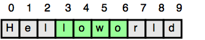

---

title: Practica Aula 1
---

# Practica Aula 1

## Java I/O

En este desafío, debes leer un número entero, un número decimal y una cadena de texto desde la entrada estándar (stdin), y luego imprimir los valores según las instrucciones de la sección Formato de salida que se encuentra a continuación. Para facilitar el problema, se proporciona una parte del código en el editor.

> [!NOTE]
> Recomendamos completar los cursos [Java Stdin y Stdout](https://www.hackerrank.com/challenges/java-stdin-and-stdout-1) I antes de intentar este desafío.


### Formato de entrada: 
Hay tres líneas de entrada: 
1. La primera línea contiene un entero. 
2. La segunda línea contiene un número decimal. 
3. La tercera línea contiene una cadena de texto. 
### Formato de salida 
Hay tres líneas de salida: 
1. En la primera línea, imprime «Cadena:» seguida de la cadena de texto original leída desde la entrada estándar. 
2. En la segunda línea, imprime «Número decimal:» seguida del número decimal original leído desde la entrada estándar. 
3. En la tercera línea, imprime «Entero:» seguida del entero original leído desde la entrada estándar. 

Para simplificar el problema, se proporciona una parte del código en el editor.

> [!NOTE]
> Si utilizas el método `nextLine()` inmediatamente después del método `nextInt()`, recuerda que `nextInt()` lee tokens enteros; por lo tanto, el último carácter de salto de línea de esa línea de entrada entera aún se encuentra en la cola del búfer de entrada y la siguiente llamada a `nextLine()` leerá el resto de la línea entera (que está vacía). 

#### Entrada de ejemplo

```bash
42
3.1415
Welcome to HackerRank's Java tutorials!
```

#### Sample Output

```bash
String: Welcome to HackerRank's Java tutorials!
Double: 3.1415
Int: 42
```

## Java IF/Else

En este desafío, ponemos a prueba tus conocimientos sobre el uso de sentencias condicionales if-else para automatizar procesos de toma de decisiones. Una sentencia if-else tiene el siguiente flujo lógico:


### Tareas:

Dado un entero `n`. Realiza las siguientes acciones condicionales:
- si `n` es impar, imprime "Weird".
- si `n` es par y está en el rango de 2 a 5, imprime "Not Weird".
- si `n` es par y está en el rango de 6 a 20, imprime "Weird".
- si `n` es par y es mayor que 20, imprime "Not Weird".

### Formato de entrada
Un solo entero, `n`.

### Formato de salida
Una sola línea que contiene la cadena "Weird" o "Not Weird" según las condiciones del problema.

#### Sample Input 0

```bash
3
```

#### Sample Output 0

```bash
Weird
```

#### Sample Input 1

```bash
24
```

#### Sample Output 1

```bash
Not Weird
```

## Java Loops

Nosotros trabajaremos con los enteros `a` y `b`, y un entero `n` para crear la siguiente serie:

$$
(a + 2^0 * b), (a + 2^0 * b + 2^1 * b), ... , (a + 2^0 * b + 2^1 * b + ... + 2^{(n-1)} * b)
$$

Se le proporcionan `q` consultas en forma de `a`, `b`, y `n`. Para cada consulta, imprima la serie correspondiente a los valores dados de `a`, `b`, y `n` como una sola línea de enteros separados por espacios.

### Formato de entrada

La primera línea contiene un número entero `q`, que indica el número de consultas.

Cada línea `i` de las `q` líneas siguientes contiene tres enteros separados por espacios: $a_i$, $b_i$, y $n_i$.

### Formato de salida

Para cada consulta, imprima la serie correspondiente en una línea nueva. Cada serie debe imprimirse en orden como una sola línea de `n` enteros separados por espacios.

#### Sample Input 0

```bash
2
0 2 10
5 3 5
```

#### Sample Output 0

```bash
2 6 14 30 62 126 254 510 1022 2046
8 14 26 50 98
```

#### Explicacion de la salida de ejemplo 0:

Nosotros tenemos dos consultas `q=2`.

1. Nosotros usamos los valores `a=0`, `b=2`, y `n=10` para la primera consulta. La serie es:

- $s_0$ = $0 + 1^0 * 2 = 2$
- $s_1$ = $0 + 1^0 * 2 + 1^1 * 2 = 6$
- $s_2$ = $0 + 1^0 * 2 + 1^1 * 2 + 1^2 * 2 = 14$
- $s_3$ = $0 + 1^0 * 2 + 1^1 * 2 + 1^2 * 2 + 1^3 * 2 = 30$
- $s_4$ = $0 + 1^0 * 2 + 1^1 * 2 + 1^2 * 2 + 1^3 * 2 + 1^4 * 2 = 62$

Seguimos este patrón hasta $s_9$ = $2046$. Por lo tanto, la salida es:

```bash
2 6 14 30 62 126 254 510 1022 2046
```

> [!TIP]
> Puedes usar el operador de desplazamiento de bits `<<` para calcular las potencias de 2 de forma más eficiente.

Aquí tienes el texto completo extraído de ambas imágenes, traducido al español sin omitir ningún detalle:

---

## Java Primitive Data Types

Java tiene 8 tipos de datos primitivos: **char, boolean, byte, short, int, long, float y double**.  
Para este ejercicio, trabajaremos con los primitivos usados para almacenar valores enteros (**byte, short, int y long**):

- Un **byte** es un entero con signo de 8 bits.  
- Un **short** es un entero con signo de 16 bits.  
- Un **int** es un entero con signo de 32 bits.  
- Un **long** es un entero con signo de 64 bits.  

Dado un número entero de entrada, debes determinar qué tipos de datos primitivos son capaces de almacenarlo correctamente.

Para comenzar, se te proporciona una parte de la solución en el editor.

Referencia: `https://docs.oracle.com/javase/tutorial/java/nutsandbolts/datatypes.html` [(docs.oracle.com in Bing)](https://www.bing.com/search?q="https%3A%2F%2Fdocs.oracle.com%2Fjavase%2Ftutorial%2Fjava%2Fnutsandbolts%2Fdatatypes.html")  

### **Formato de entrada**  
La primera línea contiene un entero, `T`, que denota el número de casos de prueba.  
Cada caso de prueba, `T`, consiste en una sola línea con un entero `n`, que puede ser arbitrariamente grande o pequeño.

### **Formato de salida**  
Para cada variable de entrada `n` y el tipo de dato primitivo apropiado `dataType`, debes determinar si los primitivos dados son capaces de almacenarlo.  
Si la respuesta es sí, entonces imprime:

```
n puede ser almacenado en:
* dataType
```

Si hay más de un tipo de dato apropiado, imprime cada uno en su propia línea y ordénalos por tamaño (es decir: `byte < short < int < long`).

Si el número no puede ser almacenado en ninguno de los cuatro tipos de datos mencionados, imprime la línea:

```
n no puede ser almacenado en ningún lado.
```

#### **Entrada de ejemplo**

```bash
5
-150
150000
1500000000
213333333333333333333333333333333333
-1000000000000
```

---


#### **Salida de ejemplo**

```bash
-150 puede ser almacenado en:
* short
* int
* long

150000 puede ser almacenado en:
* int
* long

1500000000 puede ser almacenado en:
* int
* long

213333333333333333333333333333333333333 no puede ser almacenado en ningún lado.

-100000000000000 puede ser almacenado en:
* long
```

**Explicación**  
- El número **-150** puede ser almacenado en un **short**, un **int** o un **long**.  
- El número **213333333333333333333333333333333333333** es muy grande y está fuera del rango permitido para los tipos de datos primitivos discutidos en este problema.

---

Aquí tienes el texto completo extraído de la tercera imagen, traducido al español sin omitir ningún detalle:

---

### Problema: Substring en Java

Dada una cadena, `s`, y dos índices, `start` y `end`, imprime una subcadena que consista en todos los caracteres en el rango inclusivo desde `start` hasta `end - 1`.  
Encontrarás útil el método `substring` de la clase **String** para completar este desafío.

**Formato de entrada**  
La primera línea contiene una sola cadena que denota `s`.  
La segunda línea contiene dos enteros separados por un espacio que representan los valores respectivos de `start` y `end`.

**Restricciones**  
- $(1 \leq |s| \leq 100)$  
- $(0 \leq start < end \leq n)$  
- La cadena `s` consiste únicamente en letras del alfabeto inglés (es decir, [a - z, A - Z]).

**Formato de salida**  
Imprime la subcadena en el rango inclusivo desde `start` hasta `end - 1`.

**Entrada de ejemplo**

```
Helloworld
3 7
```

**Salida de ejemplo**

```
lowo
```

**Explicación**  
En el diagrama de abajo, la subcadena está resaltada en verde:



---


---

## Java Anagrams

### Definición de Anagramas
Dos cadenas, **a** y **b**, se llaman *anagramas* si contienen exactamente los mismos caracteres con las mismas frecuencias.  
En este desafío, la prueba **no distingue mayúsculas de minúsculas**.  

- Ejemplo: Los anagramas de **CAT** son:  
`CAT, ACT, tac, TCA, aTC, CtA`

---

### Descripción de la función
Debes completar la función **isAnagram** en el editor.

### Parámetros
- `string a`: la primera cadena  
- `string b`: la segunda cadena  

### Retorno
- `boolean`:  
  - Si **a** y **b** son anagramas (ignorando mayúsculas/minúsculas), retorna `true`.  
  - En caso contrario, retorna `false`.

---

### Formato de entrada
- La primera línea contiene una cadena `a`.  
- La segunda línea contiene una cadena `b`.

---

### Restricciones
- $(1 \leq \text{length}(a), \text{length}(b) \leq 50)$  
- Las cadenas consisten únicamente en caracteres alfabéticos ingleses.  
- La comparación **NO** debe ser sensible a mayúsculas/minúsculas.


### Formato de salida
Imprime:  
- `"Anagrams"` si las cadenas son anagramas.  
- `"Not Anagrams"` si no lo son.

---

### Casos de ejemplo

#### Ejemplo 0
**Entrada**
```
anagram
margana
```

**Salida**
```
Anagrams
```

**Explicación**
| Carácter | Frecuencia en `anagram` | Frecuencia en `margana` |
|----------|--------------------------|--------------------------|
| A/a      | 3                        | 3                        |
| G/g      | 1                        | 1                        |
| N/n      | 1                        | 1                        |
| M/m      | 1                        | 1                        |
| R/r      | 1                        | 1                        |

Las dos cadenas contienen las mismas letras con las mismas frecuencias → **Anagrams**.

---

#### Ejemplo 1
**Entrada**
```
anagramm
marganaa
```

**Salida**
```
Not Anagrams
```

**Explicación**
| Carácter | Frecuencia en `anagramm` | Frecuencia en `marganaa` |
|----------|---------------------------|---------------------------|
| A/a      | 3                         | 4                         |
| G/g      | 1                         | 1                         |
| N/n      | 1                         | 1                         |
| M/m      | 2                         | 1                         |
| R/r      | 1                         | 1                         |

Las frecuencias de **a** y **m** no coinciden → **Not Anagrams**.

---

#### Ejemplo 2
**Entrada**
```
Hello
hello
```

**Salida**
```
Anagrams
```

**Explicación**
| Carácter | Frecuencia en `Hello` | Frecuencia en `hello` |
|----------|------------------------|------------------------|
| E/e      | 1                      | 1                      |
| H/h      | 1                      | 1                      |
| L/l      | 2                      | 2                      |
| O/o      | 1                      | 1                      |

Las dos cadenas contienen las mismas letras con las mismas frecuencias → **Anagrams**.

---
